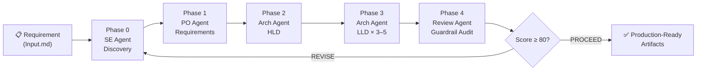
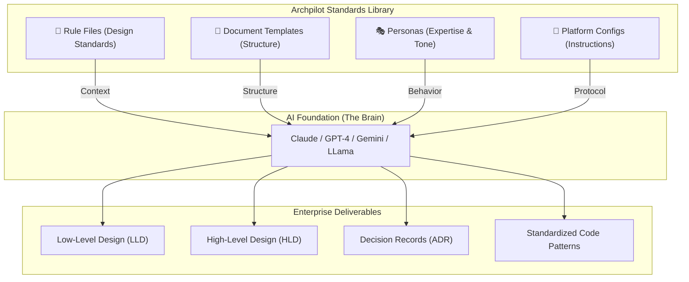

# 🏛️ Archpilot — Enterprise Architecture Standards Library

> **"Turn any LLM into a Senior Enterprise Architect."**  
> A standard-as-code library that prevents AI hallucinations by providing 50+ enterprise rules, templates, and personas.


<div align="center">

[](https://opensource.org/licenses/MIT)
[](https://github.com/gauravs19/archpilot)
[](https://github.com/gauravs19/archpilot)
[](https://github.com/gauravs19/archpilot/pulls)

</div>

---

## ⚡ The Pain Point

LLMs are great at code, but they often **hallucinate** architecture:
- They ignore non-functional requirements (NFRs).
- They mix up HLD vs LLD vs SDD.
- They suggest insecure or non-compliant design patterns.
- They lack a "senior architect" persona.

**Archpilot solves this.** It provides the "guardrails" and "context" any LLM needs to produce production-ready solution designs.

| **Without Archpilot** | **With Archpilot** |
|:--- |:--- |
| ❌ Vague, generic designs | ✅ Precision enterprise-grade LLDs |
| ❌ Security is an afterthought | ✅ Zero-trust by design |
| ❌ Missing NFRs & TCO | ✅ Comprehensive NFR & Cost audits |
| ❌ Inconsistent formats | ✅ Standardized templates & ADRs |
| ❌ "Junior" level suggestions | ✅ Expert Senior Architect guidance |

---

## 🌟 Support the Project

If you find Archpilot useful, please consider:
- **Giving it a Star** ⭐ — It helps more architects discover these standards.
- **Forking the Repo** 🍴 — Build your own internal standards library.

---

## 🎯 What is Archpilot?

Archpilot is two things in one repository:

| Mode | What it does | When to use |
|------|-------------|-------------|
| **Agentic Pipeline** | `archpilot run` — takes one requirement, runs 5 AI agent phases, produces 6 production-grade artifacts automatically | Greenfield projects, new services, ARB submissions |
| **Standards Library** | 37 rule files + 17 templates you load into Claude, Cursor, Kiro, Copilot, Gemini, Windsurf, or Aider | Code reviews, ad-hoc design, enforcing standards in an existing project |
| **MCP Server** | `python mcp_server.py` — exposes all rules, templates, and tools via MCP protocol for Claude Code and Claude.ai | Native LLM integration without copy-pasting; ideal for team-wide enforcement |

Both modes share the same rules and templates. The pipeline automates the workflow the library supports manually.

---

## 🚀 Agentic Pipeline — How it Works

Give Archpilot a single requirement. Five AI agent phases produce a complete, lint-clean architecture package:



**Rule 50 / 10:10:15:50 Mandate** enforces minimum quality at every gate:
- ≥ 15 discovery dimensions (quantified, not adjectives)
- 10–20 Epics, 50–150 EARS-notation User Stories
- 3–5 LLDs with class diagrams, schemas, sequence diagrams, and KEDA YAMLs
- Review score ≥ 80/100 to PROCEED

📖 **[Full User Guide →](docs/user-guide.md)**  
📂 **[DroneOps Reference Example →](examples/droneops-fleet-management/)** — 94.1/100 on a real enterprise requirement

---

## 🏗️ Standards Library — How it Works

Plug Archpilot rule files into any LLM to enforce consistent, enterprise-grade design:



---

## 🚀 Quick Start

### Install

```bash
git clone https://github.com/gauravs19/archpilot.git
cd archpilot
pip install -e .        # installs the `archpilot` CLI globally
# or without installing: python archpilot.py <command>
```

### Pipeline Mode (recommended)

```bash
# Initialize a new project
archpilot init my-project

# Edit my-project/.specs/Input.md — paste your requirement
# Then run all 5 phases (requires ANTHROPIC_API_KEY)
export ANTHROPIC_API_KEY=sk-ant-...
archpilot run --dir my-project

# Resume from a specific phase (e.g. redo HLD onward without re-running Discovery)
archpilot run --dir my-project --from-phase 2

# Use a larger model with more output tokens for richer documents
archpilot run --dir my-project --model claude-opus-4-8 --max-tokens 32000

# Validate all artifacts (tier 2=standard, tier 3=enterprise strictest)
archpilot lint --dir my-project --tier 2

# Machine-readable lint output for CI tooling
archpilot lint --dir my-project --tier 2 --format json

# Re-run only the guardrail audit after manual edits
archpilot review --dir my-project
```

**📖 [Full User Guide →](docs/user-guide.md)** | **📂 [DroneOps Example →](examples/droneops-fleet-management/)**

### Standards Library Mode

### Option A: Claude Projects
1. Create a new [Claude Project](https://claude.ai)
2. Paste [`llm-configs/claude-project-instructions.md`](./llm-configs/claude-project-instructions.md) as custom instructions
3. Upload these files as project knowledge:
   - `rules/00-architecture-principles.md`
   - `rules/04-lld-standards.md`
   - `templates/lld-template.md`
4. Ask: *"Create an LLD for a user authentication service using OAuth2 and JWT"*
5. Get a comprehensive, structured, enterprise-grade LLD ✨

### Option B: VS Code / GitHub Copilot
1. Copy [`llm-configs/vscode-copilot-instructions.md`](./llm-configs/vscode-copilot-instructions.md) to your project as `.github/copilot-instructions.md`
2. Copilot now follows your architecture standards for code suggestions

### Option C: Cursor IDE
1. Copy [`llm-configs/cursor-rules.md`](./llm-configs/cursor-rules.md) to your project as `.cursorrules`
2. Cursor follows your architecture standards automatically

### Option D: AWS Kiro
1. Copy [`llm-configs/kiro-steering-instructions.md`](./llm-configs/kiro-steering-instructions.md) to `.kiro/steering/archpilot-standards.md`
2. Kiro applies these standards automatically in every agent session

### Option E: ChatGPT Custom GPT
1. Create a new Custom GPT
2. Paste [`llm-configs/chatgpt-custom-gpt.md`](./llm-configs/chatgpt-custom-gpt.md) as system instructions
3. Upload rule files as knowledge

### Option F: Google Gemini
1. Open [Google AI Studio](https://aistudio.google.com) → New Project
2. Paste [`llm-configs/gemini-instructions.md`](./llm-configs/gemini-instructions.md) as System Instructions
3. For Vertex AI, pass it as the `system_instruction` field in your API call

### Option G: Windsurf IDE
1. Copy [`llm-configs/windsurf-rules.md`](./llm-configs/windsurf-rules.md) to your project root as `.windsurfrules`
2. Windsurf's Cascade agent follows your architecture standards automatically

### Option H: Aider (terminal AI)
1. Copy [`llm-configs/aider-conventions.md`](./llm-configs/aider-conventions.md) to your project
2. Reference it in `.aider.conf.yml` with `read: [llm-configs/aider-conventions.md]`
3. See the file for recommended session commands

### Option I: MCP Server (Claude Code / Claude.ai)

Run Archpilot as a local MCP server so any Claude session can read rules on demand — no copy-pasting required.

```bash
pip install -e .          # install the mcp dependency
python mcp_server.py      # starts the MCP server on stdio
```

**Add to Claude Code** (`~/.claude/settings.json`):
```json
{
  "mcpServers": {
    "archpilot": {
      "command": "python",
      "args": ["/absolute/path/to/archpilot/mcp_server.py"]
    }
  }
}
```

Once connected, Claude can call:
- `list_rules()` — discover all 37 rules
- `get_rule("03-hld-standards")` — fetch a specific rule
- `run_lint("./my-project")` — lint specs and get JSON results
- `calculate_nfrs(tps=5000, payload_kb=2, retention_days=90)` — NFR physics

---

## 🎭 Personas

Switch the LLM's expertise and tone with a drop-in persona. Paste into any system prompt:

| Persona | Best for |
|---------|----------|
| [`enterprise-architect.md`](./llm-configs/personas/enterprise-architect.md) | Full system design, ARB submissions, greenfield architecture |
| [`security-architect.md`](./llm-configs/personas/security-architect.md) | Threat modelling, compliance, zero-trust design reviews |
| [`presales-solutioner.md`](./llm-configs/personas/presales-solutioner.md) | RFP responses, estimation, solution narrative for clients |
| [`startup-cto.md`](./llm-configs/personas/startup-cto.md) | MVP-first design, pragmatic trade-offs, speed-to-market |
| [`vibe-code-reviewer.md`](./llm-configs/personas/vibe-code-reviewer.md) | Production readiness review of AI-generated code |

---

## 📁 Repository Structure

```
archpilot/
├── archpilot.py                        # 🚀 CLI entry point (init, run, review, lint)
├── mcp_server.py                       # 🔌 MCP server — rules, templates, tools over MCP protocol
├── pyproject.toml                      # 📦 pip install -e . → exposes `archpilot` CLI entry point
├── tools/                              # 🛠️ Executable Tools
│   ├── pipeline.py                     # 5-phase agentic engine (Anthropic SDK, parallel LLDs)
│   ├── nfr_calculator.py               # Enterprise NFR physics (Little's Law, IOPS, egress)
│   └── generate_diagrams.py            # Generator for standard Mermaid archetypes
├── rules/                              # 🧠 Architecture Standards & Guidelines (50 files)
│   ├── 50-agent-pipeline.md            # ⭐ Rule 50: 10:10:15:50 Mandate (pipeline gate)
│   ├── 00-architecture-principles.md   # Universal design principles, decision framework
│   ├── 01-solution-design.md           # SDD standards, when HLD vs LLD vs SDD
│   ├── 02-adr-standards.md             # ADR writing standards & lifecycle
│   ├── 03-hld-standards.md             # High-Level Design rules (C4 Context/Container)
│   ├── 04-lld-standards.md             # Low-Level Design rules (most detailed)
│   ├── 05-api-design.md                # REST API conventions, versioning, security
│   ├── 06-data-architecture.md         # Data modeling, storage selection, governance
│   ├── 07-security-architecture.md     # Zero trust, OWASP, STRIDE, compliance
│   ├── 08-cloud-architecture.md        # 12-Factor, IaC, networking, HA/DR
│   ├── 09-microservices-patterns.md    # Decomposition, sagas, resilience
│   ├── 10-integration-patterns.md      # Event-driven, CDC, webhooks, API gateway
│   ├── 11-nfr-checklist.md             # 69-point NFR audit checklist
│   ├── 12-observability-standards.md   # Logging, metrics, tracing, alerting
│   ├── 13-devops-cicd.md               # Pipelines, branching, deployments, Docker
│   ├── 14-cost-optimization.md         # FinOps, TCO, right-sizing, pricing models
│   ├── 15-code-review-guidelines.md    # Architecture-aware code review standards
│   ├── 16-estimation-framework.md      # T-shirt, story points, FPA, bottom-up, PERT
│   ├── 17-migration-modernization.md   # Strangler Fig, dual-write, data migration
│   ├── 18-architecture-governance.md   # ARB process, tech radar, compliance
│   ├── 19-incident-management.md       # Incident response, post-mortem, runbooks
│   ├── 20-testing-strategy.md          # Test pyramid, contract testing, chaos eng
│   ├── 21-tech-debt-management.md      # Debt registry, scoring, paydown strategies
│   ├── 22-multi-tenancy.md             # Silo/bridge/pool, tenant isolation, SaaS
│   ├── 23-stakeholder-communication.md # Audience adaptation, STAR-T, influence
│   ├── 24-team-topology.md             # Conway's Law, team types, scaling teams
│   ├── 25-domain-driven-design.md      # Bounded contexts, aggregates, events, DDD
│   ├── 26-ai-ml-architecture.md        # MLOps, model serving, feature stores, AI
│   ├── 27-spec-driven-development.md   # SDD, EARS notation, Spec-Kit workflow
│   ├── 28-context-engineering.md       # LLM context design, RAG, token budgets
│   ├── 29-agentic-ai-governance.md     # Agent safety, HITL, audit, blast radius
│   ├── 30-platform-engineering.md      # IDP, golden paths, developer portal
│   ├── 31-api-governance.md            # API lifecycle, productization, DX
│   ├── 32-data-contracts.md            # Producer/consumer contracts, schema drift
│   ├── 33-resilience-chaos-engineering.md  # GameDays, fault injection, blast radius
│   ├── 34-sustainability-green-architecture.md  # Carbon-aware, GreenOps, SCI
│   ├── 35-multi-agent-contracts.md     # Artifact-driven agent handoffs, trust hierarchy
│   ├── 36-discovery-ambiguity.md       # Phase 0: Presales ambiguity resolution, edge cases
│   └── 37-sdd-triage-matrix.md         # SDD Fast-Track / Bypassing matrix
│
├── diagrams/                           # 📊 Mermaid Archetype Library (22+ Patterns)
│   ├── 01-c4-context-archetype.md      # C4 Context layout
│   ├── 02-saga-choreography-archetype.md # Distributed transaction rollback
│   ├── 03-active-active-failover.md    # Multi-region HA
│   ├── 04-api-gateway-pattern.md       # API Gateway routing
│   ├── 05-event-sourcing-cqrs.md       # Command/Query segregation
│   ├── 06-strangler-fig-pattern.md     # Monolith strangulation
│   ├── 07-micro-frontend-pattern.md    # MFE shell/remote
│   ├── 08-outbox-pattern.md            # Transactional Outbox
│   ├── 09-circuit-breaker-pattern.md   # Circuit Breaker state machine
│   ├── 10-service-mesh-sidecar.md      # Envoy sidecar mesh
│   ├── 11-oauth2-oidc-flow.md          # OIDC sequence diagram
│   ├── 12-bulkhead-pattern.md          # Thread pool isolation
│   ├── 13-fan-out-fan-in.md            # Worker aggregation
│   ├── 14-change-data-capture-cdc.md   # Debezium CDC pipeline
│   ├── 15-two-phase-commit-2pc.md      # Distributed commit (XA)
│   ├── 16-backends-for-frontends-bff.md# BFF pattern
│   ├── 17-serverless-lambda-arch.md    # AWS Serverless flow
│   ├── 18-data-lake-medallion.md       # Bronze/Silver/Gold Lake
│   ├── 19-cell-based-architecture.md   # Cellular partitioned DBs
│   ├── 20-blue-green-deployment.md     # Deployment traffic splitting
│   ├── 21-cache-aside-pattern.md       # Redis read-through flow
│   └── 22-retry-exponential-backoff.md # Exponential backoff sequence
├── templates/                          # 📝 Document Templates (19 files)
│   ├── discovery-template.md           # Ambiguity resolution & presales template
│   ├── assumption-log-template.md      # RAID / Assumption tracking template
│   ├── estimation-abacus-template.md   # Fixed-bid presales estimation framework
│   ├── lld-template.md                 # Low-Level Design (13 sections)
│   ├── hld-template.md                 # High-Level Design (14 sections)
│   ├── sdd-template.md                 # Solution Design Document (11 sections)
│   ├── adr-template.md                 # Architecture Decision Record
│   ├── go-live-checklist.md            # 80-point pre-launch verification
│   ├── runbook-template.md             # Per-service operational runbook
│   ├── post-mortem-template.md         # Blameless incident post-mortem
│   ├── rfp-response-template.md        # Technical proposal / RFP response
│   ├── handover-checklist.md           # System transition / KT checklist
│   ├── capacity-planning.md            # Infrastructure capacity forecast
│   ├── technology-radar.md             # Org technology landscape tracker
│   ├── spec-template.md                # Spec-Kit requirements.md (EARS notation)
│   ├── design-spec-template.md         # Spec-Kit design.md (architecture + schemas)
│   ├── task-list-template.md           # Spec-Kit tasks.md (atomic agent tasks)
│   ├── constitution-template.md        # Project constitution / AI agent law
│   ├── data-contract-template.md       # Producer/consumer data contract
│   └── multi-agent-handoff-template.md # Handoff contract for orchestrator/sub-agents
│
├── llm-configs/                        # 🤖 Platform-Specific LLM Instructions (8 configs)
│   ├── claude-project-instructions.md  # Claude Projects / Claude.ai
│   ├── chatgpt-custom-gpt.md           # ChatGPT Custom GPT configuration
│   ├── vscode-copilot-instructions.md  # GitHub Copilot (.github/copilot-instructions.md)
│   ├── cursor-rules.md                 # Cursor IDE (.cursorrules)
│   ├── kiro-steering-instructions.md   # AWS Kiro steering file (.kiro/steering/)
│   ├── gemini-instructions.md          # Google Gemini / Vertex AI system instructions
│   ├── windsurf-rules.md               # Windsurf IDE (.windsurfrules)
│   ├── aider-conventions.md            # Aider terminal AI (.aider.conf.yml + session guide)
│   └── personas/                       # 🎭 Drop-in expertise personas
│       ├── enterprise-architect.md     # Senior architect — full system design
│       ├── security-architect.md       # Security reviewer — threat modelling, compliance
│       ├── presales-solutioner.md      # Presales — RFP responses, estimation
│       ├── startup-cto.md              # Startup CTO — MVP-first, pragmatic trade-offs
│       └── vibe-code-reviewer.md       # Production readiness review of AI-generated code
│
├── examples/                           # 📄 Sample Outputs & Reference Runs
│   ├── droneops-fleet-management/      # ⭐ Full pipeline run — 94.1/100 (8 artifacts)
│   │   ├── Input.md                    # Original requirement
│   │   ├── discovery.md                # Phase 0: 15-dimension deep discovery
│   │   ├── requirements.md             # Phase 1: 12 Epics, 68 User Stories (EARS)
│   │   ├── Design_HLD.md               # Phase 2: C4 diagrams, 4 ADRs, cost model
│   │   ├── Design_LLD_Telemetry_Processor.md     # Phase 3: Go service
│   │   ├── Design_LLD_Mission_Planning_Service.md # Phase 3: Python FastAPI
│   │   ├── Design_LLD_Incident_Detection_Service.md # Phase 3: Anomaly detection
│   │   └── review_report.md            # Phase 4: 94.1/100 — PROCEED
│   ├── sample-lld.md                   # Notification Service — full LLD example
│   ├── sample-hld.md                   # E-Commerce Platform — full HLD example
│   ├── sample-adr.md                   # PostgreSQL vs DynamoDB — full ADR example
│   ├── sample-sdd.md                   # Customer Portal — full SDD example
│   ├── sample-migration-plan.md        # Monolith → Microservices migration plan
│   └── sample-estimation.md            # Bottom-up effort estimation example
│
├── docs/                               # 📖 Documentation
│   ├── user-guide.md                   # End-to-end user guide (pipeline + library modes)
│   └── index.html                      # Project landing page
└── README.md                           # This file
```

**Total: 37 rules | 17 templates | 8 LLM configs | 5 personas | MCP server | 5-phase agentic pipeline | ~500 KB of enterprise architecture standards**

---

## 📖 Rule Files — What's Inside

| # | Rule File | What It Covers | Size |
|---|-----------|---------------|:----:|
| 00 | **Architecture Principles** | SOLID, SoC, API-First, engineering physics, fitness functions, GreenOps | 25 KB |
| 01 | **Solution Design** | SDD standards, queueing calculus, STRIDE threat modelling, 3-year TCO | 14.5 KB |
| 02 | **ADR Standards** | Lifecycle, DAG governance, Weighted Product Model scoring, CI drift detection | 13.6 KB |
| 03 | **HLD Standards** | C4 diagrams, Integration Calculus, capacity planning, network egress math | 7.6 KB |
| 04 | **LLD Standards** | SOLID physics, Saga patterns, indexing math, distributed locking, Hexagonal arch | 14.4 KB |
| 05 | **API Design** | REST, gRPC Protobuf, GraphQL DataLoaders, RFC 7807 errors, Spectral CI linting | 10.9 KB |
| 06 | **Data Architecture** | Data modeling, storage selection matrix, governance, PII, migrations, indexing | 9.5 KB |
| 07 | **Security Architecture** | Zero trust, OAuth2/JWT, RBAC/ABAC, encryption, STRIDE, OWASP, compliance | 11.0 KB |
| 08 | **Cloud Architecture** | 12-Factor App, compute selection, IaC, VPC networking, HA/DR tiers | 8.6 KB |
| 09 | **Microservices Patterns** | Decomposition, sync/async, saga, circuit breakers, service mesh | 10.1 KB |
| 10 | **Integration Patterns** | Event-driven, CDC, ETL/ELT, webhooks, API gateway, BFF | 8.8 KB |
| 11 | **NFR Checklist** | 69 checks: performance, security, reliability, scalability, observability, DR | 7.4 KB |
| 12 | **Observability** | Structured logging, RED/USE metrics, distributed tracing, alerting, dashboards | 7.8 KB |
| 13 | **DevOps & CI/CD** | Pipeline stages, branching, deployments, Docker, GitOps, environments | 8.2 KB |
| 14 | **Cost Optimization** | FinOps, TCO modeling, right-sizing, pricing models, tagging, governance | 7.1 KB |
| 15 | **Code Review** | Architecture, security, performance, error handling, testing, observability checks | 6.1 KB |
| 16 | **Estimation Framework** | T-shirt sizing, story points, FPA, bottom-up WBS, PERT, complexity multipliers | ~10 KB |
| 17 | **Migration & Modernization** | Legacy assessment, Strangler Fig, dual-write, data migration, coexistence | ~12 KB |
| 18 | **Architecture Governance** | ARB process, tech radar, standards enforcement, exception handling | ~10 KB |
| 19 | **Incident Management** | Severity levels, response process, on-call, post-mortem, runbook standards | ~11 KB |
| 20 | **Testing Strategy** | Test pyramid, contract testing, performance, chaos engineering, quality gates | ~10 KB |
| 21 | **Tech Debt Management** | Debt registry, scoring framework, paydown strategies, prevention, metrics | ~9 KB |
| 22 | **Multi-Tenancy** | Silo/bridge/pool models, tenant isolation, data partitioning, noisy neighbor | ~10 KB |
| 23 | **Stakeholder Communication** | Audience adaptation, STAR-T framework, tech-to-business translation | ~9 KB |
| 24 | **Team Topology** | Conway's Law, team types, interaction modes, scaling patterns, ownership | ~9 KB |
| 25 | **Domain-Driven Design** | Bounded contexts, aggregates, domain events, context mapping, event storming | ~11 KB |
| 26 | **AI/ML Architecture** | MLOps, model serving, feature stores, monitoring, responsible AI | ~10 KB |
| 27 | ⭐ **Spec-Driven Development** | EARS notation, Spec-Kit triad (requirements/design/tasks), SDD loop, RTM | ~15 KB |
| 28 | ⭐ **Context Engineering** | LLM context stack, RAG standards, token budgets, multi-agent context routing | ~10 KB |
| 29 | ⭐ **Agentic AI Governance** | Agent safety, HITL gates, blast radius, audit logs, CI/CD integration | ~10 KB |
| 30 | ⭐ **Platform Engineering** | IDP capabilities, golden paths, service catalog, developer portal, platform SLOs | ~9 KB |
| 31 | ⭐ **API Governance** | API lifecycle, versioning policy, DX checklist, API marketplace, OpenAPI linting | ~10 KB |
| 32 | ⭐ **Data Contracts** | Producer/consumer contracts, YAML schema, compatibility matrix, drift detection | ~11 KB |
| 33 | ⭐ **Resilience & Chaos Engineering** | GameDays, fault injection, blast radius levels, steady-state hypothesis, chaos loop | ~12 KB |
| 34 | ⭐ **Sustainability & Green Architecture** | SCI score, carbon-aware scheduling, GreenOps, demand shaping, ARM efficiency | ~9 KB |
| 35 | ⭐ **Multi-Agent Contracts** | Artifact-driven agent handoffs, trust hierarchy, bounding boxes, code review protocols | ~11 KB |

---

## 🔥 Example Prompts (How to Use)

### 1. The Direct Standard (LLM-Agnostic)
If you aren't using a "Project" or "Custom GPT", use this prefix:
> *"Follow these standards: [Paste content of rules/05-api-design.md]. Now create the API specification for a Loyalty Program service."*

### 2. High-Level Design (HLD)
> *"Follow these standards: [Upload rules/03-hld-standards.md]. Now create an HLD for a Global Logistics Platform. Focus on C4 Container diagrams and address multi-region availability."*

### 3. Estimation & Planning (Phase 4)
> *"Follow these standards: [Upload rules/16-estimation-framework.md]. Estimate the effort for building a 'Real-time Fraud Detection' engine. Use PERT analysis and include complexity multipliers for high-security environments."*

### 4. Legacy Migration (Phase 4)
> *"Follow these standards: [Upload rules/17-migration-modernization.md]. Propose a migration strategy for a 15-year old COBOL monolith to a Node.js microservice architecture. Use the Strangler Fig pattern."*

### 5. Multi-Tenant SaaS (Phase 5)
> *"Follow these standards: [Upload rules/22-multi-tenancy.md]. Design the database isolation model for a B2B CRM. We need to balance strict data isolation with cost efficiency for 10,000 small tenants."*

### 6. Domain-Driven Design (Phase 5)
> *"Follow these standards: [Upload rules/25-domain-driven-design.md]. Conduct a virtual Event Storming session for an Insurance Claims process. Identify bounded contexts and core aggregates."*

### 7. AI/ML MLOps (Phase 5)
> *"Follow these standards: [Upload rules/26-ai-ml-architecture.md]. Design the MLOps pipeline for a real-time recommendation engine. Include feature store integration and model drift monitoring."*

### 8. Stakeholder Pitch (Phase 5)
> *"Follow these standards: [Upload rules/23-stakeholder-communication.md]. Help me pitch the transition from Batch to Event-Driven architecture to our CFO. Focus on TCO reduction and business agility."*

### 9. AI-Generated Code Review (Phase 6)
> *"Take on the Vibe Code Reviewer persona: [Upload llm-configs/personas/vibe-code-reviewer.md and rules/27-ai-assisted-development.md]. Review this code for production readiness. Flag issues in order of severity."*

---

## 🤖 Active Governance (GitHub Action)

Transform your static standards into an **active auditor**. The [Archpilot Reviewer](https://github.com/gauravs19/archpilot-reviewer) automatically audits design docs in your Pull Requests.

- **🔴 Automated Audits**: Catch architectural gaps (NFRs, Security, Patterns) before they are merged.
- **🌐 Centralized Rules**: Host rules in `archpilot`, and scan every other repo in your org.
- **📝 Expert Feedback**: Get senior-level suggestions directly as PR comments.

### Quick Setup:
Add [`workflows/archpilot-review.yml`](./workflows/archpilot-review.yml) to your repository and set `secrets.OPENAI_API_KEY`.

---

## 🏗️ Roadmap

### ✅ Phase 1 — Core (Complete)
- Architecture Principles
- LLD Standards + Template
- HLD Standards + Template
- ADR Standards + Template
- API Design Standards
- Security Architecture
- Microservices Patterns
- NFR Checklist (69 checks)
- Claude Project Instructions
- Enterprise Architect Persona

### ✅ Phase 2 — Extended Standards (Complete)
- Solution Design Standards + Template
- Data Architecture Standards
- Integration Patterns (Event-Driven, CDC, Webhooks, API Gateway)
- Cloud Architecture Standards (12-Factor, IaC, HA/DR)
- Observability Standards (Logging, Metrics, Tracing, Alerting)
- DevOps & CI/CD Standards (Pipelines, Docker, GitOps)
- Cost Optimization / FinOps
- Code Review Guidelines

### 📋 Phase 3 — Platform Configs & Examples (Complete)
- VS Code Copilot Instructions
- Cursor Rules
- ChatGPT Custom GPT Config
- Additional Personas (Security Architect, Presales Solutioner)
- Example Outputs (Sample LLD, Sample ADR, Sample HLD)

### 🔄 Phase 4 — Lifecycle & Governance (Complete)
- Estimation Framework (T-shirt, Story Points, FPA, PERT)
- Migration & Modernization Playbook (Strangler Fig, Dual-Write)
- Architecture Governance (ARB, Tech Radar)
- Incident Management & Post-Mortem Standards
- Testing Strategy (Test Pyramid, Contract, Chaos)
- Tech Debt Management Framework
- Go-Live Checklist (80-point template, extended to 90 in Phase 6)
- Operational Runbook, Post-Mortem, RFP Response, Handover templates
- Startup CTO Persona
- Example: Migration Plan, Estimation

### 🚀 Phase 5 — Deep Coverage (Complete)
- Multi-Tenancy Architecture (Silo/Bridge/Pool, SaaS patterns)
- Stakeholder Communication Guide (STAR-T, audience adaptation)
- Team Topology (Conway's Law, team types, scaling)
- Domain-Driven Design (Bounded contexts, aggregates, events)
- AI/ML Architecture (MLOps, model serving, responsible AI)
- Capacity Planning & Technology Radar templates
- Sample SDD (Customer Portal)
- Mermaid diagrams + Anti-patterns for files 05, 07, 12

### ⭐ Phase 6 — Spec-Driven & Agentic Era (Complete)
- **Spec-Driven Development (rule 27):** EARS notation, Spec-Kit triad, SDD loop, RTM, agent prompt patterns
- **Context Engineering (rule 28):** 5-layer context stack, RAG standards, token budgets, PII-in-context rules
- **Agentic AI Governance (rule 29):** 5-level autonomy model, HITL gates, blast radius, audit log format
- **Platform Engineering (rule 30):** IDP capabilities, golden paths, service catalog, platform SLOs
- **API Governance (rule 31):** Full lifecycle, versioning policy, DX checklist, OpenAPI linting gates
- **Data Contracts (rule 32):** YAML contract schema, compatibility matrix, drift detection, consumer registration
- **Resilience & Chaos Engineering (rule 33):** GameDay playbook, 5 blast-radius levels, 7-step chaos loop
- **Sustainability & Green Architecture (rule 34):** SCI formula, carbon-aware patterns, GreenOps, ARM migration
- **Multi-Agent Contracts (rule 35):** Artifact-driven handoffs, trust hierarchy, agent bounding boxes, automated review protocols
- **Spec-Kit Templates:** spec-template.md (EARS), design-spec-template.md, task-list-template.md, constitution-template.md
- **Data Contract Template:** Fully structured YAML + field definition table
- **Multi-Agent Handoff Template:** Structured contract for orchestrator to sub-agent delegation
- **AWS Kiro Steering File:** kiro-steering-instructions.md for native SDD enforcement in Kiro
- **Enterprise Hardening (Rules 00–05):** All core rules expanded to 500+ lines with mathematical rigor, engineering physics, and CI fitness functions

### ⭐ Phase 7 — Agentic Pipeline (Complete)
- **5-Phase Agentic Engine (`tools/pipeline.py`):** SE Agent → PO Agent → Arch Agent → Review Agent, all orchestrated via Anthropic SDK
- **Rule 50 / 10:10:15:50 Mandate:** Enforces ≥15 discovery dimensions, 10–20 Epics, 50–150 Stories, 3–5 LLDs, ≥80 review score
- **`archpilot run` CLI command:** Single command to run all 5 phases against a project directory
- **Tier 3 Lint Engine:** Vague-word detector, placeholder scanner, narrative-section checker
- **Discovery Template (15 dimensions):** Physics, cost, STRIDE, CAP, RPO/RTO, edge cases
- **Requirements Breakdown Template:** EARS notation, MoSCoW, NFR tags, RTM
- **DroneOps Reference Run:** Full end-to-end example at `examples/droneops-fleet-management/` (94.1/100)

### 🔭 Phase 8 — Automated Enforcement (Planned)
- **`archpilot-reviewer` GitHub Action:** Automated PR auditing against NFR, Security, and ADR compliance gates
- **Drift Detection Script:** Verify implementation code has not deviated from `design.md` or `data-contract.md`
- **MCP Server:** Package all rules as a Model Context Protocol server for direct LLM integration without file uploads
- **Fitness Function Runner:** CLI-based ArchUnit/Spectral linter that gates merges on architectural compliance
- **ADR DAG Visualizer:** Generate a living graph of all decision records and their supersession chains

---

## 🤝 Contributing

We welcome contributions! Whether it's a new rule, a design pattern, or a template, your input helps the community.
1. Fork the codebase.
2. Create a new branch (`feat/your-feature`).
3. Commit your changes.
4. Push and open a Pull Request.

---

## 📄 License

This project is licensed under the MIT License — see the [LICENSE](LICENSE) file for details.

---

## 🏛️ Philosophy

> *"The quality of an architect's work is defined not by the buildings they design,
> but by the standards they maintain."*

Most architects carry their standards in their heads. Archpilot codifies them —
making enterprise architecture consistent, teachable, and AI-augmented.

---

*Created by [Gaurav Sharma](https://gauravs19.github.io/portfolio/) — 18+ Years of Architecture Delivery*


---

## Ecosystem

| Tool | Description |
|---|---|
| [archpilot-cli](https://github.com/gauravs19/archpilot-cli) | CLI to scaffold architecture documents from this standards library |
| [archpilot-reviewer](https://github.com/gauravs19/archpilot-reviewer) | GitHub Action for automated architecture governance on PRs |
