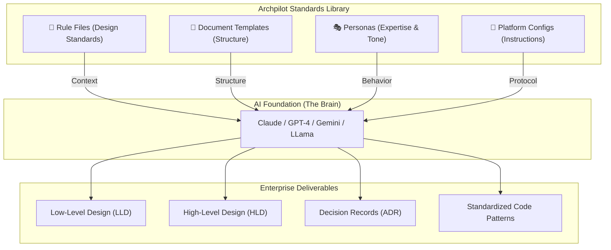

# 🏛️ Archpilot — Enterprise Architecture Standards Library

> **"Turn any LLM into a Senior Enterprise Architect."**  
> A standard-as-code library that prevents AI hallucinations by providing 50+ enterprise rules, templates, and personas.


<div align="center">

[](https://opensource.org/licenses/MIT)
[](https://github.com/gauravs19/archpilot)
[](https://github.com/gauravs19/archpilot)
[](https://github.com/gauravs19/archpilot/pulls)

</div>

---

## ⚡ The Pain Point

LLMs are great at code, but they often **hallucinate** architecure:
- They ignore non-functional requirements (NFRs).
- They mix up HLD vs LLD vs SDD.
- They suggest insecure or non-compliant design patterns.
- They lack a "senior architect" persona.

**Archpilot solves this.** It provides the "guardrails" and "context" any LLM needs to produce production-ready solution designs.

| **Without Archpilot** | **With Archpilot** |
|:--- |:--- |
| ❌ Vague, generic designs | ✅ Precision enterprise-grade LLDs |
| ❌ Security is an afterthought | ✅ Zero-trust by design |
| ❌ Missing NFRs & TCO | ✅ Comprehensive NFR & Cost audits |
| ❌ Inconsistent formats | ✅ Standardized templates & ADRs |
| ❌ "Junior" level suggestions | ✅ Expert Senior Architect guidance |

---

## 🌟 Support the Project

If you find Archpilot useful, please consider:
- **Giving it a Star** ⭐ — It helps more architects discover these standards.
- **Forking the Repo** 🍴 — Build your own internal standards library.

---

## 🎯 What is Archpilot?

Archpilot is a **repository of rule files, templates, and AI instructions** that you plug into any LLM (Claude, ChatGPT, Gemini, Copilot, Cursor) to make it produce consistent, enterprise-grade architecture artifacts.

**It is NOT a CLI tool or application.** It is a **standards library** — think of it as `.eslintrc` but for enterprise architecture.

---

## 🏗️ How it Works (Logical View)



---

## 🚀 Quick Start (2 Minutes)

### Option A: Claude Projects
1. Create a new [Claude Project](https://claude.ai)
2. Paste [`llm-configs/claude-project-instructions.md`](./llm-configs/claude-project-instructions.md) as custom instructions
3. Upload these files as project knowledge:
   - `rules/00-architecture-principles.md`
   - `rules/04-lld-standards.md`
   - `templates/lld-template.md`
4. Ask: *"Create an LLD for a user authentication service using OAuth2 and JWT"*
5. Get a comprehensive, structured, enterprise-grade LLD ✨

### Option B: VS Code / GitHub Copilot
1. Copy [`llm-configs/vscode-copilot-instructions.md`](./llm-configs/vscode-copilot-instructions.md) to your project as `.github/copilot-instructions.md`
2. Copilot now follows your architecture standards for code suggestions

### Option C: Cursor IDE
1. Copy [`llm-configs/cursor-rules.md`](./llm-configs/cursor-rules.md) to your project as `.cursorrules`
2. Cursor follows your architecture standards automatically

### Option D: ChatGPT Custom GPT
1. Create a new Custom GPT
2. Paste [`llm-configs/claude-project-instructions.md`](./llm-configs/claude-project-instructions.md) as system instructions (works for ChatGPT too)
3. Upload rule files as knowledge

### Option E: Any LLM (Gemini, Groq, etc.)
1. Copy the relevant rule file content
2. Prefix your prompt: *"Follow these standards: [paste rules]. Now create..."*

---

## 📁 Repository Structure

```
archpilot/
├── rules/                              # 🧠 Architecture Standards & Guidelines (27 files)
│   ├── 00-architecture-principles.md   # Universal design principles, decision framework
│   ├── 01-solution-design.md           # SDD standards, when HLD vs LLD vs SDD
│   ├── 02-adr-standards.md             # ADR writing standards & lifecycle
│   ├── 03-hld-standards.md             # High-Level Design rules (C4 Context/Container)
│   ├── 04-lld-standards.md             # Low-Level Design rules (most detailed)
│   ├── 05-api-design.md                # REST API conventions, versioning, security
│   ├── 06-data-architecture.md         # Data modeling, storage selection, governance
│   ├── 07-security-architecture.md     # Zero trust, OWASP, STRIDE, compliance
│   ├── 08-cloud-architecture.md        # 12-Factor, IaC, networking, HA/DR
│   ├── 09-microservices-patterns.md    # Decomposition, sagas, resilience
│   ├── 10-integration-patterns.md      # Event-driven, CDC, webhooks, API gateway
│   ├── 11-nfr-checklist.md             # 69-point NFR audit checklist
│   ├── 12-observability-standards.md   # Logging, metrics, tracing, alerting
│   ├── 13-devops-cicd.md               # Pipelines, branching, deployments, Docker
│   ├── 14-cost-optimization.md         # FinOps, TCO, right-sizing, pricing models
│   ├── 15-code-review-guidelines.md    # Architecture-aware code review standards
│   ├── 16-estimation-framework.md      # T-shirt, story points, FPA, bottom-up, PERT
│   ├── 17-migration-modernization.md   # Strangler Fig, dual-write, data migration
│   ├── 18-architecture-governance.md   # ARB process, tech radar, compliance
│   ├── 19-incident-management.md       # Incident response, post-mortem, runbooks
│   ├── 20-testing-strategy.md          # Test pyramid, contract testing, chaos eng
│   ├── 21-tech-debt-management.md      # Debt registry, scoring, paydown strategies
│   ├── 22-multi-tenancy.md             # Silo/bridge/pool, tenant isolation, SaaS
│   ├── 23-stakeholder-communication.md # Audience adaptation, STAR-T, influence
│   ├── 24-team-topology.md             # Conway's Law, team types, scaling teams
│   ├── 25-domain-driven-design.md      # Bounded contexts, aggregates, events, DDD
│   └── 26-ai-ml-architecture.md        # MLOps, model serving, feature stores, AI
│
├── templates/                          # 📝 Document Templates (11 files)
│   ├── lld-template.md                 # Low-Level Design (13 sections)
│   ├── hld-template.md                 # High-Level Design (14 sections)
│   ├── sdd-template.md                 # Solution Design Document (11 sections)
│   ├── adr-template.md                 # Architecture Decision Record
│   ├── go-live-checklist.md            # 80-point pre-launch verification
│   ├── runbook-template.md             # Per-service operational runbook
│   ├── post-mortem-template.md         # Blameless incident post-mortem
│   ├── rfp-response-template.md        # Technical proposal / RFP response
│   ├── handover-checklist.md           # System transition / KT checklist
│   ├── capacity-planning.md            # Infrastructure capacity forecast
│   └── technology-radar.md             # Org technology landscape tracker
│
├── llm-configs/                        # 🤖 Platform-Specific LLM Instructions
│   ├── claude-project-instructions.md  # Ready for Claude Projects
│   ├── chatgpt-custom-gpt.md           # ChatGPT Custom GPT configuration
│   ├── vscode-copilot-instructions.md  # GitHub Copilot (.github/copilot-instructions.md)
│   ├── cursor-rules.md                 # Cursor IDE (.cursorrules)
│   └── personas/
│       ├── enterprise-architect.md     # Senior architect persona
│       ├── security-architect.md       # Security architecture reviewer
│       ├── presales-solutioner.md      # Presales / proposal persona
│       └── startup-cto.md             # Startup / MVP-first persona
│
├── examples/                           # 📄 Sample Outputs
│   ├── sample-lld.md                   # Notification Service — full LLD example
│   ├── sample-hld.md                   # E-Commerce Platform — full HLD example
│   ├── sample-adr.md                   # PostgreSQL vs DynamoDB — full ADR example
│   ├── sample-sdd.md                   # Customer Portal — full SDD example
│   ├── sample-migration-plan.md        # Monolith → Microservices migration plan
│   └── sample-estimation.md            # Bottom-up effort estimation example
│
└── README.md                           # This file
```

**Total: 53 files | ~500 KB of enterprise architecture standards**

---

## 📖 Rule Files — What's Inside

| # | Rule File | What It Covers | Size |
|---|-----------|---------------|:----:|
| 00 | **Architecture Principles** | SOLID, SoC, API-First, Fail Fast, Least Privilege, FinOps, decision framework | 12.5 KB |
| 01 | **Solution Design** | SDD standards, when to use HLD vs LLD vs SDD, mandatory sections | 5.0 KB |
| 02 | **ADR Standards** | When to write, lifecycle, trade-off matrices, quality checklist, anti-patterns | 8.6 KB |
| 03 | **HLD Standards** | C4 diagrams, integration architecture, NFR summary, cost estimates | 6.9 KB |
| 04 | **LLD Standards** | 11 mandatory sections, API specs, DB schemas, error handling, security | 14.0 KB |
| 05 | **API Design** | REST conventions, status codes, error format, pagination, versioning, rate limiting | 8.6 KB |
| 06 | **Data Architecture** | Data modeling, storage selection matrix, governance, PII, migrations, indexing | 9.5 KB |
| 07 | **Security Architecture** | Zero trust, OAuth2/JWT, RBAC/ABAC, encryption, STRIDE, OWASP, compliance | 11.0 KB |
| 08 | **Cloud Architecture** | 12-Factor App, compute selection, IaC, VPC networking, HA/DR tiers | 8.6 KB |
| 09 | **Microservices Patterns** | Decomposition, sync/async, saga, circuit breakers, service mesh | 10.1 KB |
| 10 | **Integration Patterns** | Event-driven, CDC, ETL/ELT, webhooks, API gateway, BFF | 8.8 KB |
| 11 | **NFR Checklist** | 69 checks: performance, security, reliability, scalability, observability, DR | 7.4 KB |
| 12 | **Observability** | Structured logging, RED/USE metrics, distributed tracing, alerting, dashboards | 7.8 KB |
| 13 | **DevOps & CI/CD** | Pipeline stages, branching, deployments, Docker, GitOps, environments | 8.2 KB |
| 14 | **Cost Optimization** | FinOps, TCO modeling, right-sizing, pricing models, tagging, governance | 7.1 KB |
| 15 | **Code Review** | Architecture, security, performance, error handling, testing, observability checks | 6.1 KB |
| 16 | **Estimation Framework** | T-shirt sizing, story points, FPA, bottom-up WBS, PERT, complexity multipliers | ~10 KB |
| 17 | **Migration & Modernization** | Legacy assessment, Strangler Fig, dual-write, data migration, coexistence | ~12 KB |
| 18 | **Architecture Governance** | ARB process, tech radar, standards enforcement, exception handling | ~10 KB |
| 19 | **Incident Management** | Severity levels, response process, on-call, post-mortem, runbook standards | ~11 KB |
| 20 | **Testing Strategy** | Test pyramid, contract testing, performance, chaos engineering, quality gates | ~10 KB |
| 21 | **Tech Debt Management** | Debt registry, scoring framework, paydown strategies, prevention, metrics | ~9 KB |
| 22 | **Multi-Tenancy** | Silo/bridge/pool models, tenant isolation, data partitioning, noisy neighbor | ~10 KB |
| 23 | **Stakeholder Communication** | Audience adaptation, STAR-T framework, tech-to-business translation | ~9 KB |
| 24 | **Team Topology** | Conway's Law, team types, interaction modes, scaling patterns, ownership | ~9 KB |
| 25 | **Domain-Driven Design** | Bounded contexts, aggregates, domain events, context mapping, event storming | ~11 KB |
| 26 | **AI/ML Architecture** | MLOps, model serving, feature stores, monitoring, responsible AI | ~10 KB |

---

## 🔥 Example Prompts (How to Use)

### 1. The Direct Standard (LLM-Agnostic)
If you aren't using a "Project" or "Custom GPT", use this prefix:
> *"Follow these standards: [Paste content of rules/05-api-design.md]. Now create the API specification for a Loyalty Program service."*

### 2. High-Level Design (HLD)
> *"Follow these standards: [Upload rules/03-hld-standards.md]. Now create an HLD for a Global Logistics Platform. Focus on C4 Container diagrams and address multi-region availability."*

### 3. Estimation & Planning (Phase 4)
> *"Follow these standards: [Upload rules/16-estimation-framework.md]. Estimate the effort for building a 'Real-time Fraud Detection' engine. Use PERT analysis and include complexity multipliers for high-security environments."*

### 4. Legacy Migration (Phase 4)
> *"Follow these standards: [Upload rules/17-migration-modernization.md]. Propose a migration strategy for a 15-year old COBOL monolith to a Node.js microservice architecture. Use the Strangler Fig pattern."*

### 5. Multi-Tenant SaaS (Phase 5)
> *"Follow these standards: [Upload rules/22-multi-tenancy.md]. Design the database isolation model for a B2B CRM. We need to balance strict data isolation with cost efficiency for 10,000 small tenants."*

### 6. Domain-Driven Design (Phase 5)
> *"Follow these standards: [Upload rules/25-domain-driven-design.md]. Conduct a virtual Event Storming session for an Insurance Claims process. Identify bounded contexts and core aggregates."*

### 7. AI/ML MLOps (Phase 5)
> *"Follow these standards: [Upload rules/26-ai-ml-architecture.md]. Design the MLOps pipeline for a real-time recommendation engine. Include feature store integration and model drift monitoring."*

### 8. Stakeholder Pitch (Phase 5)
> *"Follow these standards: [Upload rules/23-stakeholder-communication.md]. Help me pitch the transition from Batch to Event-Driven architecture to our CFO. Focus on TCO reduction and business agility."*

---

## 🏗️ Roadmap

### ✅ Phase 1 — Core (Complete)
- [x] Architecture Principles
- [x] LLD Standards + Template
- [x] HLD Standards + Template
- [x] ADR Standards + Template
- [x] API Design Standards
- [x] Security Architecture
- [x] Microservices Patterns
- [x] NFR Checklist (69 checks)
- [x] Claude Project Instructions
- [x] Enterprise Architect Persona

### ✅ Phase 2 — Extended Standards (Complete)
- [x] Solution Design Standards + Template
- [x] Data Architecture Standards
- [x] Integration Patterns (Event-Driven, CDC, Webhooks, API Gateway)
- [x] Cloud Architecture Standards (12-Factor, IaC, HA/DR)
- [x] Observability Standards (Logging, Metrics, Tracing, Alerting)
- [x] DevOps & CI/CD Standards (Pipelines, Docker, GitOps)
- [x] Cost Optimization / FinOps
- [x] Code Review Guidelines

### 📋 Phase 3 — Platform Configs & Examples (Complete)
- [x] VS Code Copilot Instructions
- [x] Cursor Rules
- [x] ChatGPT Custom GPT Config
- [x] Additional Personas (Security Architect, Presales Solutioner)
- [x] Example Outputs (Sample LLD, Sample ADR, Sample HLD)

### 🔄 Phase 4 — Lifecycle & Governance (Complete)
- [x] Estimation Framework (T-shirt, Story Points, FPA, PERT)
- [x] Migration & Modernization Playbook (Strangler Fig, Dual-Write)
- [x] Architecture Governance (ARB, Tech Radar)
- [x] Incident Management & Post-Mortem Standards
- [x] Testing Strategy (Test Pyramid, Contract, Chaos)
- [x] Tech Debt Management Framework
- [x] Go-Live Checklist (80-point template)
- [x] Operational Runbook, Post-Mortem, RFP Response, Handover templates
- [x] Startup CTO Persona
- [x] Example: Migration Plan, Estimation

### 🚀 Phase 5 — Deep Coverage (Complete)
- [x] Multi-Tenancy Architecture (Silo/Bridge/Pool, SaaS patterns)
- [x] Stakeholder Communication Guide (STAR-T, audience adaptation)
- [x] Team Topology (Conway's Law, team types, scaling)
- [x] Domain-Driven Design (Bounded contexts, aggregates, events)
- [x] AI/ML Architecture (MLOps, model serving, responsible AI)
- [x] Capacity Planning & Technology Radar templates
- [x] Sample SDD (Customer Portal)
- [x] Mermaid diagrams + Anti-patterns for files 05, 07, 12

---

## 🤝 Contributing

We welcome contributions! Whether it's a new rule, a design pattern, or a template, your input helps the community.
1. Fork the codebase.
2. Create a new branch (`feat/your-feature`).
3. Commit your changes.
4. Push and open a Pull Request.

---

## 📄 License

This project is licensed under the MIT License — see the [LICENSE](LICENSE) file for details.

---

## 🏛️ Philosophy

> *"The quality of an architect's work is defined not by the buildings they design,
> but by the standards they maintain."*

Most architects carry their standards in their heads. Archpilot codifies them —
making enterprise architecture consistent, teachable, and AI-augmented.

---

*Created by [Gaurav Sharma](https://gauravs19.github.io/portfolio/) — 18+ Years of Architecture Delivery*
