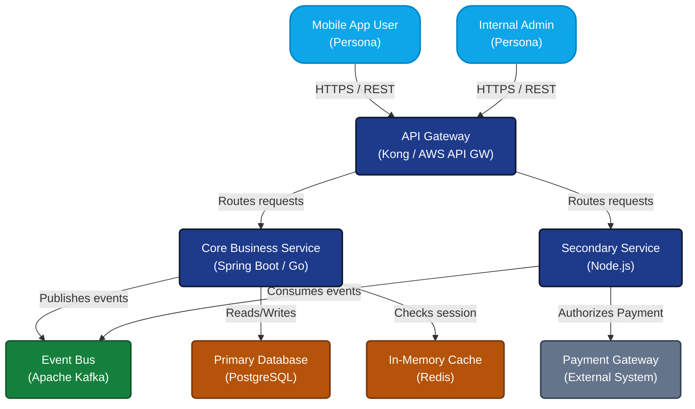

# C4 Context / Container Archetype

Use this archetype for High-Level Design (HLD) architecture diagrams. It uses strict color definitions to differentiate between personas, internal components, external systems, and databases.

