# Distributed Saga (Choreography) Archetype

Use this archetype for LLDs demonstrating distributed transactions. It explicitly maps out the happy path and the compensating transaction (rollback) path.

```mermaid
sequenceDiagram
    autonumber
    
    participant Client
    participant OrderSVC as Order Service
    participant PaySVC as Payment Service
    participant InvSVC as Inventory Service
    participant EventBus as Kafka/RabbitMQ

    Client->>OrderSVC: POST /v1/orders
    OrderSVC->>OrderSVC: Create Order (Status: PENDING)
    OrderSVC->>EventBus: Publish `OrderCreatedEvent`
    OrderSVC-->>Client: 202 Accepted

    %% Happy Path
    rect rgb(20, 83, 45)
        Note right of OrderSVC: Happy Path (Saga Forward)
        EventBus-->>PaySVC: Consume `OrderCreatedEvent`
        PaySVC->>PaySVC: Reserve Funds
        PaySVC->>EventBus: Publish `PaymentReservedEvent`
        
        EventBus-->>InvSVC: Consume `PaymentReservedEvent`
        InvSVC->>InvSVC: Allocate Stock
        InvSVC->>EventBus: Publish `InventoryAllocatedEvent`
        
        EventBus-->>OrderSVC: Consume `InventoryAllocatedEvent`
        OrderSVC->>OrderSVC: Update Order (Status: COMPLETED)
    end

    %% Rollback Path
    rect rgb(127, 29, 29)
        Note right of OrderSVC: Compensating Path (Saga Rollback)
        EventBus-->>InvSVC: Consume `PaymentReservedEvent`
        InvSVC->>InvSVC: Allocate Stock Fails! (Out of Stock)
        InvSVC->>EventBus: Publish `InventoryFailedEvent`
        
        EventBus-->>PaySVC: Consume `InventoryFailedEvent`
        PaySVC->>PaySVC: Compensating Tx: Release Funds
        PaySVC->>EventBus: Publish `PaymentRefundedEvent`
        
        EventBus-->>OrderSVC: Consume `InventoryFailedEvent`
        OrderSVC->>OrderSVC: Update Order (Status: CANCELLED)
    end
```

