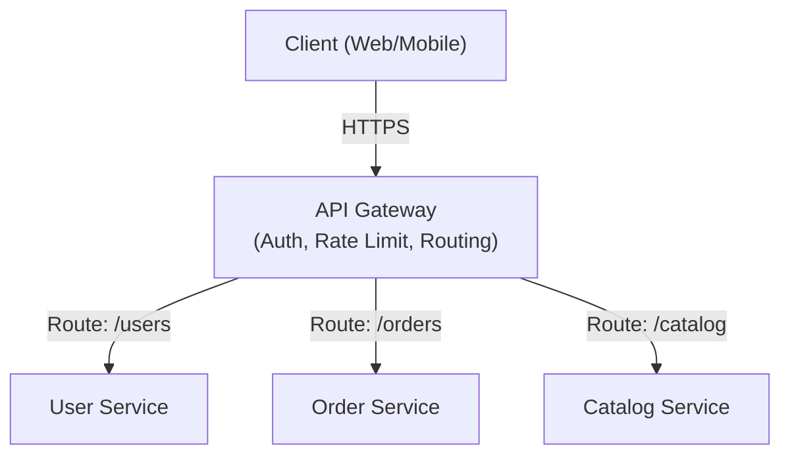

# API Gateway Pattern Archetype

```mermaid
graph TD
    Client["Client (Web/Mobile)"] -->|"HTTPS"| APIGW["API Gateway<br/>(Auth, Rate Limit, Routing)"]
    APIGW -->|"Route: /users"| UserSVC["User Service"]
    APIGW -->|"Route: /orders"| OrderSVC["Order Service"]
    APIGW -->|"Route: /catalog"| CatalogSVC["Catalog Service"]
```