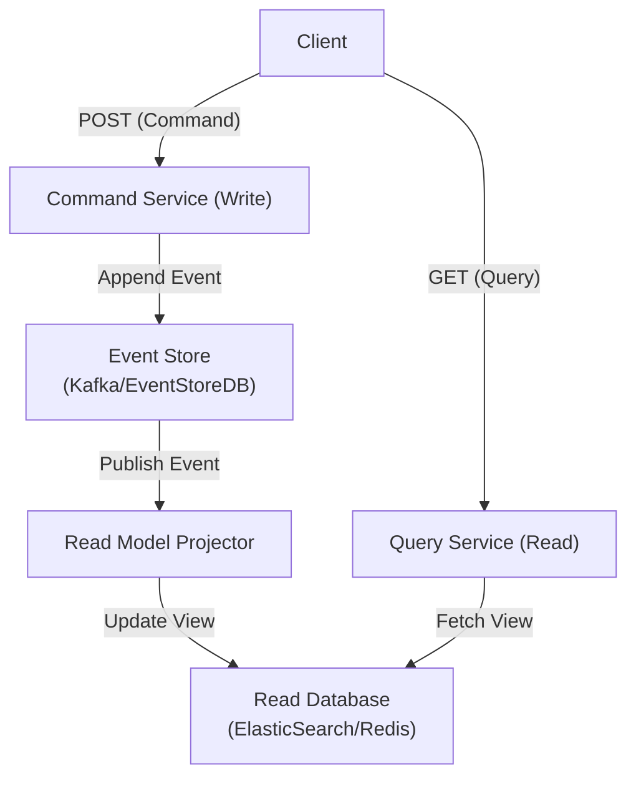

# Event Sourcing & CQRS Archetype

```mermaid
graph TD
    Client["Client"] -->|"POST (Command)"| CommandAPI["Command Service (Write)"]
    CommandAPI -->|"Append Event"| EventStore["Event Store<br/>(Kafka/EventStoreDB)"]
    EventStore -->|"Publish Event"| Projector["Read Model Projector"]
    Projector -->|"Update View"| ReadDB["Read Database<br/>(ElasticSearch/Redis)"]
    Client -->|"GET (Query)"| QueryAPI["Query Service (Read)"]
    QueryAPI -->|"Fetch View"| ReadDB
```