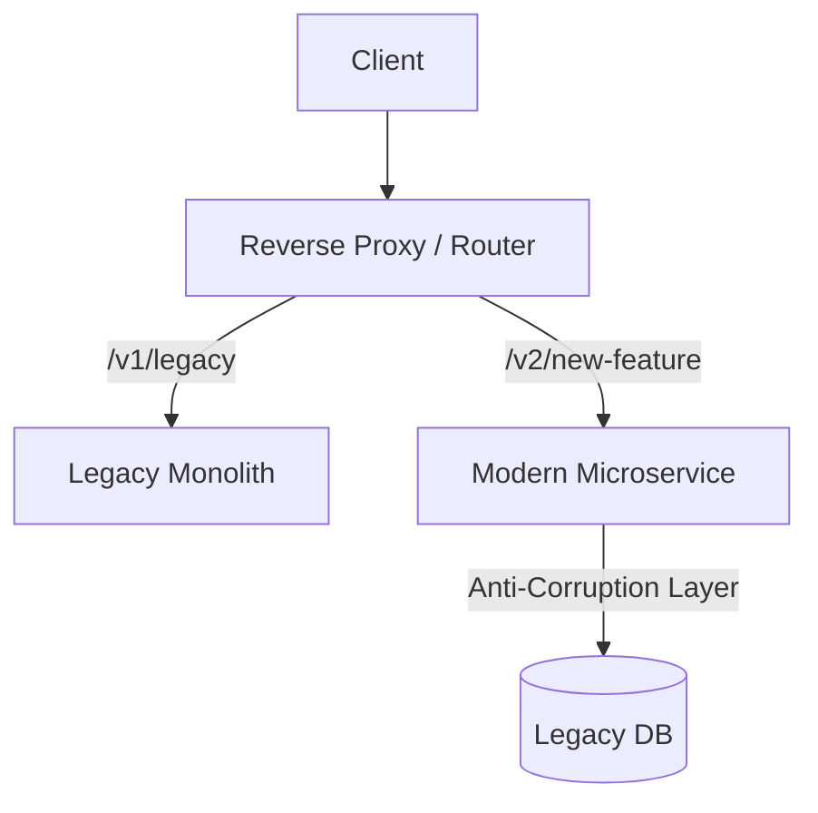

# Strangler Fig Pattern Archetype

```mermaid
graph TD
    Client["Client"] --> Router["Reverse Proxy / Router"]
    Router -->|"/v1/legacy"| Monolith["Legacy Monolith"]
    Router -->|"/v2/new-feature"| NewService["Modern Microservice"]
    NewService -->|"Anti-Corruption Layer"| MonolithDB[(Legacy DB)]
```