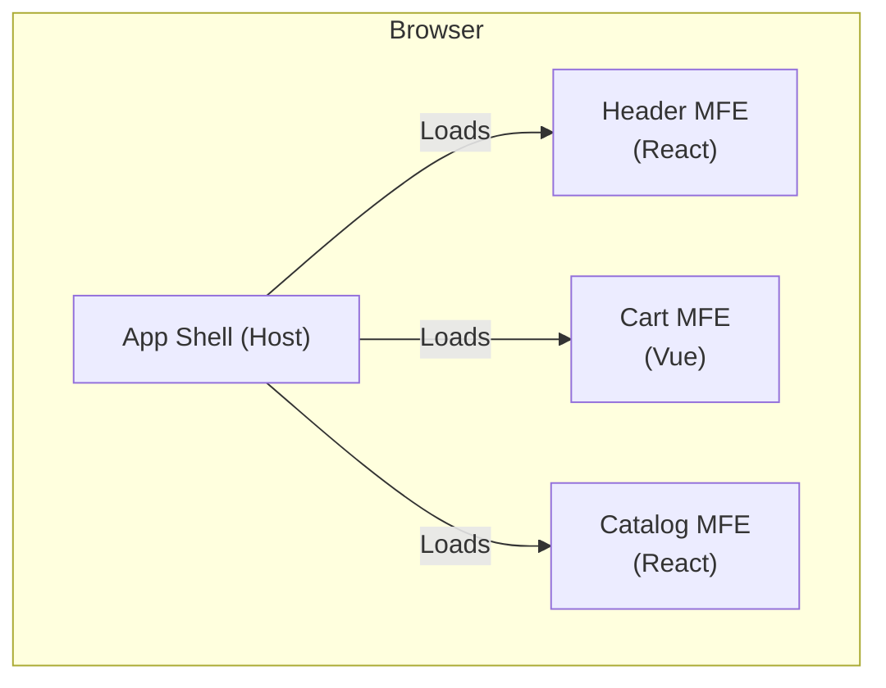

# Micro-Frontend Pattern Archetype

```mermaid
graph TD
    AppShell["App Shell (Host)"]
    subgraph Browser
        AppShell -->|"Loads"| MFE_Header["Header MFE<br/>(React)"]
        AppShell -->|"Loads"| MFE_Cart["Cart MFE<br/>(Vue)"]
        AppShell -->|"Loads"| MFE_Catalog["Catalog MFE<br/>(React)"]
    end
```