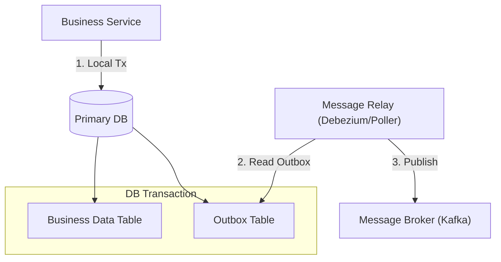

# Transactional Outbox Pattern Archetype

```mermaid
graph TD
    Service["Business Service"] -->|"1. Local Tx"| DB[(Primary DB)]
    subgraph DB Transaction
        DB_State["Business Data Table"]
        DB_Outbox["Outbox Table"]
    end
    DB --> DB_State
    DB --> DB_Outbox
    Relay["Message Relay (Debezium/Poller)"] -->|"2. Read Outbox"| DB_Outbox
    Relay -->|"3. Publish"| Broker["Message Broker (Kafka)"]
```