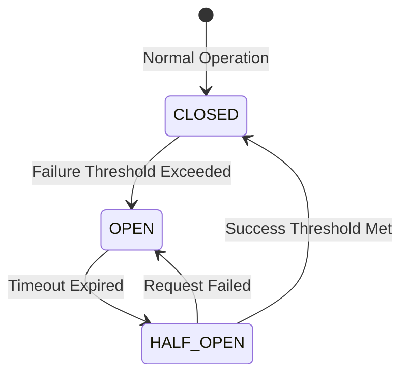

# Circuit Breaker Pattern Archetype

```mermaid
stateDiagram-v2
    [*] --> CLOSED : Normal Operation
    CLOSED --> OPEN : Failure Threshold Exceeded
    OPEN --> HALF_OPEN : Timeout Expired
    HALF_OPEN --> CLOSED : Success Threshold Met
    HALF_OPEN --> OPEN : Request Failed
```