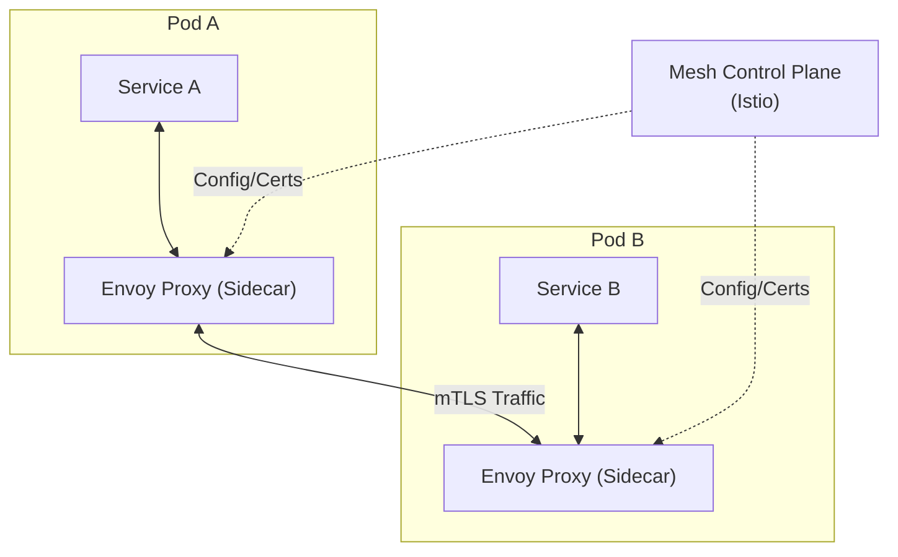

# Service Mesh (Sidecar) Archetype

```mermaid
graph TD
    subgraph Pod A
        SvcA["Service A"] <--> ProxyA["Envoy Proxy (Sidecar)"]
    end
    subgraph Pod B
        SvcB["Service B"] <--> ProxyB["Envoy Proxy (Sidecar)"]
    end
    ProxyA <-->|"mTLS Traffic"| ProxyB
    ControlPlane["Mesh Control Plane<br/>(Istio)"] -.->|"Config/Certs"| ProxyA
    ControlPlane -.->|"Config/Certs"| ProxyB
```