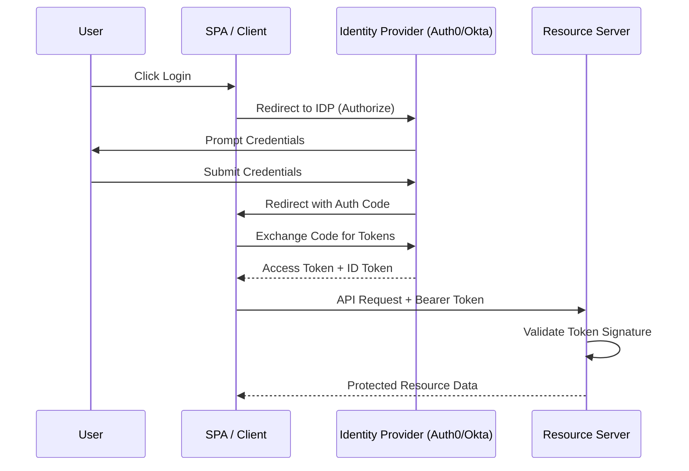

# OAuth2 / OIDC Auth Flow Archetype

```mermaid
sequenceDiagram
    participant User
    participant App as SPA / Client
    participant IDP as Identity Provider (Auth0/Okta)
    participant API as Resource Server
    
    User->>App: Click Login
    App->>IDP: Redirect to IDP (Authorize)
    IDP->>User: Prompt Credentials
    User->>IDP: Submit Credentials
    IDP->>App: Redirect with Auth Code
    App->>IDP: Exchange Code for Tokens
    IDP-->>App: Access Token + ID Token
    App->>API: API Request + Bearer Token
    API->>API: Validate Token Signature
    API-->>App: Protected Resource Data
```