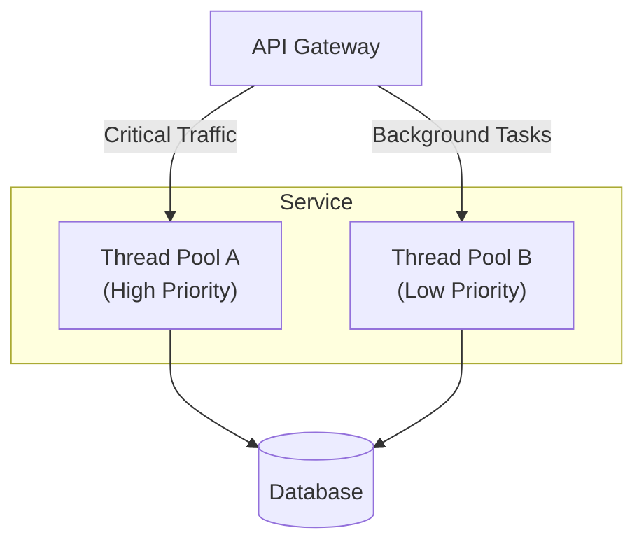

# Bulkhead Pattern Archetype

```mermaid
graph TD
    APIGW["API Gateway"]
    subgraph Service
        PoolA["Thread Pool A<br/>(High Priority)"]
        PoolB["Thread Pool B<br/>(Low Priority)"]
    end
    APIGW -->|"Critical Traffic"| PoolA
    APIGW -->|"Background Tasks"| PoolB
    PoolA --> DB[(Database)]
    PoolB --> DB
```