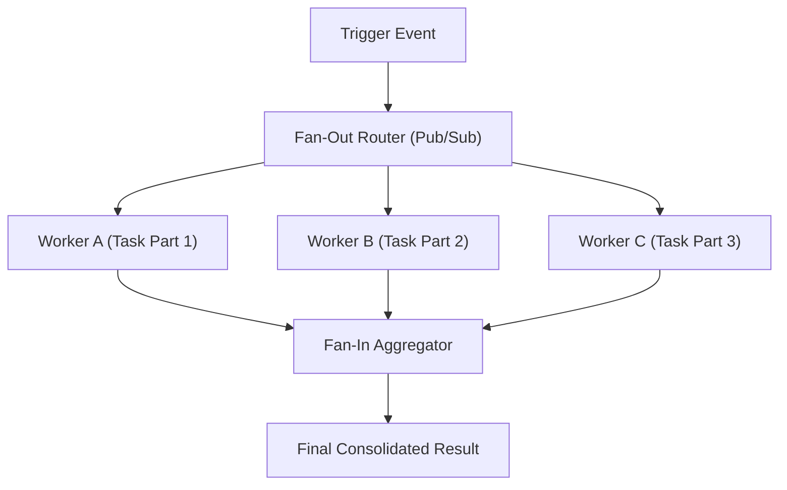

# Fan-out / Fan-in Pattern Archetype

```mermaid
graph TD
    Trigger["Trigger Event"] --> FanOut["Fan-Out Router (Pub/Sub)"]
    FanOut --> Worker1["Worker A (Task Part 1)"]
    FanOut --> Worker2["Worker B (Task Part 2)"]
    FanOut --> Worker3["Worker C (Task Part 3)"]
    Worker1 --> FanIn["Fan-In Aggregator"]
    Worker2 --> FanIn
    Worker3 --> FanIn
    FanIn --> Result["Final Consolidated Result"]
```