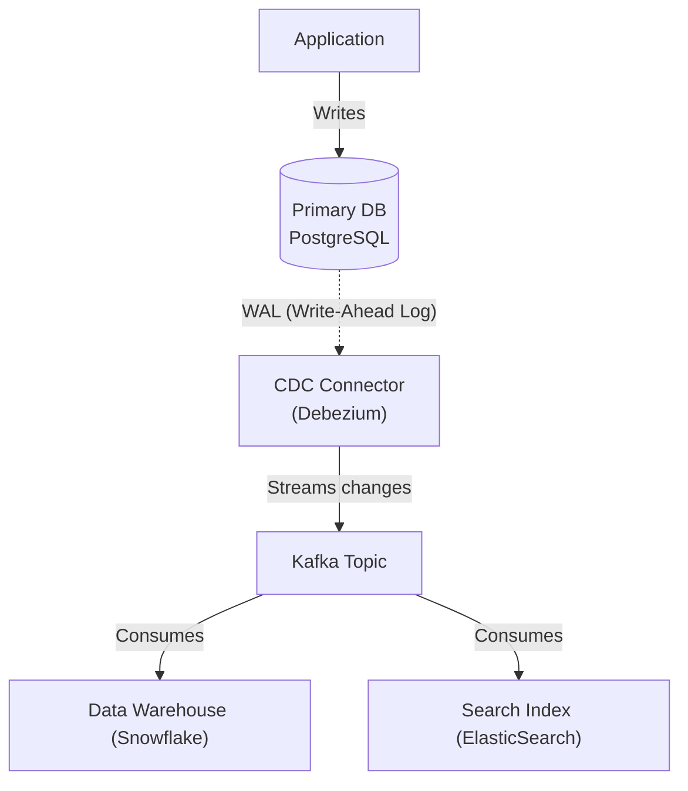

# Change Data Capture (CDC) Archetype

```mermaid
graph TD
    App["Application"] -->|"Writes"| SourceDB[(Primary DB<br/>PostgreSQL)]
    SourceDB -.->|"WAL (Write-Ahead Log)"| Debezium["CDC Connector<br/>(Debezium)"]
    Debezium -->|"Streams changes"| Kafka["Kafka Topic"]
    Kafka -->|"Consumes"| Sink1["Data Warehouse (Snowflake)"]
    Kafka -->|"Consumes"| Sink2["Search Index (ElasticSearch)"]
```