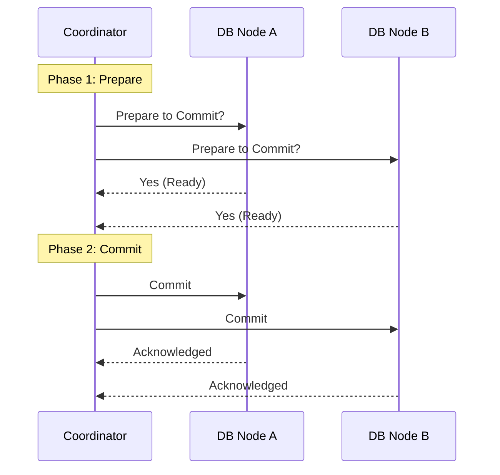

# Two-Phase Commit (2PC) Archetype

```mermaid
sequenceDiagram
    participant Coordinator
    participant NodeA as DB Node A
    participant NodeB as DB Node B
    
    Note over Coordinator: Phase 1: Prepare
    Coordinator->>NodeA: Prepare to Commit?
    Coordinator->>NodeB: Prepare to Commit?
    NodeA-->>Coordinator: Yes (Ready)
    NodeB-->>Coordinator: Yes (Ready)
    
    Note over Coordinator: Phase 2: Commit
    Coordinator->>NodeA: Commit
    Coordinator->>NodeB: Commit
    NodeA-->>Coordinator: Acknowledged
    NodeB-->>Coordinator: Acknowledged
```