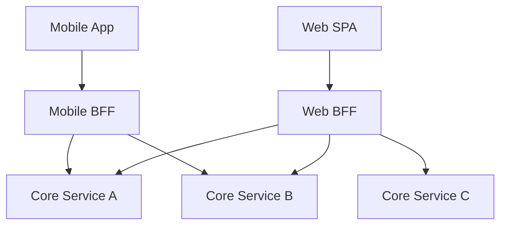

# Backends for Frontends (BFF) Archetype

```mermaid
graph TD
    MobileUI["Mobile App"] --> MobileBFF["Mobile BFF"]
    WebUI["Web SPA"] --> WebBFF["Web BFF"]
    
    MobileBFF --> SvcA["Core Service A"]
    MobileBFF --> SvcB["Core Service B"]
    
    WebBFF --> SvcA
    WebBFF --> SvcB
    WebBFF --> SvcC["Core Service C"]
```