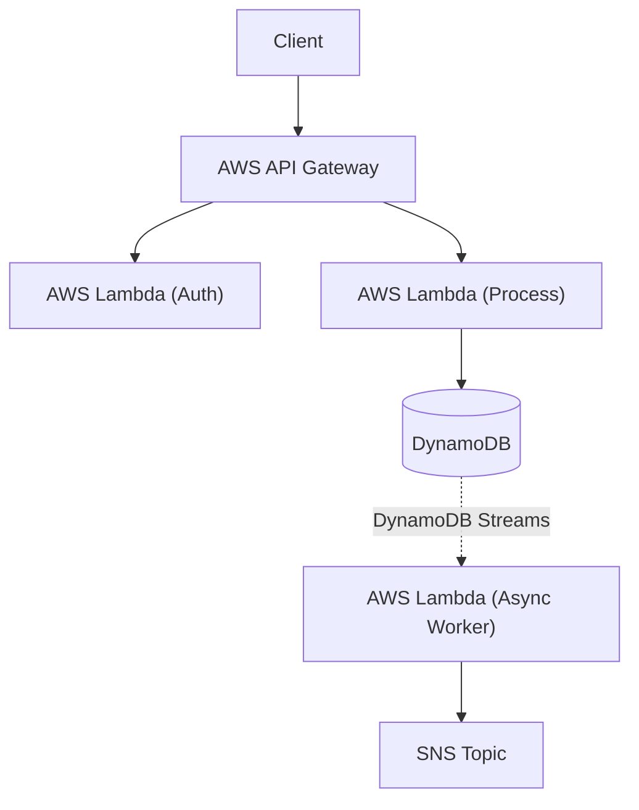

# Serverless Architecture Archetype

```mermaid
graph TD
    Client["Client"] --> APIGW["AWS API Gateway"]
    APIGW --> Lambda1["AWS Lambda (Auth)"]
    APIGW --> Lambda2["AWS Lambda (Process)"]
    Lambda2 --> Dynamo[(DynamoDB)]
    Dynamo -.->|"DynamoDB Streams"| Lambda3["AWS Lambda (Async Worker)"]
    Lambda3 --> SNS["SNS Topic"]
```