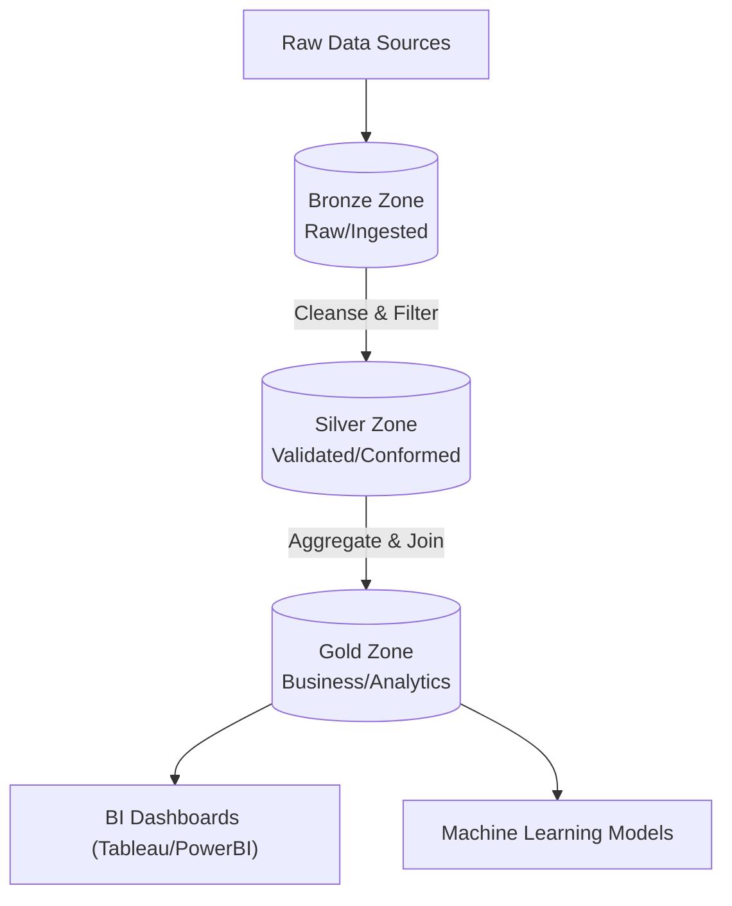

# Medallion Data Lake Archetype

```mermaid
graph TD
    Raw["Raw Data Sources"] --> Bronze[(Bronze Zone<br/>Raw/Ingested)]
    Bronze -->|"Cleanse & Filter"| Silver[(Silver Zone<br/>Validated/Conformed)]
    Silver -->|"Aggregate & Join"| Gold[(Gold Zone<br/>Business/Analytics)]
    Gold --> BI["BI Dashboards (Tableau/PowerBI)"]
    Gold --> ML["Machine Learning Models"]
```