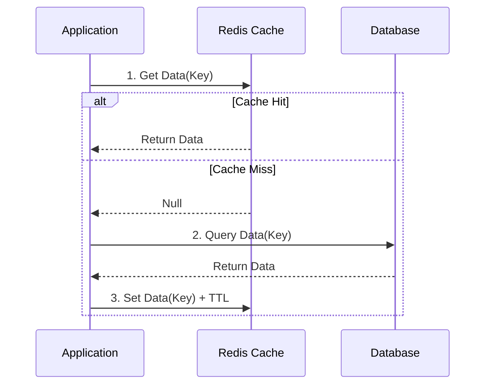

# Cache-Aside Pattern Archetype

```mermaid
sequenceDiagram
    participant App as Application
    participant Cache as Redis Cache
    participant DB as Database
    
    App->>Cache: 1. Get Data(Key)
    alt Cache Hit
        Cache-->>App: Return Data
    else Cache Miss
        Cache-->>App: Null
        App->>DB: 2. Query Data(Key)
        DB-->>App: Return Data
        App->>Cache: 3. Set Data(Key) + TTL
    end
```