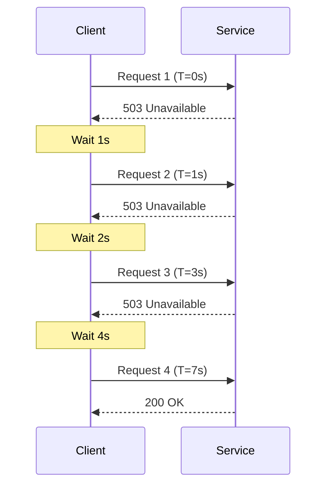

# Retry with Exponential Backoff Archetype

```mermaid
sequenceDiagram
    participant Client
    participant Service
    
    Client->>Service: Request 1 (T=0s)
    Service-->>Client: 503 Unavailable
    Note over Client: Wait 1s
    
    Client->>Service: Request 2 (T=1s)
    Service-->>Client: 503 Unavailable
    Note over Client: Wait 2s
    
    Client->>Service: Request 3 (T=3s)
    Service-->>Client: 503 Unavailable
    Note over Client: Wait 4s
    
    Client->>Service: Request 4 (T=7s)
    Service-->>Client: 200 OK
```