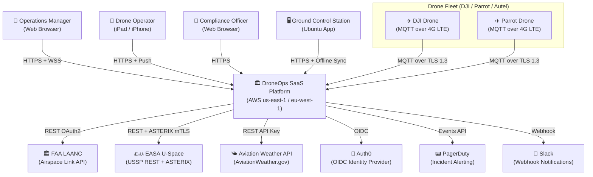
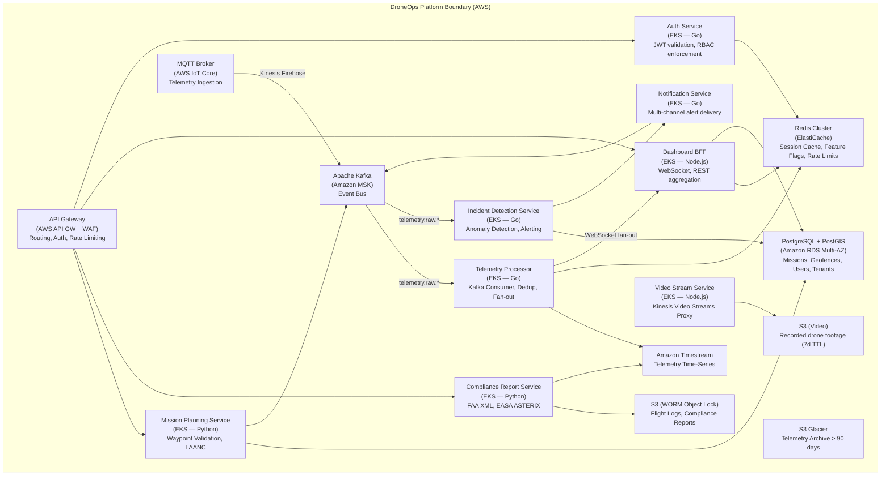
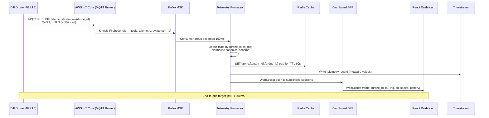
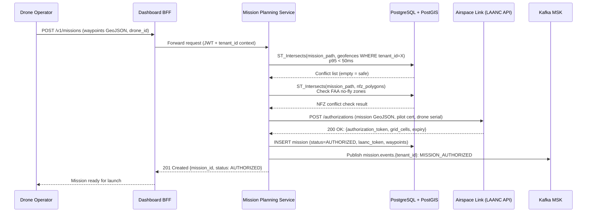
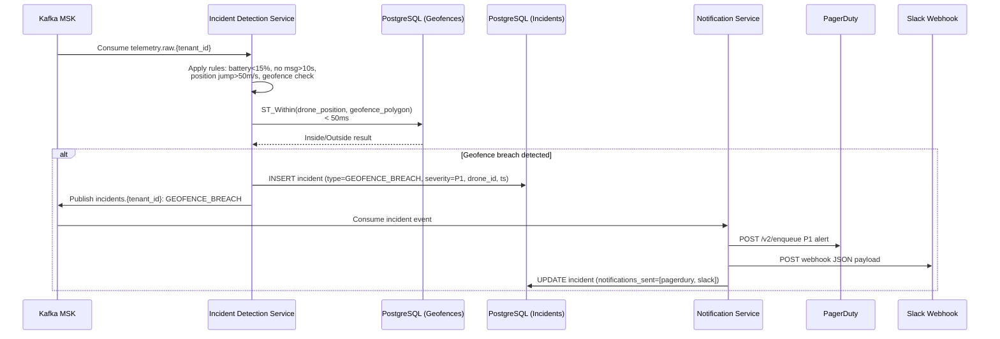
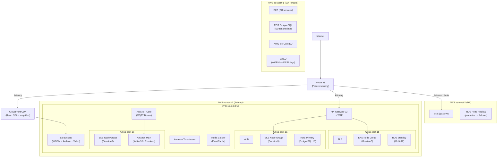

# DroneOps SaaS — High-Level Design

| Field | Value |
|-------|-------|
| **Version** | 1.0 |
| **Author** | Arch Agent (Phase 2) |
| **Status** | Draft |
| **Date** | 2026-05-15 |
| **Related Discovery** | DISC-001 |
| **ADRs** | ADR-001, ADR-002, ADR-003, ADR-004 |

---

## 1. Executive Summary

DroneOps is a multi-tenant SaaS platform that provides enterprise drone fleet management including real-time telemetry, autonomous mission planning with FAA/EASA regulatory compliance, automated incident detection, and live video streaming. The platform ingests telemetry from 25,000 concurrent drone streams via an MQTT-to-Kafka pipeline and delivers sub-500ms position updates to React dashboards via WebSocket. It is built as a cloud-native microservices platform on AWS, using PostgreSQL with PostGIS for geospatial data and Amazon Timestream for telemetry time-series. The architecture follows a pool multi-tenancy model with PostgreSQL row-level security and per-tenant Kafka topic namespacing, designed to scale from 50 enterprise customers at launch to 500 within 24 months.

---

## 2. Business Context

### 2.1 Business Drivers

- Fragmented drone operations market: enterprises manage fleets of 10-500 drones using spreadsheets and vendor apps
- Regulatory pressure: FAA Part 107 and EASA U-Space compliance obligations are manual and error-prone
- Safety risk: without real-time telemetry and incident detection, response time to drone emergencies is measured in minutes

### 2.2 Key Use Cases

| # | Use Case | Actor | Priority |
|---|----------|-------|:--------:|
| UC-01 | View live position of all fleet drones on interactive map | Operations Manager | Must |
| UC-02 | Create, validate, and submit mission for LAANC authorisation | Drone Operator | Must |
| UC-03 | Receive instant alert when drone loses signal or breaches geofence | Drone Operator | Must |
| UC-04 | Generate FAA Part 107 compliant flight log export | Compliance Officer | Must |
| UC-05 | Watch live video feed from drone camera during inspection | Drone Operator | Should |
| UC-06 | View fleet analytics: flight hours, mission completion rate | Operations Manager | Should |

### 2.3 Stakeholders

| Role | Interest |
|------|----------|
| Product Owner | Feature completeness, time-to-market |
| Engineering Lead | Architecture quality, scalability |
| CISO | FAA/EASA compliance, zero-trust security |
| SRE Team | 99.9% uptime, operational simplicity |
| Enterprise Customer | Sub-500ms telemetry, reliable alerting |

---

## 3. System Context Diagram (C4 Level 1)



---

## 4. Container Diagram (C4 Level 2)



| Container | Technology | Responsibility |
|-----------|-----------|---------------|
| API Gateway | AWS API GW v2 + WAF | Request routing, JWT auth offload, WAF rules, rate limiting |
| MQTT Broker | AWS IoT Core | MQTT ingestion from drones, per-drone X.509 mTLS, QoS Level 1 |
| Telemetry Processor | Go on EKS (HPA: 3-50 pods) | Kafka consumer, deduplication, WebSocket fan-out, Timestream write |
| Mission Planning Service | Python (FastAPI) on EKS | Waypoint validation, PostGIS geofence checks, LAANC API calls |
| Incident Detection Service | Go on EKS | Telemetry anomaly rules, GPS spoofing detection, incident lifecycle |
| Compliance Report Service | Python on EKS | FAA XML generation, EASA ASTERIX, WORM S3 storage, report signing |
| Video Stream Service | Node.js on EKS | Kinesis Video Streams proxy, signed URL generation, SRTP relay |
| Dashboard BFF | Node.js on EKS | WebSocket multiplexer, REST aggregation, React frontend serving |
| Auth Service | Go on EKS | JWKS validation, RBAC enforcement, tenant context injection |
| Notification Service | Go on EKS | Multi-channel delivery (email/Slack/PagerDuty/push), retry, DLQ |
| Apache Kafka (MSK) | Kafka 3.6 on MSK | Event bus: telemetry, mission events, incidents, compliance logs |
| PostgreSQL + PostGIS | RDS PostgreSQL 16 Multi-AZ | Missions, geofences (PostGIS), users, tenants, incidents, audit log |
| Amazon Timestream | Managed time-series DB | Drone telemetry (30d memory / 90d magnetic store) |
| Redis Cluster | ElastiCache Redis 7 (cluster mode) | WebSocket session state, last-known telemetry (60s TTL), rate limits |
| S3 WORM | S3 + Object Lock Compliance | Flight logs (3-7 years), compliance reports (7 years) |
| S3 Archive | S3 Glacier | Telemetry > 90 days |
| S3 Video | S3 Standard | Video recordings (7-30 day TTL, AES-256) |

**Design Rationale:**
The pool multi-tenancy model with PostgreSQL row-level security was chosen over silo (per-tenant DB) because at 500 tenants, silo would require 500 database instances at ~$50K/month additional cost. Pool model with RLS enforces isolation at the DB engine level — not application code — making it harder to bypass. The risk of cross-tenant leakage is mitigated by canary sentinel records in integration tests per deployment.

**Implementation Strategy:**
Each service owns its schema tables within a shared PostgreSQL instance. Row-level security policies are applied at migration time. Services connect via IAM-authenticated RDS Proxy (no connection strings in code). All tables have a `tenant_id UUID NOT NULL` column with an RLS policy: `USING (tenant_id = current_setting('app.tenant_id')::uuid)`.

---

## 5. Data Flow

### 5.1 Primary Telemetry Flow (Happy Path)



### 5.2 Mission Planning + LAANC Authorisation Flow



### 5.3 Incident Detection & Alert Flow (Async)



---

## 6. Technology Stack

| Layer | Technology | Rationale |
|-------|-----------|-----------|
| Frontend | React 18 + TypeScript + Mapbox GL JS | React ecosystem; Mapbox best-in-class for drone tracking maps with 500+ live markers |
| API Gateway | AWS API Gateway v2 (HTTP API) + AWS WAF | Managed auth offload; WAF for OWASP Top 10; per-route rate limiting; no operational overhead |
| Telemetry Ingest | AWS IoT Core (MQTT) + Kinesis Firehose | Fully managed; scales to 1M connections; per-device X.509; $1/million messages |
| Event Bus | Apache Kafka 3.6 on Amazon MSK | Industry standard for high-throughput event streaming; per-tenant topic isolation |
| Telemetry Services (Go) | Go 1.22 on EKS (Graviton3 arm64) | Go goroutines ideal for 25K concurrent WebSocket connections; Graviton3 = 25% lower energy vs x86 |
| Core Services (Python) | Python 3.12 (FastAPI) on EKS | FastAPI async; ideal for I/O-bound LAANC/EASA API calls; rich geospatial library ecosystem |
| Notification Service | Go on EKS | High-throughput, low-latency; goroutine-per-alert model |
| Primary Database | PostgreSQL 16 + PostGIS on RDS Multi-AZ | Best-in-class geospatial (PostGIS); ACID; row-level security; managed failover |
| Telemetry Time-Series | Amazon Timestream | Serverless; automatic tiering (memory → magnetic → S3); purpose-built for time-series |
| Cache | Redis 7 on ElastiCache (cluster mode) | Sub-millisecond; WebSocket session affinity; last-known telemetry buffer (60s TTL) |
| Message Queue | Amazon SQS | Dead-letter queue for failed notifications; decouples Notification Service from Kafka |
| Object Storage | Amazon S3 (+ Object Lock for compliance) | S3 WORM with Compliance Object Lock for regulatory-grade tamper-proof storage |
| Video Streaming | AWS Kinesis Video Streams | Fully managed RTSP/HLS; integrates with WebRTC for low-latency live view |
| Auth / IdP | Auth0 (OAuth 2.0 + OIDC) | SOC 2 pre-certified; enterprise SSO/SAML; 6-month build saving |
| Feature Flags | LaunchDarkly | Per-tenant targeting; kill-switch per tenant; 30-second propagation |
| Infrastructure | AWS (us-east-1 primary, eu-west-1 EU, us-west-2 DR) | AWS managed services reduce operational overhead; multi-region for data residency |
| Container Orchestration | Amazon EKS 1.29 (Graviton3 nodes) | Managed Kubernetes; Graviton3 for cost and carbon reduction |
| CI/CD | GitHub Actions + ArgoCD (GitOps) | GitHub Actions for build/test; ArgoCD for GitOps-based deployment to EKS |
| IaC | Terraform 1.8 + Terragrunt | Industry standard; per-environment state; all AWS resources defined in code |
| Observability | OpenTelemetry → CloudWatch + OpenSearch + AWS X-Ray | Unified telemetry pipeline; managed backends; service map visualisation |
| Secrets | AWS Secrets Manager + KMS CMK | Centralised secret rotation; CMK per environment; zero hardcoded secrets |

---

## 7. Integration Architecture

| Integration | Protocol | Auth | Direction | Data Format | SLA | Failure Mode |
|------------|----------|------|-----------|-------------|----:|--------------|
| DJI SDK | MQTT over TLS 1.3 | X.509 per-drone cert | Drone → Platform | Normalized JSON (via Adapter) | 99.5% | Buffer 90s; retry; signal-loss incident |
| Parrot GroundSDK | MQTT over TLS 1.3 | X.509 per-drone cert | Drone → Platform | Normalized JSON (via Adapter) | 99.0% | Buffer 60s; retry |
| FAA LAANC (Airspace Link) | REST/HTTPS | OAuth 2.0 Client Credentials | Platform → FAA | JSON | 99.0% | Queue mission; manual approval fallback |
| EASA U-Space USSP | REST/HTTPS + ASTERIX | mTLS | Platform → EASA | ASTERIX Cat-21 | 99.5% | Queue flight plan; alert compliance |
| Auth0 (OIDC) | HTTPS/OIDC | Client credentials | Platform → Auth0 | JWT | 99.9% | Cache valid JWTs 15 min; block new logins |
| Aviation Weather | REST/HTTPS | API Key | Platform → Weather | JSON | 95.0% | Serve 6-hour cached forecast |
| Airspace Link (NFZ) | REST/HTTPS | API Key + JWT | Platform → Airspace | GeoJSON | 99.0% | Serve 24-hour cached NFZ data |
| PagerDuty | REST/HTTPS | Events API Key | Platform → PagerDuty | JSON | 99.9% | Fallback to email |
| Slack | HTTPS Webhook | Signed secret | Platform → Slack | JSON | 99.0% | Log failure; email fallback |
| Customer systems | REST/HTTPS | API Key (JWT) | Bidirectional | JSON (OpenAPI 3.1) | 99.5% | Rate limiting; retry guidance in docs |

**Design Rationale:**
All external integrations are abstracted behind an integration adapter layer. Each adapter implements a standard interface (`connect()`, `call()`, `circuit_break()`). Circuit breaker thresholds: open when error rate > 50% over 10-second window; half-open after 30 seconds; close after 3 successful calls. This ensures that LAANC or Weather API degradation cannot propagate failures into the telemetry pipeline.

---

## 8. Non-Functional Requirements

| Category | Requirement | Target | Measurement |
|----------|------------|--------|-------------|
| **Availability** | Telemetry ingest + Mission API uptime | >= 99.9% monthly | External synthetic monitoring (Datadog) |
| **Latency** | Telemetry end-to-end (MQTT to WebSocket) | p95 < 500ms at 25K streams | CloudWatch + k6 load test |
| **Latency** | Mission planning API | p95 < 200ms at 500 RPS | CloudWatch |
| **Throughput** | Peak telemetry ingest | 25,000 msg/sec sustained 30 min | k6 load test |
| **Scalability** | Scale from 50 to 500 tenants | Zero redesign; auto-scale only | Architecture review |
| **RPO** | Telemetry on regional failure | < 1 minute | DR drill quarterly |
| **RTO** | Full service restoration on regional failure | < 15 minutes | DR drill quarterly |
| **Data Retention** | Flight logs (FAA) | 3 years minimum | S3 Object Lock policy |
| **Data Retention** | Flight logs (EASA EU) | 7 years minimum | S3 Object Lock policy |
| **Compliance** | SOC 2 Type II | Annual audit pass | Audit report |
| **Cost** | Platform cost per tenant | < $70/month/tenant at 500 tenants | AWS Cost Explorer |
| **Carbon** | SCI score reduction | 30% reduction by Year 2 | Green Software Foundation SCI |

---

## 9. Security Architecture

| Concern | Approach | Standard |
|---------|----------|----------|
| **Authentication (users)** | OAuth 2.0 + OIDC via Auth0; access token 15-min expiry; refresh token 7-day rotation | RFC 6749, RFC 8693 |
| **Authentication (drones)** | Mutual TLS (X.509 per-drone certificate); provisioned at onboarding; 1-year cert lifecycle | MQTT 5.0 + X.509 |
| **Authentication (services)** | JWT signed RS256; 5-min expiry; service account per service | RFC 7519 |
| **Authorization** | RBAC at tenant level (Fleet Admin/Operator/Viewer); enforced at Auth Service + API Gateway; row-level security at DB | OWASP ASVS 4.0 |
| **Encryption (transit)** | TLS 1.3 minimum for all connections; MQTT over TLS; SRTP for video streams | TLS 1.3 (RFC 8446) |
| **Encryption (rest)** | AES-256 via AWS KMS CMK; per-environment CMK; WORM S3 for compliance data | FIPS 140-2 |
| **Network Security** | VPC with private subnets for all compute; no direct internet access; NAT Gateway for egress; Security Groups with least-privilege | AWS Well-Architected |
| **Secrets Management** | AWS Secrets Manager; zero hardcoded secrets; rotation every 90 days for service credentials | CIS AWS Foundations |
| **API Security** | WAF (OWASP Core Rule Set 3.3); per-tenant rate limits (500 RPS); request size limit 1MB; CORS policy | OWASP API Security Top 10 |
| **Multi-Tenant Isolation** | PostgreSQL row-level security; per-tenant Kafka topic ACLs; namespace-level NetworkPolicies in EKS | OWASP ASVS 4.0 |
| **Audit Logging** | All security events to WORM S3 (3-year retention); pgaudit for DB queries; immutable CloudTrail | SOC 2 CC6.1 |
| **Vulnerability Management** | Trivy (container CVE scan), Semgrep (SAST), OWASP ZAP (DAST), Dependabot, Gitleaks -- all in CI | OWASP SAMM |
| **Compliance** | SOC 2 Type II; FAA Part 107; EASA U-Space; GDPR; CCPA | Annual audit |

**Design Rationale (Zero-Trust):**
The platform adopts zero-trust: every service-to-service call carries a short-lived JWT. No implicit trust within the cluster -- all inter-service calls are authenticated. Network policy restricts which pods can communicate (Telemetry Processor may call Redis and Kafka; it may NOT call PostgreSQL or external APIs). This limits blast radius if a single service is compromised.

---

## 10. Deployment Architecture

### 10.1 Infrastructure Diagram



### 10.2 Environments

| Environment | Purpose | Scale | AWS Account |
|------------|---------|-------|-------------|
| Development | Developer testing | 1 EKS node (Spot); RDS t3.medium; auto-shutdown 20 min idle | dev-account |
| Staging | Pre-production; load tests; DAST | Production-like; 3 EKS nodes; RDS r7g.large | staging-account |
| Production | Live | Full: 5-15 EKS nodes HPA; RDS r7g.2xlarge Multi-AZ | prod-account |
| EU Production | EU tenant data sovereignty | Mirrors prod; eu-west-1 | prod-eu-account |
| DR | Regional failover | Passive; RDS read replica; EKS cold nodes | prod-dr-account |

### 10.3 CI/CD Pipeline

```
commit to main →
  GitHub Actions:
    [Lint] → [Unit Tests (Go/Python)] → [SAST (Semgrep)] →
    [Container Build] → [Trivy CVE Scan] → [Integration Tests] →
    [Tenant Isolation Tests] → [DAST (OWASP ZAP on staging)] →
  ArgoCD:
    [Deploy to Staging] → [k6 Smoke Test] →
    [Blue-Green Deploy: 10% canary 10min] →
    [Full Production Rollout] → [Health Check] →
    [Auto-Rollback if health check fails within 5min]
```

**Design Rationale:**
GitOps via ArgoCD ensures the deployed state always matches the Git state. Blue-green deployment with a 10% canary window allows real traffic validation before full rollout. Auto-rollback removes human dependency for recovery, achieving RTO < 5 minutes for deployment failures.

---

## 11. Cost Estimate

| Service | Monthly (Expected) | Monthly (Peak) | Notes |
|---------|:-----------------:|:--------------:|-------|
| EKS (Graviton3 nodes) | $4,200 | $8,500 | 5-15 nodes HPA |
| Amazon MSK (Kafka) | $2,800 | $4,200 | 3 brokers, r7g.large |
| RDS PostgreSQL Multi-AZ | $1,800 | $2,400 | r7g.2xlarge primary + standby |
| Amazon Timestream | $1,200 | $2,800 | ~2TB/month ingestion |
| ElastiCache Redis | $800 | $1,200 | r7g.large cluster |
| AWS IoT Core | $1,500 | $6,000 | 5M msgs/day → 25M msgs/day |
| AWS API Gateway | $300 | $900 | 10M → 50M req/month |
| S3 (all buckets) | $800 | $1,500 | WORM + archive + video |
| CloudFront | $200 | $600 | React SPA + map tiles |
| Kinesis Video Streams | $1,200 | $3,600 | 50-300 concurrent streams |
| Data Transfer | $600 | $1,800 | Egress to drones + browsers |
| Auth0 | $1,200 | $2,400 | $0.023/MAU; 50K-100K MAU |
| Airspace Link | $500 | $500 | Fixed SaaS subscription |
| LaunchDarkly | $1,000 | $1,000 | Fixed SaaS |
| Monitoring/CloudWatch | $400 | $800 | Logs + metrics + X-Ray |
| **Total** | **~$18,300** | **~$38,200** | Within $35K target at launch |

**3-Year TCO:** $10.1M total (infra + SaaS + personnel). Break-even at 210 enterprise customers ($48K ACV).

---

## 12. Key Architecture Decisions

| # | Decision | Rationale | ADR |
|---|----------|-----------|-----|
| 1 | Pool multi-tenancy with PostgreSQL RLS over silo model | 500 silo DBs = $50K/month additional cost; RLS enforces isolation at DB engine level | ADR-001 |
| 2 | AWS IoT Core over self-managed MQTT broker (EMQX/Mosquitto) | Managed; scales to 1M connections; per-device X.509 built-in; no operational overhead | ADR-002 |
| 3 | Amazon Timestream over InfluxDB or ClickHouse | Serverless; auto-tiering memory→magnetic→Glacier; no cluster management; $0.50/GB | ADR-003 |
| 4 | Active-Passive DR (Option B) over Active-Active (Option A) | $52K/month cost difference; 1-min RPO acceptable per discovery Q1; Option A path retained for Year 2 | ADR-004 |

---

## 13. Risks & Mitigations

| # | Risk | Probability | Impact | Mitigation |
|---|------|:-----------:|:------:|-----------|
| 1 | Cross-tenant data leakage via RLS misconfiguration | LOW | CRITICAL | Canary sentinel records per tenant; tenant isolation test suite in CI on every deployment |
| 2 | Kafka consumer lag spike during shift start burst (500 drones × 500 tenants) | MEDIUM | HIGH | Pre-warm 10 extra consumer pods 5 min before shift window; Kafka lag alert at 10K |
| 3 | GPS spoofing causes false telemetry / compliance log tampering | MEDIUM | HIGH | Cross-validate GPS with barometric alt + accelerometer; ML anomaly detection (Year 2) |
| 4 | FAA LAANC API degradation grounds customer fleet | LOW | HIGH | Manual approval fallback workflow; queue missions; SLA monitoring with Airspace Link |
| 5 | GDPR erasure request conflicts with FAA 3-year retention | MEDIUM | MEDIUM | Regulatory-retention flag on flight logs; legal disclosure in ToS; legal review before EU launch |
| 6 | Auth0 outage blocks all user logins | LOW | HIGH | Cache last-valid JWTs for 15 min; degraded mode allows existing sessions to continue |
| 7 | DJI SDK breaking change disrupts telemetry for all DJI customers | LOW | HIGH | Drone Adapter Layer pattern isolates SDK changes to adapter module only; quarterly SDK review cycle |

---

## 14. Roadmap

| Phase | Scope | Timeline |
|-------|-------|----------|
| Phase 1 (MVP) | Core telemetry pipeline, real-time map, basic mission planning, signal-loss alerting, FAA Part 107 log export | Month 1-6 |
| Phase 2 (Launch) | Geofence management, LAANC integration, incident detection (all types), compliance dashboard, public REST API v1, webhooks | Month 7-12 |
| Phase 3 (EU Expansion) | EASA U-Space integration, eu-west-1 data residency, GDPR compliance, video streaming, multi-language support | Month 9-15 |
| Phase 4 (Scale) | Autel drone SDK, analytics warehouse, Active-Active DR migration, mobile SDK for operators, India DGCA NPNT | Month 13-24 |

---

## Appendix

### A. ADR Summary

**ADR-001: Pool Multi-Tenancy with RLS**
Decision: Use shared PostgreSQL with row-level security over per-tenant database isolation.
Status: Accepted. Review trigger: > 500 tenants OR tenant with > 100GB individual data.

**ADR-002: AWS IoT Core for MQTT**
Decision: Use managed AWS IoT Core over self-hosted EMQX or Mosquitto.
Status: Accepted. Exit trigger: Cost exceeds $15K/month (estimated at 750M messages/month).

**ADR-003: Amazon Timestream for Telemetry**
Decision: Use serverless Timestream over InfluxDB or ClickHouse self-hosted.
Status: Accepted. Review trigger: Query latency > 1s p95 at 6-month data volume.

**ADR-004: Active-Passive DR (Option B)**
Decision: Single-region primary with passive DR over Active-Active multi-region.
Status: Accepted. Revisit at 200+ tenants or if enterprise SLAs require < 30s RTO.

### B. Glossary

| Term | Definition |
|------|-----------|
| LAANC | Low Altitude Authorization and Notification Capability (FAA airspace authorization) |
| ASTERIX | All Purpose STructured Eurocontrol SuRveillance Information eXchange (EASA format) |
| RLS | Row-Level Security (PostgreSQL feature enforcing per-row access control) |
| BFF | Backend for Frontend (service layer tailored to a specific UI client's needs) |
| MSK | Amazon Managed Streaming for Apache Kafka |
| WORM | Write Once Read Many (tamper-proof storage for compliance records) |
| GCS | Ground Control Station (operator laptop/workstation running drone control software) |

---

*Archpilot HLD v4.0 | DroneOps SaaS | Generated by Arch Agent (Phase 2)*
*Created by Gaurav Sharma | Governed by rules/03-hld-standards.md*
