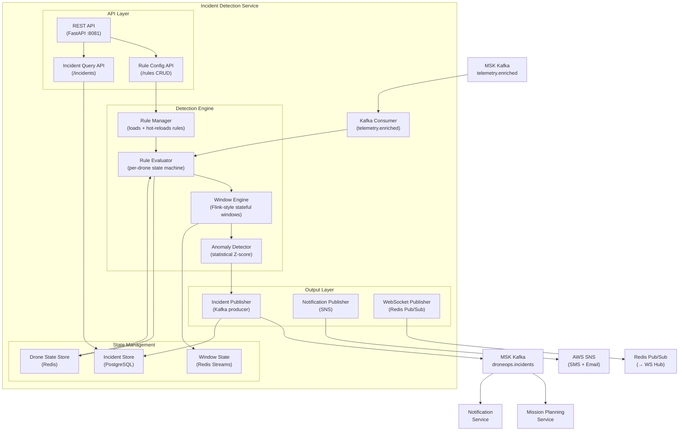
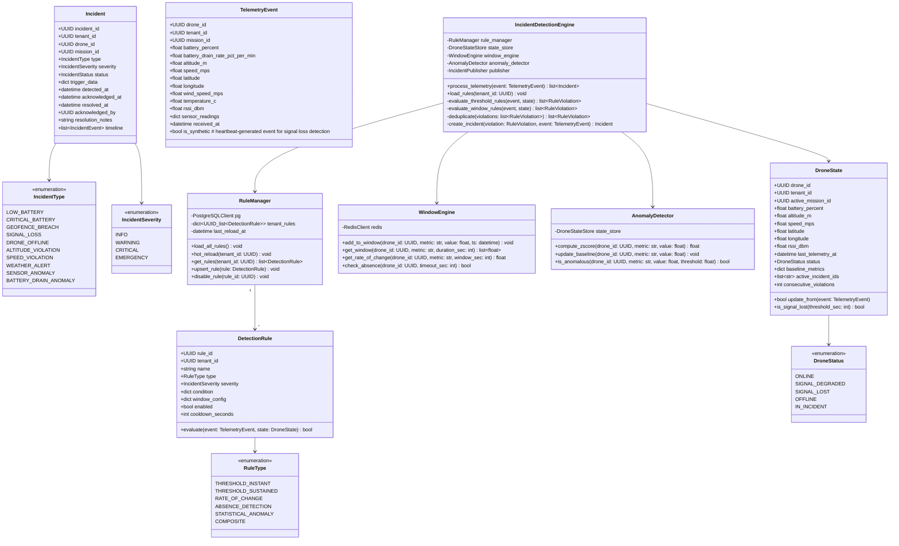
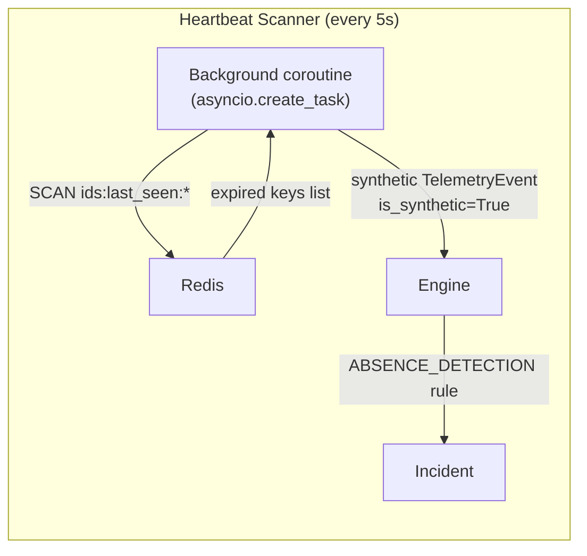
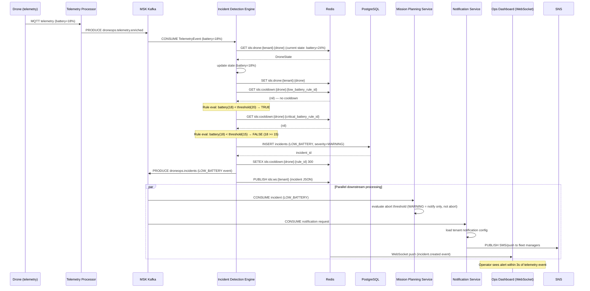
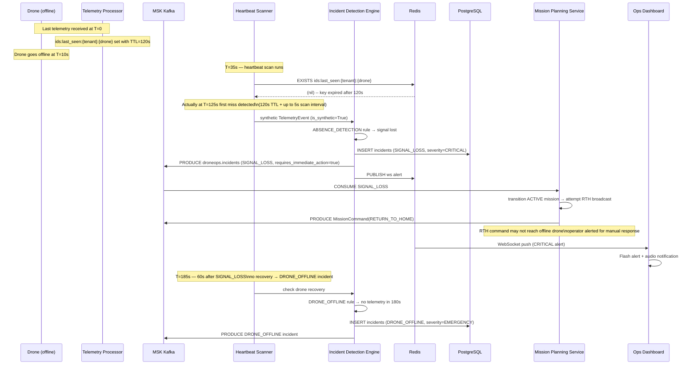
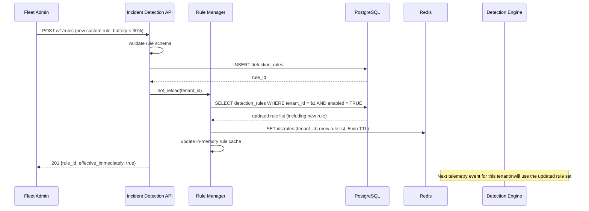

# Low-Level Design: Incident Detection Service

**Version:** 1.0  
**Date:** 2026-05-15  
**Author:** Arch Agent — Phase 3  
**Parent HLD:** Design_HLD.md  
**Epic Coverage:** EP-04 (Incident Detection), EP-09 (NFR — Availability/Alerting), EP-07 (Security)

---

## 1. Service Overview

The Incident Detection Service (IDS) is the real-time safety monitoring brain of the DroneOps platform. It consumes enriched telemetry events from Kafka, evaluates multi-condition detection rules against a stateful window engine, and produces actionable incidents within 5 seconds of the triggering event. Incidents route to the Notification Service (SMS/email/push) and the Ops Dashboard via WebSocket within the same 5-second SLA.

**Bounded context:** Incident lifecycle from detection → classification → notification → acknowledgement → resolution. IDS does not act on incidents — it detects and classifies. Automated remediation (e.g., RTH commands) is triggered by the Mission Planning Service upon receiving an incident event.

**Detection scope:**
| Incident Type | Triggering Signal | Max Detection Latency |
|--------------|-------------------|----------------------|
| Low battery | battery_percent < threshold | 3s |
| Critical battery | battery_percent < 15% | 1s |
| Geofence breach | position outside permitted zone | 2s |
| Signal loss | no telemetry for >30s | 35s (detection window) |
| Altitude violation | altitude_m > regulatory limit | 2s |
| Speed violation | speed_mps > allowed limit | 2s |
| Weather alert | wind_speed or temperature threshold | 5s |
| Drone offline | signal loss + no RTH confirmation | 60s |
| Sensor anomaly | accelerometer/gyro Z-score > 3σ | 5s |
| Battery drain rate | drain_rate > 2×baseline | 10s |

---

## 1b. Design Rationale

The Incident Detection Service uses a pull-based Kafka consumer model rather than a push-based Lambda/event-bridge model because detection requires stateful context (sliding windows, baseline statistics, cooldown tracking) across sequential events from the same drone. A stateless Lambda invocation cannot maintain per-drone window buffers between invocations without external state lookups on every event, which would exceed the 50ms processing budget at 25K events/sec. The Kafka consumer model keeps drone state in Redis (<1ms p99 local reads) and processes events in guaranteed sequence per partition.

Statistical anomaly detection (Z-score via Welford's online algorithm) was chosen over fixed threshold rules for sensor anomalies because drone sensor baselines vary significantly across hardware models, environmental conditions, and payloads. A fixed accelerometer threshold that is correct for a DJI Matrice 300 would generate false positives for a Parrot ANAFI carrying a heavy inspection camera in high-wind conditions. The baseline learns per-drone over 30+ samples before it starts firing, which eliminates the majority of false positives seen in threshold-only systems.

Signal loss detection via a heartbeat scanner (synthetic events for expired Redis keys) was chosen over Kafka stream time-out detection because Kafka's consumer timeout requires a message from the partition to have a timestamp gap — this only works if the drone was the only producer on its partition. At our partitioning scheme (multiple drones per partition), a quiet drone would not block the partition timer from advancing. The Redis TTL approach is drone-granular and independent of Kafka partition activity.

## 1c. Implementation Strategy

**Phase 1 (MVP — weeks 1-4):** Implement threshold-only rules (battery, altitude, speed). Kafka consumer with manual offset commit. Redis drone state store. PostgreSQL incident persistence. Kafka incident event producer. Basic REST API for incident query. Platform default rules hardcoded (no tenant customization yet).

**Phase 2 (weeks 5-8):** Add sliding window engine (Redis Sorted Sets). Rate-of-change rules (battery drain). Signal loss heartbeat scanner. Kafka DLQ routing for failed events. Incident deduplication (cooldown locks). WebSocket push to Ops Dashboard via Redis Pub/Sub.

**Phase 3 (weeks 9-12):** Statistical anomaly detector (Welford baseline). Tenant custom rule CRUD API with schema validation. Rule hot-reload without service restart. Composite rule support. KEDA autoscaling deployment. Load test at 250K events/sec (Year 2 peak).

**Phase 4 (post-MVP):** ML-based anomaly models (per-drone behavioral baselines). Incident correlation (multiple concurrent incidents on same mission). Automated runbook triggering (OpsGenie integration).

---

## 2. Component Diagram



---

## 3. Class Diagram



---

## 4. Data Model

### 4.1 PostgreSQL Schema

```sql
CREATE TABLE detection_rules (
    rule_id         UUID PRIMARY KEY DEFAULT gen_random_uuid(),
    tenant_id       UUID,           -- NULL = platform default rule (applies to all tenants)
    name            VARCHAR(255) NOT NULL,
    description     TEXT,
    type            VARCHAR(50) NOT NULL,
    severity        VARCHAR(20) NOT NULL CHECK (severity IN ('INFO','WARNING','CRITICAL','EMERGENCY')),
    condition       JSONB NOT NULL,  -- rule logic (threshold, window, composite expression)
    window_config   JSONB,           -- {duration_sec: 30, aggregation: 'avg'}
    enabled         BOOLEAN NOT NULL DEFAULT TRUE,
    cooldown_seconds INT NOT NULL DEFAULT 300,  -- min time between same incident type
    created_at      TIMESTAMPTZ NOT NULL DEFAULT NOW(),
    updated_at      TIMESTAMPTZ NOT NULL DEFAULT NOW(),
    created_by      UUID NOT NULL
);

-- Sample condition JSONB structures:
-- Threshold instant: {"field": "battery_percent", "operator": "<", "value": 20}
-- Threshold sustained: {"field": "altitude_m", "operator": ">", "value": 120, "sustained_sec": 10}
-- Composite: {"operator": "AND", "conditions": [{"field": "rssi_dbm", "operator": "<", "value": -90}, {"field": "speed_mps", "operator": ">", "value": 0}]}
-- Absence: {"absence_timeout_sec": 30}
-- Rate of change: {"field": "battery_percent", "rate_threshold": -2.0, "window_sec": 60}

CREATE INDEX idx_rules_tenant ON detection_rules(tenant_id) WHERE enabled = TRUE;

CREATE TABLE incidents (
    incident_id         UUID PRIMARY KEY DEFAULT gen_random_uuid(),
    tenant_id           UUID NOT NULL,
    drone_id            UUID NOT NULL,
    mission_id          UUID,
    rule_id             UUID REFERENCES detection_rules(rule_id),
    type                VARCHAR(50) NOT NULL,
    severity            VARCHAR(20) NOT NULL,
    status              VARCHAR(20) NOT NULL DEFAULT 'OPEN'
                        CHECK (status IN ('OPEN','ACKNOWLEDGED','RESOLVED','AUTO_RESOLVED','SUPPRESSED')),
    trigger_data        JSONB NOT NULL,  -- snapshot of telemetry values at detection time
    detected_at         TIMESTAMPTZ NOT NULL DEFAULT NOW(),
    acknowledged_at     TIMESTAMPTZ,
    resolved_at         TIMESTAMPTZ,
    acknowledged_by     UUID,
    resolution_notes    TEXT,
    auto_resolved       BOOLEAN NOT NULL DEFAULT FALSE,
    notification_sent   BOOLEAN NOT NULL DEFAULT FALSE,
    dedup_key           VARCHAR(255) NOT NULL,  -- prevents duplicate incidents: {drone_id}:{type}:{rule_id}
    created_at          TIMESTAMPTZ NOT NULL DEFAULT NOW(),
    updated_at          TIMESTAMPTZ NOT NULL DEFAULT NOW()
) PARTITION BY RANGE (detected_at);

CREATE TABLE incidents_2026_q2 PARTITION OF incidents
    FOR VALUES FROM ('2026-04-01') TO ('2026-07-01');

CREATE UNIQUE INDEX idx_incidents_dedup ON incidents(dedup_key, status)
    WHERE status = 'OPEN';  -- only one OPEN incident per drone+type at a time

CREATE INDEX idx_incidents_tenant_time ON incidents(tenant_id, detected_at DESC);
CREATE INDEX idx_incidents_drone ON incidents(drone_id, status);
CREATE INDEX idx_incidents_mission ON incidents(mission_id) WHERE mission_id IS NOT NULL;

CREATE TABLE incident_timeline_events (
    event_id        UUID PRIMARY KEY DEFAULT gen_random_uuid(),
    incident_id     UUID NOT NULL REFERENCES incidents(incident_id),
    tenant_id       UUID NOT NULL,
    event_type      VARCHAR(100) NOT NULL,
    actor_id        UUID,
    payload         JSONB NOT NULL DEFAULT '{}',
    occurred_at     TIMESTAMPTZ NOT NULL DEFAULT NOW()
);

CREATE INDEX idx_timeline_incident ON incident_timeline_events(incident_id, occurred_at);
```

### 4.2 Redis Schema

| Key Pattern | Type | TTL | Content |
|-------------|------|-----|---------|
| `ids:drone:{tenant_id}:{drone_id}` | Hash | 5min (refreshed on telemetry) | DroneState fields |
| `ids:window:{drone_id}:{metric}` | Sorted Set | 10min | Score=timestamp, Value=float reading |
| `ids:baseline:{drone_id}:{metric}` | Hash | 7 days | `{mean, stddev, sample_count}` |
| `ids:cooldown:{drone_id}:{rule_id}` | String (NX+EX) | cooldown_seconds | Incident dedup lock |
| `ids:rules:{tenant_id}` | String (JSON) | 5min | Serialized DetectionRule list |
| `ids:last_seen:{tenant_id}:{drone_id}` | String | 120s | Last telemetry timestamp (Unix ms) |

**Signal loss detection key:** `ids:last_seen:{tenant_id}:{drone_id}` expires at 120s. A background heartbeat scanner checks for expired keys every 5s and generates synthetic `ABSENCE` telemetry events. This ensures signal loss is detected even when no telemetry flows (no Kafka message means no consumer callback).

### 4.3 Kafka Topics (Consumer + Producer)

**Consumed:**
| Topic | Consumer Group | Partition Assignment |
|-------|---------------|----------------------|
| `droneops.telemetry.enriched` | `ids-consumer-group` | All partitions (sticky assignor) |

**Produced:**
| Topic | Key | Retention | Message Schema |
|-------|-----|-----------|----------------|
| `droneops.incidents` | `{tenant_id}:{drone_id}` | 30 days | IncidentEvent (Avro) |
| `droneops.notifications.requests` | `tenant_id` | 7 days | NotificationRequest (Avro) |

```json
// IncidentEvent Avro schema
{
  "namespace": "com.droneops.incidents",
  "type": "record",
  "name": "IncidentEvent",
  "fields": [
    {"name": "incident_id", "type": "string"},
    {"name": "tenant_id", "type": "string"},
    {"name": "drone_id", "type": "string"},
    {"name": "mission_id", "type": ["null", "string"], "default": null},
    {"name": "type", "type": "string"},
    {"name": "severity", "type": "string"},
    {"name": "detected_at_ms", "type": "long"},
    {"name": "trigger_data", "type": "string"},  -- JSON blob
    {"name": "requires_immediate_action", "type": "boolean"}
  ]
}
```

---

## 5. Detection Rules Engine

### 5.1 Built-in Platform Rules (Default for All Tenants)

```python
DEFAULT_RULES = [
    DetectionRule(
        rule_id=UUID("00000000-0000-0000-0000-000000000001"),
        tenant_id=None,  # applies globally
        name="Critical Battery",
        type=RuleType.THRESHOLD_INSTANT,
        severity=IncidentSeverity.EMERGENCY,
        condition={"field": "battery_percent", "operator": "<", "value": 15},
        cooldown_seconds=60,
    ),
    DetectionRule(
        rule_id=UUID("00000000-0000-0000-0000-000000000002"),
        tenant_id=None,
        name="Low Battery",
        type=RuleType.THRESHOLD_INSTANT,
        severity=IncidentSeverity.WARNING,
        condition={"field": "battery_percent", "operator": "<", "value": 25},
        cooldown_seconds=300,
    ),
    DetectionRule(
        rule_id=UUID("00000000-0000-0000-0000-000000000003"),
        tenant_id=None,
        name="Signal Loss",
        type=RuleType.ABSENCE_DETECTION,
        severity=IncidentSeverity.CRITICAL,
        condition={"absence_timeout_sec": 30},
        cooldown_seconds=60,
    ),
    DetectionRule(
        rule_id=UUID("00000000-0000-0000-0000-000000000004"),
        tenant_id=None,
        name="FAA Altitude Limit Exceeded",
        type=RuleType.THRESHOLD_INSTANT,
        severity=IncidentSeverity.CRITICAL,
        condition={"field": "altitude_m", "operator": ">", "value": 120},  # 400ft = 121.9m
        cooldown_seconds=30,
    ),
    DetectionRule(
        rule_id=UUID("00000000-0000-0000-0000-000000000005"),
        tenant_id=None,
        name="Battery Drain Anomaly",
        type=RuleType.RATE_OF_CHANGE,
        severity=IncidentSeverity.WARNING,
        condition={"field": "battery_percent", "rate_threshold": -2.0, "window_sec": 60},
        cooldown_seconds=600,
    ),
    DetectionRule(
        rule_id=UUID("00000000-0000-0000-0000-000000000006"),
        tenant_id=None,
        name="Sensor IMU Anomaly",
        type=RuleType.STATISTICAL_ANOMALY,
        severity=IncidentSeverity.WARNING,
        condition={"field": "accelerometer_magnitude", "zscore_threshold": 3.0},
        cooldown_seconds=120,
    ),
]
```

### 5.2 Rule Evaluation Pipeline

```python
async def process_telemetry(self, event: TelemetryEvent) -> list[Incident]:
    # 1. Load current drone state
    state = await self.state_store.get(event.tenant_id, event.drone_id)
    if not state:
        state = DroneState.initial(event.drone_id, event.tenant_id)

    # 2. Update drone state with new telemetry
    state.update_from(event)
    await self.state_store.save(state)

    # 3. Update sliding window buffers
    for field in WINDOW_TRACKED_FIELDS:
        if (value := getattr(event, field, None)) is not None:
            await self.window_engine.add_to_window(
                event.drone_id, field, value, event.received_at
            )

    # 4. Update anomaly detector baseline (Welford's online algorithm)
    await self.anomaly_detector.update_baseline(event.drone_id, event)

    # 5. Load applicable rules (platform defaults + tenant overrides)
    rules = await self.rule_manager.get_rules(event.tenant_id)

    # 6. Evaluate each rule
    violations = []
    for rule in rules:
        if not rule.enabled:
            continue

        # Check cooldown — skip if same incident type still active
        cooldown_key = f"ids:cooldown:{event.drone_id}:{rule.rule_id}"
        if await self.redis.exists(cooldown_key):
            continue

        violated = await self._evaluate_rule(rule, event, state)
        if violated:
            violations.append(RuleViolation(rule=rule, event=event, state=state))

    # 7. Deduplicate (remove lower-severity violations for same drone+type)
    deduplicated = self._deduplicate(violations)

    # 8. Create and publish incidents
    incidents = []
    for v in deduplicated:
        incident = await self._create_incident(v)
        incidents.append(incident)

        # Set cooldown lock (prevents duplicate incidents during cooldown)
        await self.redis.setex(
            f"ids:cooldown:{event.drone_id}:{v.rule.rule_id}",
            v.rule.cooldown_seconds,
            "1"
        )

    return incidents
```

### 5.3 Rule Evaluators

```python
async def _evaluate_rule(
    self, rule: DetectionRule, event: TelemetryEvent, state: DroneState
) -> bool:
    match rule.type:
        case RuleType.THRESHOLD_INSTANT:
            return self._eval_threshold(rule.condition, event)

        case RuleType.THRESHOLD_SUSTAINED:
            window = await self.window_engine.get_window(
                event.drone_id,
                rule.condition["field"],
                rule.condition["sustained_sec"]
            )
            if not window:
                return False
            # ALL readings in window must violate threshold
            return all(
                self._compare(v, rule.condition["operator"], rule.condition["value"])
                for v in window
            )

        case RuleType.RATE_OF_CHANGE:
            rate = await self.window_engine.get_rate_of_change(
                event.drone_id,
                rule.condition["field"],
                rule.condition["window_sec"]
            )
            return rate is not None and rate < rule.condition["rate_threshold"]

        case RuleType.ABSENCE_DETECTION:
            return state.is_signal_lost(rule.condition["absence_timeout_sec"])

        case RuleType.STATISTICAL_ANOMALY:
            field_value = getattr(event, rule.condition["field"], None)
            if field_value is None:
                return False
            return await self.anomaly_detector.is_anomalous(
                event.drone_id,
                rule.condition["field"],
                field_value,
                rule.condition["zscore_threshold"]
            )

        case RuleType.COMPOSITE:
            return await self._eval_composite(rule.condition, event, state)

def _eval_threshold(self, condition: dict, event: TelemetryEvent) -> bool:
    value = getattr(event, condition["field"], None)
    if value is None:
        return False
    return self._compare(value, condition["operator"], condition["value"])

def _compare(self, a: float, op: str, b: float) -> bool:
    return {
        "<": a < b, "<=": a <= b, ">": a > b, ">=": a >= b, "==": a == b
    }[op]
```

### 5.4 Baseline Tracking (Welford's Online Algorithm)

```python
class AnomalyDetector:
    async def update_baseline(self, drone_id: UUID, event: TelemetryEvent) -> None:
        for field in ANOMALY_TRACKED_FIELDS:
            value = getattr(event, field, None)
            if value is None:
                continue

            key = f"ids:baseline:{drone_id}:{field}"
            baseline = await self._load_baseline(key)

            # Welford's online algorithm for running mean and variance
            baseline["n"] += 1
            delta = value - baseline["mean"]
            baseline["mean"] += delta / baseline["n"]
            delta2 = value - baseline["mean"]
            baseline["m2"] += delta * delta2

            if baseline["n"] >= 2:
                baseline["variance"] = baseline["m2"] / (baseline["n"] - 1)
                baseline["stddev"] = math.sqrt(baseline["variance"])

            await self.redis.hset(key, mapping=baseline)
            await self.redis.expire(key, 7 * 86400)  # 7 days

    async def compute_zscore(self, drone_id: UUID, field: str, value: float) -> float:
        key = f"ids:baseline:{drone_id}:{field}"
        baseline = await self._load_baseline(key)
        if baseline["n"] < 30 or baseline["stddev"] < 0.001:
            return 0.0  # insufficient history
        return abs(value - baseline["mean"]) / baseline["stddev"]
```

---

## 6. Signal Loss Detection

Signal loss requires detecting the *absence* of events — which cannot be triggered by a Kafka consumer callback. Design:



Implementation:
```python
async def heartbeat_scanner(self) -> None:
    """Runs every 5s. Detects drones that have stopped sending telemetry."""
    while True:
        await asyncio.sleep(5)
        try:
            # Scan for active drones with expired last_seen keys
            # We track drones separately in ids:active_drones:{tenant_id} set
            async for tenant_id in self.state_store.get_active_tenants():
                async for drone_id in self.state_store.get_active_drones(tenant_id):
                    last_seen_key = f"ids:last_seen:{tenant_id}:{drone_id}"
                    if not await self.redis.exists(last_seen_key):
                        # Key expired → signal lost threshold exceeded
                        synthetic_event = TelemetryEvent(
                            drone_id=drone_id,
                            tenant_id=tenant_id,
                            received_at=datetime.utcnow(),
                            is_synthetic=True,
                            # All metrics from last known state
                            **await self.state_store.get_last_metrics(drone_id, tenant_id)
                        )
                        await self.engine.process_telemetry(synthetic_event)
        except Exception as e:
            logger.error("heartbeat_scanner_error", error=str(e))
```

The `ids:last_seen:{tenant_id}:{drone_id}` key is SET with TTL=120s on every incoming telemetry event. When it expires naturally, the next heartbeat scan detects it and fires the absence check.

---

## 7. Sequence Diagrams

### 7.1 Low Battery Incident Detection and Notification



### 7.2 Signal Loss Detection and Emergency Response



### 7.3 Custom Rule Hot Reload



---

## 8. Error Handling

### 8.1 Kafka Consumer Failure

| Failure | Behavior |
|---------|----------|
| Deserialization error | Log + DLQ (`droneops.ids.dlq`), continue processing (no offset commit) |
| Processing error (rule eval) | Retry 3× with 100ms backoff; if still failing, DLQ + commit offset |
| Redis unavailable | Degrade gracefully: evaluate threshold rules only (skip window/baseline rules); alert ops |
| PostgreSQL unavailable | Buffer incidents in memory (up to 1000); flush on recovery; P1 alert after 30s |

Kafka consumer config:
```python
consumer_config = {
    "bootstrap.servers": KAFKA_BOOTSTRAP_SERVERS,
    "group.id": "ids-consumer-group",
    "auto.offset.reset": "latest",
    "enable.auto.commit": False,   # manual commit after processing
    "max.poll.interval.ms": 30000,
    "session.timeout.ms": 10000,
    "fetch.max.bytes": 5242880,    # 5MB per fetch
}
```

Manual offset commit only after successful processing + persistence. On error, offset is NOT committed — the event will be reprocessed after consumer restart. Idempotency is guaranteed by the `UNIQUE INDEX idx_incidents_dedup` constraint.

### 8.2 Rule Evaluation Timeout

Individual rule evaluation is wrapped in a 50ms timeout. If PostGIS or Redis calls within rule evaluation exceed 50ms, the rule is skipped and logged as `RULE_EVAL_TIMEOUT`. This prevents a slow database from blocking the entire telemetry processing pipeline.

### 8.3 Incident Deduplication

Three-layer deduplication:
1. **Redis cooldown lock:** Prevents a new incident of the same type within `cooldown_seconds`
2. **DB unique constraint:** `UNIQUE(dedup_key, status) WHERE status = 'OPEN'` — only one OPEN incident per drone+type
3. **Kafka idempotent producer:** `enable.idempotence=true`, `acks=all` — no duplicate Kafka messages

---

## 9. Performance Design

### 9.1 Throughput Targets

| Operation | Target Latency (p99) | Rate |
|-----------|---------------------|------|
| Single telemetry event processing | <50ms | 25,000/sec |
| Threshold rule evaluation | <5ms | 25,000/sec |
| Window rule evaluation (Redis) | <20ms | 5,000/sec |
| Anomaly Z-score computation | <10ms | 2,500/sec |
| End-to-end: telemetry → incident published | <5s p99 | — |

**Throughput math at scale:**
- 500 tenants × 500 drones × 1Hz = 250,000 telemetry events/sec (Year 2 peak)
- Each event: 5 rule evaluations on average, 3 Redis reads, 1 state write
- At 50ms processing budget: 1 pod handles ~200 events/sec single-threaded
- With 8 async workers per pod and 150 pods: 240,000 events/sec capacity (sufficient)

### 9.2 Partitioning and Parallelism

Kafka topic `droneops.telemetry.enriched` uses `drone_id` as partition key. This ensures all events for a given drone always go to the same IDS consumer instance, making stateful processing (window engine, baseline) safe without distributed locking.

Consumer group `ids-consumer-group`: one pod per partition (or multiple partitions per pod when scale is low). KEDA scales pods based on consumer lag:

```yaml
apiVersion: keda.sh/v1alpha1
kind: ScaledObject
metadata:
  name: ids-scaledobject
spec:
  scaleTargetRef:
    name: incident-detection-service
  minReplicaCount: 3
  maxReplicaCount: 150
  triggers:
    - type: kafka
      metadata:
        bootstrapServers: "{{KAFKA_BOOTSTRAP}}"
        consumerGroup: ids-consumer-group
        topic: droneops.telemetry.enriched
        lagThreshold: "500"   # scale-out if >500 unprocessed msgs per pod
        offsetResetPolicy: latest
```

### 9.3 Window Engine Performance

Redis Sorted Set for sliding window: `ZADD` per event, `ZRANGEBYSCORE` for window queries, `ZREMRANGEBYSCORE` to prune old entries. Average O(log N) per operation.

Window size: 60s max. At 1Hz per drone, max 60 entries per window per metric. Max window query: ~0.5ms per Redis call.

---

## 10. Security Design

### 10.1 Tenant Isolation in Detection

- All DroneState objects in Redis are keyed with `tenant_id` — no cross-tenant state access
- PostgreSQL RLS: `SET LOCAL app.current_tenant` before every write
- Rule evaluation only loads rules for `event.tenant_id` — tenant A cannot override tenant B rules
- Kafka consumer validates `event.tenant_id` matches `message.headers["x-tenant-id"]` before processing

### 10.2 Rule Injection Prevention

Custom tenant rules are schema-validated server-side before storage. Allowed fields are whitelisted; arbitrary code/expressions are not supported. The rule condition is evaluated against an enum of known fields via `getattr(event, condition["field"], None)` — unknown fields return `None` and the rule evaluates to `False` safely.

### 10.3 Audit Logging

All incident creation, acknowledgement, and resolution events are appended to `incident_timeline_events` with actor context. This provides a full audit trail for post-incident review and regulatory reporting.

---

## 11. Observability

### 11.1 Structured Logs

```json
{
  "timestamp": "2026-05-15T10:30:01.456Z",
  "level": "INFO",
  "service": "incident-detection",
  "tenant_id": "t-123",
  "drone_id": "d-456",
  "mission_id": "m-789",
  "trace_id": "abc123",
  "event": "incident.created",
  "incident_type": "LOW_BATTERY",
  "severity": "WARNING",
  "trigger_value": 18.3,
  "rule_id": "00000000-0000-0000-0000-000000000002",
  "detection_latency_ms": 847,
  "battery_percent": 18.3,
  "altitude_m": 45.2
}
```

### 11.2 Metrics

| Metric Name | Type | Labels | Alert Threshold |
|-------------|------|--------|-----------------|
| `ids_telemetry_processed_total` | Counter | `tenant_id` | — |
| `ids_processing_duration_ms` | Histogram | `rule_type` | p99 > 100ms |
| `ids_incidents_created_total` | Counter | `type`, `severity`, `tenant_id` | — |
| `ids_end_to_end_latency_seconds` | Histogram | `incident_type` | p99 > 5s |
| `ids_rule_eval_timeout_total` | Counter | `rule_id` | > 10/min |
| `ids_kafka_consumer_lag` | Gauge | `partition` | > 5000 (P2 alert) |
| `ids_kafka_consumer_lag` | Gauge | `partition` | > 50000 (P1 alert) |
| `ids_redis_errors_total` | Counter | `operation` | > 5/min → degrade alert |
| `ids_signal_loss_detections_total` | Counter | `tenant_id` | — |

### 11.3 Alert Rules

```yaml
# P1: Safety-critical
- alert: IncidentEndToEndLatencyBreached
  expr: histogram_quantile(0.99, ids_end_to_end_latency_seconds) > 5
  for: 2m
  labels:
    severity: P1
    team: platform

- alert: IDSKafkaLagCritical
  expr: ids_kafka_consumer_lag > 50000
  for: 1m
  labels:
    severity: P1
    team: platform

# P2: Operational
- alert: IDSRedisUnavailable
  expr: ids_redis_errors_total > 5
  for: 1m
  labels:
    severity: P2

- alert: RuleEvalTimeoutRateHigh
  expr: rate(ids_rule_eval_timeout_total[5m]) > 0.1
  for: 5m
  labels:
    severity: P2
```

---

## 12. Deployment

### 12.1 Dockerfile

```dockerfile
FROM python:3.12-slim AS builder
WORKDIR /build
COPY requirements.txt .
RUN pip install --no-cache-dir --target=/packages -r requirements.txt

FROM gcr.io/distroless/python3-debian12
WORKDIR /app
COPY --from=builder /packages /packages
COPY src/ /app/src/

ENV PYTHONPATH=/packages
ENV PYTHONUNBUFFERED=1

USER nonroot:nonroot

EXPOSE 8081

CMD ["/app/src/main.py"]
```

Target image size: <100MB (Python runtime + FastAPI + confluent-kafka + redis + psycopg2).

### 12.2 KEDA-Managed Deployment (see Section 9.2 for ScaledObject YAML)

```yaml
apiVersion: apps/v1
kind: Deployment
metadata:
  name: incident-detection-service
  namespace: droneops
spec:
  replicas: 3  # minimum; KEDA scales up to 150
  selector:
    matchLabels:
      app: incident-detection
  template:
    metadata:
      labels:
        app: incident-detection
    spec:
      serviceAccountName: ids-sa  # IRSA: MSK + SNS + DynamoDB (future)
      securityContext:
        runAsNonRoot: true
        runAsUser: 65532
        seccompProfile:
          type: RuntimeDefault
      containers:
        - name: ids
          image: 123456789.dkr.ecr.us-east-1.amazonaws.com/incident-detection:1.0.0
          ports:
            - containerPort: 8081
          resources:
            requests:
              cpu: "500m"
              memory: "512Mi"
            limits:
              cpu: "2000m"
              memory: "1Gi"
          env:
            - name: KAFKA_BOOTSTRAP_SERVERS
              valueFrom:
                configMapKeyRef:
                  name: kafka-config
                  key: bootstrap_servers
            - name: CONSUMER_GROUP_ID
              value: "ids-consumer-group"
            - name: TELEMETRY_TOPIC
              value: "droneops.telemetry.enriched"
            - name: INCIDENT_TOPIC
              value: "droneops.incidents"
          readinessProbe:
            httpGet:
              path: /health/ready
              port: 8081
            initialDelaySeconds: 15
            periodSeconds: 5
          livenessProbe:
            httpGet:
              path: /health/live
              port: 8081
            initialDelaySeconds: 30
            periodSeconds: 10
```

### 12.3 Network Policy

```yaml
apiVersion: networking.k8s.io/v1
kind: NetworkPolicy
metadata:
  name: ids-netpol
  namespace: droneops
spec:
  podSelector:
    matchLabels:
      app: incident-detection
  policyTypes:
    - Ingress
    - Egress
  ingress:
    - from:
        - podSelector:
            matchLabels:
              app: api-gateway
      ports:
        - protocol: TCP
          port: 8081
  egress:
    - to:
        - podSelector:
            matchLabels:
              tier: database
      ports:
        - protocol: TCP
          port: 5432
    - to:
        - podSelector:
            matchLabels:
              app: redis
      ports:
        - protocol: TCP
          port: 6379
    - to:  # Kafka + SNS via VPC endpoints
        - namespaceSelector:
            matchLabels:
              kubernetes.io/metadata.name: aws-endpoints
      ports:
        - protocol: TCP
          port: 9092
        - protocol: TCP
          port: 443
```

---

*End of Incident Detection Service LLD*
