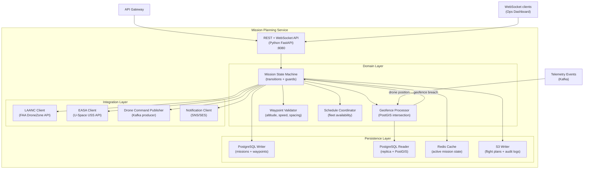
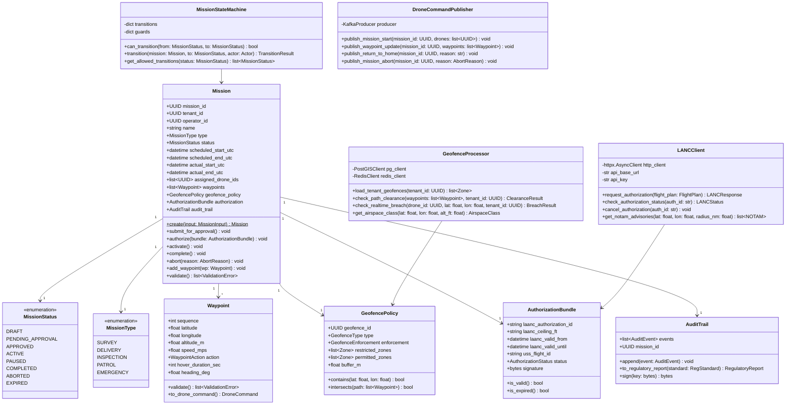
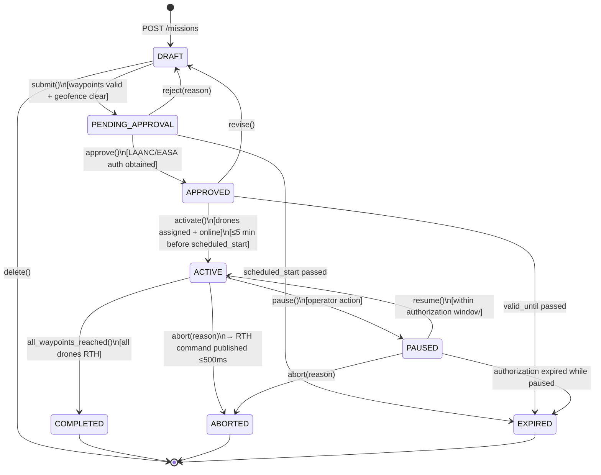
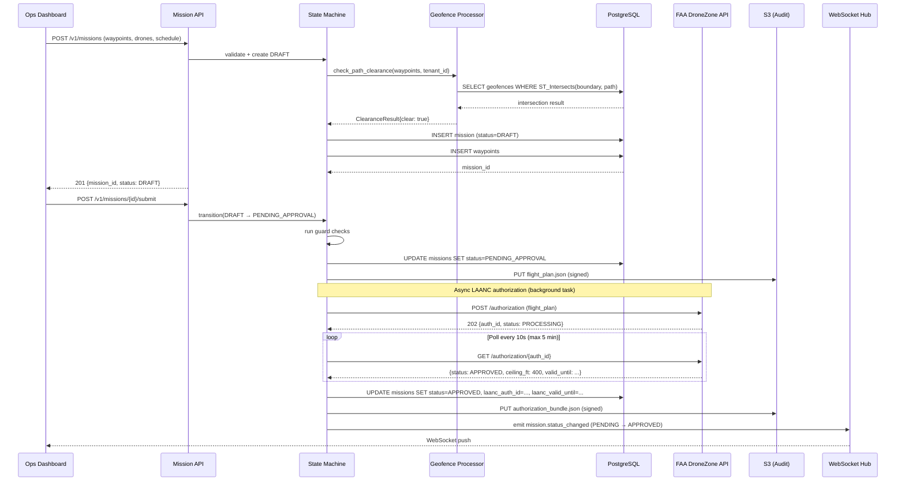
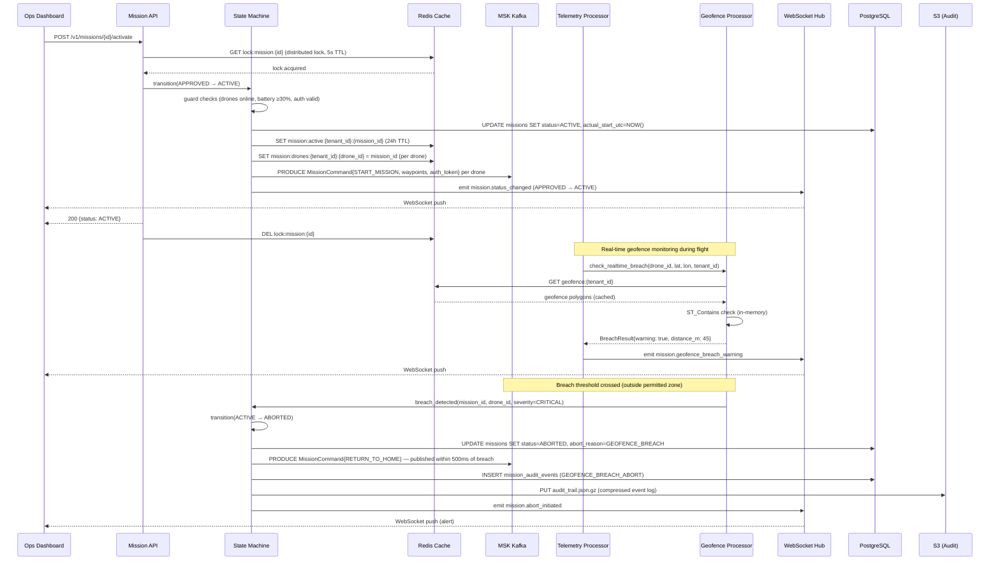
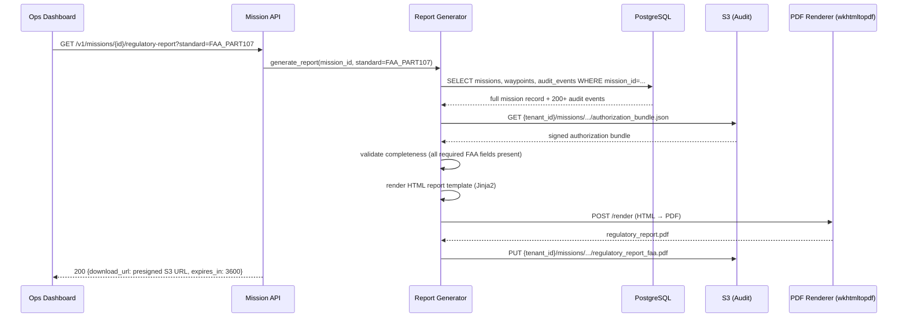

# Low-Level Design: Mission Planning Service

**Version:** 1.0  
**Date:** 2026-05-15  
**Author:** Arch Agent — Phase 3  
**Parent HLD:** Design_HLD.md  
**Epic Coverage:** EP-02 (Mission Planning), EP-03 (Compliance Reporting), EP-07 (Security)

---

## 1. Service Overview

The Mission Planning Service is the orchestrator for all pre-flight, in-flight, and post-flight operations in the DroneOps platform. It enforces geofence boundaries, coordinates LAANC (Low Altitude Authorization and Notification Capability) approval for US airspace, manages mission state machines, and produces regulatory audit trails for FAA Part 107, EASA U-Space, and DGCA compliance.

**Bounded context:** Mission lifecycle from draft → approved → active → completed/aborted. All authorization decisions for airspace and geofence must flow through this service; no drone may execute a waypoint sequence without a `MissionAuthorization` token signed by this service.

**Critical invariant:** A mission in `ACTIVE` state is the only state from which drones accept new waypoints. Any mission transition to `ABORTED` must propagate a `RETURN_TO_HOME` command to all assigned drones within 500ms. This is a safety requirement, not a product requirement.

---

## 1b. Design Rationale

Python FastAPI was chosen over Go for this service because the dominant workload is I/O-bound: LAANC API polling, PostGIS queries, Redis cache operations, and WebSocket fan-out. Python's async/await model with uvicorn handles thousands of concurrent I/O-bound coroutines efficiently at this service's scale (max 20 RPS per tenant for mission activation). Go would provide lower memory overhead per goroutine but would not change the I/O bottleneck character of the workload. This decision is revisable if profiling shows CPU-bound rule evaluation (composite geofence + RBAC) exceeding 15% of request time.

The Mission State Machine is implemented as an explicit FSM with a transitions table and guards dictionary rather than boolean flags, because mission state has 8 valid states with 14 allowed transitions. Encoding this as conditionals in application code would produce a combinatorial explosion of untestable paths. The FSM table is the single source of truth for which transitions are legal; the guards enforce preconditions. This makes state bugs detectable in unit tests without spinning up infrastructure.

LAANC authorization is handled asynchronously (background coroutine with polling) rather than blocking the HTTP request because FAA DroneZone can take 30 seconds to 5 minutes to respond. A synchronous approach would either require very long HTTP timeouts (bad for client UX) or force a polling endpoint onto the API consumer. The async background approach allows the mission to move to `PENDING_APPROVAL` immediately and WebSocket push to notify when approval arrives, which is the natural operator experience.

## 1c. Implementation Strategy

**Phase 1 (MVP — weeks 1-4):** Implement core state machine (DRAFT → APPROVED → ACTIVE → COMPLETED/ABORTED), PostgreSQL schema with RLS, basic REST API, and Kafka command publisher. Hardcode US airspace rules (FAA Part 107 ceiling 400ft). Stub LAANC with a mock that auto-approves (enables end-to-end testing before FAA sandbox access).

**Phase 2 (weeks 5-8):** Integrate real LAANC client against FAA DroneZone sandbox. Implement PostGIS geofence intersection for pre-flight path clearance. Add Redis caching for geofence polygons. Implement RTH emergency abort path with 500ms SLA. Add WebSocket event hub for real-time status to Ops Dashboard.

**Phase 3 (weeks 9-12):** EASA U-Space USS integration. Regulatory report PDF generation (Jinja2 → wkhtmltopdf). WORM S3 audit trail with hash chain. Full RBAC (OPERATOR vs FLEET_ADMIN). Load testing at 500 concurrent active missions.

**Phase 4 (post-MVP):** DGCA India integration. Multi-drone coordinated missions. Mission playback for post-incident analysis. Custom geofence import (KML/GeoJSON upload).

---

## 2. Component Diagram



---

## 3. Class Diagram



---

## 4. Data Model

### 4.1 PostgreSQL Schema

```sql
-- Row-Level Security enabled at database level (inherited from platform policy)
-- All tables are in schema: droneops (tenant isolation via tenant_id column + RLS policy)

CREATE TABLE missions (
    mission_id          UUID PRIMARY KEY DEFAULT gen_random_uuid(),
    tenant_id           UUID NOT NULL,
    operator_id         UUID NOT NULL REFERENCES users(user_id),
    name                VARCHAR(255) NOT NULL,
    type                VARCHAR(50) NOT NULL CHECK (type IN ('SURVEY','DELIVERY','INSPECTION','PATROL','EMERGENCY')),
    status              VARCHAR(50) NOT NULL DEFAULT 'DRAFT',
    scheduled_start_utc TIMESTAMPTZ NOT NULL,
    scheduled_end_utc   TIMESTAMPTZ NOT NULL,
    actual_start_utc    TIMESTAMPTZ,
    actual_end_utc      TIMESTAMPTZ,
    assigned_drone_ids  UUID[] NOT NULL DEFAULT '{}',
    geofence_id         UUID REFERENCES geofences(geofence_id),
    laanc_auth_id       VARCHAR(255),
    laanc_valid_from    TIMESTAMPTZ,
    laanc_valid_until   TIMESTAMPTZ,
    uss_flight_id       VARCHAR(255),
    authorization_sig   BYTEA,
    audit_s3_key        VARCHAR(1024),
    abort_reason        VARCHAR(255),
    created_at          TIMESTAMPTZ NOT NULL DEFAULT NOW(),
    updated_at          TIMESTAMPTZ NOT NULL DEFAULT NOW(),
    version             INT NOT NULL DEFAULT 1,        -- optimistic lock version

    CONSTRAINT missions_end_after_start CHECK (scheduled_end_utc > scheduled_start_utc),
    CONSTRAINT missions_status_valid CHECK (status IN (
        'DRAFT','PENDING_APPROVAL','APPROVED','ACTIVE','PAUSED','COMPLETED','ABORTED','EXPIRED'
    ))
);

-- Partitioned by status for query performance (ACTIVE missions queried most frequently)
CREATE INDEX idx_missions_tenant_status ON missions(tenant_id, status);
CREATE INDEX idx_missions_tenant_scheduled ON missions(tenant_id, scheduled_start_utc DESC);
CREATE INDEX idx_missions_active_drones ON missions USING GIN(assigned_drone_ids)
    WHERE status = 'ACTIVE';

CREATE TABLE waypoints (
    waypoint_id     UUID PRIMARY KEY DEFAULT gen_random_uuid(),
    mission_id      UUID NOT NULL REFERENCES missions(mission_id) ON DELETE CASCADE,
    tenant_id       UUID NOT NULL,
    sequence        INT NOT NULL,
    location        GEOMETRY(POINT, 4326) NOT NULL,  -- PostGIS point (lon, lat)
    altitude_m      FLOAT NOT NULL CHECK (altitude_m BETWEEN 0 AND 400),
    speed_mps       FLOAT NOT NULL CHECK (speed_mps BETWEEN 0 AND 30),
    heading_deg     FLOAT CHECK (heading_deg BETWEEN 0 AND 360),
    action          VARCHAR(50) NOT NULL DEFAULT 'FLY_THROUGH',
    hover_duration_sec INT NOT NULL DEFAULT 0,
    created_at      TIMESTAMPTZ NOT NULL DEFAULT NOW(),

    CONSTRAINT waypoints_sequence_unique UNIQUE (mission_id, sequence)
);

-- Spatial index for geofence intersection queries
CREATE INDEX idx_waypoints_location ON waypoints USING GIST(location);
CREATE INDEX idx_waypoints_mission ON waypoints(mission_id, sequence);

CREATE TABLE geofences (
    geofence_id     UUID PRIMARY KEY DEFAULT gen_random_uuid(),
    tenant_id       UUID NOT NULL,
    name            VARCHAR(255) NOT NULL,
    type            VARCHAR(50) NOT NULL CHECK (type IN ('PERMITTED','RESTRICTED','EMERGENCY_LANDING')),
    boundary        GEOMETRY(POLYGON, 4326) NOT NULL,  -- PostGIS polygon
    max_altitude_m  FLOAT,
    valid_from      TIMESTAMPTZ,
    valid_until     TIMESTAMPTZ,
    source          VARCHAR(50) NOT NULL DEFAULT 'TENANT',  -- TENANT | FAA | EASA | DGCA
    created_at      TIMESTAMPTZ NOT NULL DEFAULT NOW(),
    updated_at      TIMESTAMPTZ NOT NULL DEFAULT NOW()
);

CREATE INDEX idx_geofences_tenant ON geofences(tenant_id);
CREATE INDEX idx_geofences_boundary ON geofences USING GIST(boundary);
CREATE INDEX idx_geofences_active ON geofences(tenant_id, valid_until)
    WHERE valid_until IS NULL OR valid_until > NOW();

-- Audit event log (append-only; archived to S3 after 30 days)
CREATE TABLE mission_audit_events (
    event_id        UUID PRIMARY KEY DEFAULT gen_random_uuid(),
    mission_id      UUID NOT NULL REFERENCES missions(mission_id),
    tenant_id       UUID NOT NULL,
    event_type      VARCHAR(100) NOT NULL,
    actor_id        UUID,
    actor_type      VARCHAR(50),  -- USER | SYSTEM | DRONE | REGULATORY_API
    payload         JSONB NOT NULL DEFAULT '{}',
    occurred_at     TIMESTAMPTZ NOT NULL DEFAULT NOW()
) PARTITION BY RANGE (occurred_at);

CREATE TABLE mission_audit_events_2026_q2 PARTITION OF mission_audit_events
    FOR VALUES FROM ('2026-04-01') TO ('2026-07-01');

CREATE INDEX idx_audit_mission ON mission_audit_events(mission_id, occurred_at DESC);
```

### 4.2 Redis Cache Schema

| Key Pattern | Type | TTL | Content |
|-------------|------|-----|---------|
| `mission:active:{tenant_id}:{mission_id}` | Hash | 24h (refreshed on update) | Full serialized mission state |
| `mission:drones:{tenant_id}:{drone_id}` | String | 5min | Current active mission_id for drone |
| `geofence:{tenant_id}` | String (JSON) | 10min | Serialized tenant geofence polygons |
| `laanc:{auth_id}` | String | Until laanc_valid_until | Authorization status and ceiling |
| `lock:mission:{mission_id}` | String (NX+EX) | 5s | Distributed lock for state transitions |

### 4.3 S3 Object Layout

```
s3://droneops-{env}-audit/
  {tenant_id}/
    missions/
      {year}/{month}/{day}/
        {mission_id}/
          flight_plan.json          # signed pre-flight plan (WORM, 7 years)
          authorization_bundle.json # LAANC + EASA tokens
          audit_trail.json.gz       # complete event log
          regulatory_report_faa.pdf # generated post-flight (US tenants)
          regulatory_report_easa.pdf # (EU tenants)
```

S3 bucket: `Object Lock enabled, Compliance mode, 7-year retention` (FAA Part 107 requirement).

---

## 5. API Specification

### 5.1 REST Endpoints

```
POST   /v1/missions                          Create draft mission
GET    /v1/missions/{id}                     Get mission details
PUT    /v1/missions/{id}                     Update draft mission
DELETE /v1/missions/{id}                     Delete draft (only DRAFT status)
POST   /v1/missions/{id}/submit              Submit for approval (→ PENDING_APPROVAL)
POST   /v1/missions/{id}/approve             Approve mission (internal: triggers LAANC)
POST   /v1/missions/{id}/activate            Activate (→ ACTIVE, publishes to drones)
POST   /v1/missions/{id}/pause              Pause active mission
POST   /v1/missions/{id}/resume             Resume paused mission
POST   /v1/missions/{id}/abort              Abort with reason
GET    /v1/missions/{id}/audit              Get audit trail events
GET    /v1/missions/{id}/regulatory-report  Generate regulatory report (PDF)

GET    /v1/missions?status=ACTIVE&drone_id={id}  List missions with filters
GET    /v1/missions?tenant_id={id}&from={ts}&to={ts}  Historical missions

POST   /v1/geofences                         Create geofence zone
GET    /v1/geofences                         List tenant geofences
PUT    /v1/geofences/{id}                    Update geofence
DELETE /v1/geofences/{id}                    Delete geofence (soft delete)
POST   /v1/geofences/check                   Point-in-polygon check (real-time use)
POST   /v1/geofences/intersect               Path intersection check (pre-flight)

GET    /v1/airspace/notams?lat={}&lon={}&radius_nm={}&alt_ft={} Get NOTAMs
GET    /v1/airspace/classes?lat={}&lon={}   Get airspace classification
```

### 5.2 WebSocket Events

```
WS /ws/missions/{tenant_id}

# Server → Client events
{
  "event": "mission.status_changed",
  "mission_id": "uuid",
  "from_status": "APPROVED",
  "to_status": "ACTIVE",
  "timestamp": "2026-05-15T10:30:00Z"
}

{
  "event": "mission.geofence_breach_warning",
  "mission_id": "uuid",
  "drone_id": "uuid",
  "distance_to_boundary_m": 45.3,
  "bearing_deg": 270.0,
  "timestamp": "2026-05-15T10:31:15Z"
}

{
  "event": "mission.abort_initiated",
  "mission_id": "uuid",
  "reason": "GEOFENCE_BREACH",
  "affected_drone_ids": ["uuid1", "uuid2"],
  "timestamp": "2026-05-15T10:31:16Z"
}
```

### 5.3 Kafka Topics (Producer)

| Topic | Key | Partition Count | Retention | Message Schema |
|-------|-----|-----------------|-----------|----------------|
| `{tenant_id}.mission.commands` | `drone_id` | 12 | 7 days | MissionCommand (Avro) |
| `droneops.mission.events` | `mission_id` | 24 | 30 days | MissionEvent (Avro) |
| `droneops.compliance.reports` | `tenant_id` | 6 | 365 days | ComplianceReport (Avro) |

```json
// MissionCommand Avro schema (Kafka payload to Telemetry Processor / Drone Gateway)
{
  "namespace": "com.droneops.mission",
  "type": "record",
  "name": "MissionCommand",
  "fields": [
    {"name": "command_id", "type": "string"},
    {"name": "mission_id", "type": "string"},
    {"name": "drone_id", "type": "string"},
    {"name": "tenant_id", "type": "string"},
    {"name": "command_type", "type": {
      "type": "enum",
      "name": "CommandType",
      "symbols": ["START_MISSION", "PAUSE_MISSION", "RESUME_MISSION", "ABORT_MISSION",
                  "RETURN_TO_HOME", "UPDATE_WAYPOINTS", "LAND_IMMEDIATELY"]
    }},
    {"name": "waypoints", "type": {"type": "array", "items": {
      "type": "record",
      "name": "WaypointCmd",
      "fields": [
        {"name": "sequence", "type": "int"},
        {"name": "lat", "type": "double"},
        {"name": "lon", "type": "double"},
        {"name": "alt_m", "type": "float"},
        {"name": "speed_mps", "type": "float"},
        {"name": "action", "type": "string"}
      ]
    }}, "default": []},
    {"name": "authorization_token", "type": ["null", "string"], "default": null},
    {"name": "issued_at_ms", "type": "long"},
    {"name": "expires_at_ms", "type": "long"}
  ]
}
```

---

## 6. Mission State Machine



**Guard conditions for `submit()`:**
1. At least 1 waypoint defined
2. All waypoints within altitude limits (≤400ft AGL for FAA)
3. Path does not intersect any RESTRICTED geofence zone
4. Scheduled time is ≥30 minutes in the future (allows LAANC processing)
5. No drone assigned to another ACTIVE mission at the same time

**Guard conditions for `activate()`:**
1. Authorization bundle is valid and not expired
2. All assigned drones are online (last telemetry ≤30 seconds ago)
3. All assigned drones have battery ≥30%
4. Weather check passes (no active weather alerts for the zone)
5. Mission activation is within 5 minutes of `scheduled_start_utc`

---

## 7. Sequence Diagrams

### 7.1 Mission Creation and LAANC Authorization



### 7.2 Mission Activation and Safety Abort



### 7.3 Regulatory Report Generation



---

## 8. Geofence Processing Design

### 8.1 Pre-flight Path Clearance

Uses PostGIS `ST_Intersects` for path-against-polygon intersection:

```sql
-- Check if any waypoint path segment intersects a restricted zone
WITH flight_path AS (
    SELECT ST_MakeLine(
        ARRAY(
            SELECT location::geometry
            FROM waypoints
            WHERE mission_id = $1
            ORDER BY sequence
        )
    ) AS path
)
SELECT g.geofence_id, g.name, g.type,
       ST_Distance(fp.path::geography, g.boundary::geography) AS distance_m
FROM geofences g, flight_path fp
WHERE g.tenant_id = $2
  AND g.type = 'RESTRICTED'
  AND (g.valid_until IS NULL OR g.valid_until > NOW())
  AND ST_DWithin(fp.path::geography, g.boundary::geography, 50)  -- 50m buffer
ORDER BY distance_m;
```

### 8.2 Real-time Breach Detection (In-flight)

Real-time breach detection runs on the Telemetry Processor (not in this service), but uses geofence data served by this service's Redis cache. Cache update strategy:

1. Geofences loaded on service startup and cached per tenant (10-minute TTL)
2. Cache invalidated immediately on `PUT /v1/geofences/{id}` via Redis `DEL geofence:{tenant_id}`
3. In-memory breach check using Shapely (Python): `polygon.contains(Point(lon, lat))`
4. Warning threshold: 100m from boundary → emit WebSocket warning
5. Critical threshold: outside permitted zone → trigger abort sequence

### 8.3 Airspace Classification Integration

NOTAMs and airspace class data sourced from:
- **US:** FAA's NOTAM API (`api.faa.gov`) — refreshed every 5 minutes, cached in Redis
- **EU:** EAD (European AIS Database) NOTAM API — refreshed every 15 minutes
- **India:** AIM India API — refreshed every 30 minutes

Airspace classes are preloaded into PostGIS as static polygon layers (updated monthly via ETL job). A drone flying into Class B/C/D airspace without LAANC approval triggers immediate mission abort regardless of tenant geofence settings.

---

## 9. Error Handling

### 9.1 LAANC Authorization Failures

| Failure Scenario | Behavior | Timeout |
|-----------------|----------|---------|
| LAANC API unreachable | Retry 3× (exponential: 1s, 2s, 4s), then fail PENDING_APPROVAL → DRAFT with error | 30s total |
| LAANC returns REJECTED | Move mission to DRAFT with rejection reason; notify operator | Immediate |
| LAANC approval expires before activation | Move APPROVED → EXPIRED; operator must resubmit | On expiry check (every 1min) |
| LAANC API rate-limited (429) | Back-off 60s, retry once; if fails again, queue for next available window | 2min |

### 9.2 State Transition Conflicts

Concurrent activation attempts are prevented by a Redis distributed lock (`SET NX EX 5`). If the lock cannot be acquired within 100ms, the request returns `409 Conflict` with `Retry-After: 1`. This prevents race conditions when two operators simultaneously attempt to activate the same mission.

Optimistic locking via `version` column in `missions` table:
```sql
UPDATE missions SET status = $1, version = version + 1
WHERE mission_id = $2 AND version = $3;
-- If rowcount = 0, another process modified the row → return 409
```

### 9.3 RTH Command Delivery Guarantee

The `RETURN_TO_HOME` command must be published within 500ms of abort decision. Implementation:

1. Kafka producer configured: `acks=all`, `retries=3`, `delivery.timeout.ms=400`
2. If Kafka publish fails within 400ms, fallback to direct MQTT publish via IoT Core (bypasses Kafka entirely)
3. Both paths are attempted if first fails — idempotency key on `command_id` prevents duplicate execution
4. Failure to deliver RTH within 500ms triggers PagerDuty `P1` alert (safety-critical SLA)

---

## 10. Performance Design

### 10.1 Throughput Targets

| Operation | Target Latency (p99) | Target RPS |
|-----------|---------------------|------------|
| Create mission | <500ms | 50 RPS |
| Submit for approval | <200ms | 50 RPS |
| Activate mission | <300ms | 20 RPS |
| Geofence path check (50 waypoints) | <150ms | 100 RPS |
| Real-time breach check | <10ms | 5,000 RPS (telemetry rate) |
| Abort + RTH publish | <500ms end-to-end | 500 RPS (spike) |

### 10.2 Database Optimization

- Read replica for all `GET` endpoints (geofence queries, mission lists, audit trails)
- Primary only for state transitions (writes)
- PostGIS spatial index (`GIST`) on `waypoints.location` and `geofences.boundary`
- Covering index on `(tenant_id, status)` for fleet dashboard queries
- Connection pooling via PgBouncer: max 100 connections to primary, 200 to replica

### 10.3 Geofence Cache Strategy

```python
class GeofenceCache:
    TTL_SECONDS = 600  # 10 minutes

    async def get_tenant_geofences(self, tenant_id: UUID) -> list[GeoPolygon]:
        key = f"geofence:{tenant_id}"
        cached = await self.redis.get(key)
        if cached:
            return [GeoPolygon.parse_raw(z) for z in json.loads(cached)]

        zones = await self.pg.fetch_tenant_geofences(tenant_id)
        serialized = json.dumps([z.json() for z in zones])
        await self.redis.setex(key, self.TTL_SECONDS, serialized)
        return zones

    async def invalidate(self, tenant_id: UUID) -> None:
        await self.redis.delete(f"geofence:{tenant_id}")
```

### 10.4 Scaling Policy

| Metric | Scale-out trigger | Min replicas | Max replicas |
|--------|-------------------|--------------|--------------|
| CPU utilization | >65% for 2 min | 2 | 20 |
| Active missions count | >500 per pod | 2 | 20 |
| WebSocket connections | >2,000 per pod | 2 | 20 |

HPA configuration (Kubernetes):
```yaml
apiVersion: autoscaling/v2
kind: HorizontalPodAutoscaler
metadata:
  name: mission-planning-hpa
spec:
  scaleTargetRef:
    apiVersion: apps/v1
    kind: Deployment
    name: mission-planning-service
  minReplicas: 2
  maxReplicas: 20
  metrics:
    - type: Resource
      resource:
        name: cpu
        target:
          type: Utilization
          averageUtilization: 65
    - type: Pods
      pods:
        metric:
          name: active_missions_per_pod
        target:
          type: AverageValue
          averageValue: "500"
```

---

## 11. Security Design

### 11.1 Authorization Model

Every mission operation requires:
1. **JWT validation:** `tenant_id` claim in JWT must match mission's `tenant_id` (enforced in middleware)
2. **RBAC check:** Only `OPERATOR` and `FLEET_ADMIN` roles may create/activate missions; `VIEWER` role is read-only
3. **Scope enforcement:** `OPERATOR` may only manage their own missions; `FLEET_ADMIN` may manage all tenant missions
4. **RLS enforcement:** PostgreSQL Row-Level Security applies `tenant_id = current_setting('app.current_tenant')` to all queries

```python
# FastAPI middleware: set PostgreSQL session variable before every query
async def set_tenant_context(tenant_id: UUID, conn: asyncpg.Connection):
    await conn.execute("SET LOCAL app.current_tenant = $1", str(tenant_id))
```

### 11.2 Authorization Token Signing

The `AuthorizationBundle` produced after LAANC approval is signed using the tenant's private key (stored in AWS KMS):

```python
async def sign_authorization_bundle(bundle: AuthorizationBundle, tenant_id: UUID) -> bytes:
    payload = bundle.json().encode()
    # KMS asymmetric signing — Ed25519 key per tenant
    response = await kms_client.sign(
        KeyId=f"alias/droneops-tenant-{tenant_id}",
        Message=payload,
        MessageType="RAW",
        SigningAlgorithm="ECDSA_SHA_256"
    )
    return response["Signature"]
```

Drone firmware verifies this signature before executing a mission, preventing command injection from compromised backend services.

### 11.3 Audit Trail Integrity

Every `mission_audit_events` row includes a hash chain:
- `event_hash = SHA256(prev_event_hash + event_payload)`
- Stored in `payload->>'_chain_hash'`
- S3-archived audit trail includes the full hash chain for tamper detection
- Regulatory report generation validates the hash chain before producing the PDF

### 11.4 Threat Mitigations

| Threat (STRIDE) | Control |
|----------------|---------|
| Spoofed mission abort (Tampering) | Authorization token signed by KMS; drone verifies before RTH |
| Tenant A reads Tenant B missions (Info Disclosure) | RLS + JWT tenant_id validation in middleware |
| Mission state injection via race (Tampering) | Redis distributed lock + optimistic DB version lock |
| Regulatory report forgery (Tampering) | Audit trail hash chain + WORM S3 Object Lock |
| LAANC API impersonation (Spoofing) | TLS client certificate pinning to FAA DroneZone endpoint |
| DoS via waypoint flood (DoS) | Max 200 waypoints per mission; rate limit 50 req/min per tenant |

---

## 12. Observability

### 12.1 Structured Logs

```json
{
  "timestamp": "2026-05-15T10:30:01.234Z",
  "level": "INFO",
  "service": "mission-planning",
  "tenant_id": "t-123",
  "mission_id": "m-456",
  "trace_id": "abc123",
  "span_id": "def456",
  "event": "mission.state_transition",
  "from_status": "APPROVED",
  "to_status": "ACTIVE",
  "actor_id": "u-789",
  "actor_type": "USER",
  "duration_ms": 187,
  "drone_count": 3
}
```

PII policy: `operator_id`, `actor_id` logged as UUIDs only (no names/emails). Location coordinates rounded to 4 decimal places (±11m precision) in logs.

### 12.2 Metrics

| Metric Name | Type | Labels | Alert Threshold |
|-------------|------|--------|-----------------|
| `mission_state_transitions_total` | Counter | `from`, `to`, `tenant_id` | — |
| `mission_activation_duration_seconds` | Histogram | `tenant_id` | p99 > 500ms |
| `geofence_breach_events_total` | Counter | `severity`, `tenant_id` | >5/min per tenant |
| `laanc_authorization_duration_seconds` | Histogram | `result` | p99 > 180s |
| `rth_command_publish_duration_ms` | Histogram | — | p99 > 400ms (P1 alert) |
| `active_missions_gauge` | Gauge | `tenant_id` | — |
| `mission_abort_total` | Counter | `reason`, `tenant_id` | >3/hour per tenant |
| `geofence_cache_hit_ratio` | Gauge | — | < 0.85 |

### 12.3 Distributed Traces

OpenTelemetry spans per request:

```
POST /v1/missions/{id}/activate
├── middleware.jwt_validate (2ms)
├── middleware.rbac_check (1ms)
├── redis.acquire_lock (5ms)
├── postgres.read_mission (8ms)
├── state_machine.run_guards (45ms)
│   ├── redis.check_drone_online (10ms × 3 drones)
│   └── redis.check_geofence (5ms)
├── postgres.update_mission (12ms)
├── redis.set_active_mission (3ms × 3 drones)
├── kafka.produce_commands (15ms × 3 drones)
└── websocket.emit_event (2ms)
```

### 12.4 Alert Rules

```yaml
# Safety-critical alerts (PagerDuty P1)
- alert: RTHCommandDeliveryDelayed
  expr: histogram_quantile(0.99, rth_command_publish_duration_ms) > 400
  for: 1m
  labels:
    severity: P1
    team: platform

- alert: GeofenceBreachRateHigh
  expr: rate(geofence_breach_events_total{severity="CRITICAL"}[5m]) > 1
  for: 0s  # immediate
  labels:
    severity: P1
    team: safety

# Operational alerts (PagerDuty P2)
- alert: LANCAuthorizationLatencyHigh
  expr: histogram_quantile(0.95, laanc_authorization_duration_seconds) > 120
  for: 5m
  labels:
    severity: P2

- alert: MissionAbortRateHigh
  expr: rate(mission_abort_total[1h]) > 3
  for: 10m
  labels:
    severity: P2
```

---

## 13. Deployment

### 13.1 Dockerfile

```dockerfile
FROM python:3.12-slim AS builder
WORKDIR /build
COPY requirements.txt .
RUN pip install --no-cache-dir --target=/packages -r requirements.txt

FROM gcr.io/distroless/python3-debian12
WORKDIR /app
COPY --from=builder /packages /packages
COPY src/ /app/src/

ENV PYTHONPATH=/packages
ENV PYTHONUNBUFFERED=1

USER nonroot:nonroot

EXPOSE 8080

CMD ["/app/src/main.py"]
```

Target image size: <120MB (Python runtime + FastAPI + psycopg2 + shapely + httpx).

### 13.2 Kubernetes Deployment

```yaml
apiVersion: apps/v1
kind: Deployment
metadata:
  name: mission-planning-service
  namespace: droneops
  labels:
    app: mission-planning
    version: "1.0.0"
spec:
  replicas: 2
  selector:
    matchLabels:
      app: mission-planning
  template:
    metadata:
      labels:
        app: mission-planning
    spec:
      serviceAccountName: mission-planning-sa  # IRSA: KMS + S3 + MSK permissions
      securityContext:
        runAsNonRoot: true
        runAsUser: 65532
        seccompProfile:
          type: RuntimeDefault
      containers:
        - name: mission-planning
          image: 123456789.dkr.ecr.us-east-1.amazonaws.com/mission-planning:1.0.0
          ports:
            - containerPort: 8080
          resources:
            requests:
              cpu: "500m"
              memory: "512Mi"
            limits:
              cpu: "2000m"
              memory: "2Gi"
          env:
            - name: DATABASE_URL
              valueFrom:
                secretKeyRef:
                  name: mission-planning-secrets
                  key: database_url
            - name: REDIS_URL
              valueFrom:
                secretKeyRef:
                  name: mission-planning-secrets
                  key: redis_url
            - name: KAFKA_BOOTSTRAP_SERVERS
              valueFrom:
                configMapKeyRef:
                  name: kafka-config
                  key: bootstrap_servers
          readinessProbe:
            httpGet:
              path: /health/ready
              port: 8080
            initialDelaySeconds: 10
            periodSeconds: 5
            failureThreshold: 3
          livenessProbe:
            httpGet:
              path: /health/live
              port: 8080
            initialDelaySeconds: 30
            periodSeconds: 10
```

### 13.3 Network Policy

```yaml
apiVersion: networking.k8s.io/v1
kind: NetworkPolicy
metadata:
  name: mission-planning-netpol
  namespace: droneops
spec:
  podSelector:
    matchLabels:
      app: mission-planning
  policyTypes:
    - Ingress
    - Egress
  ingress:
    - from:
        - podSelector:
            matchLabels:
              app: api-gateway
      ports:
        - protocol: TCP
          port: 8080
  egress:
    - to:
        - podSelector:
            matchLabels:
              tier: database
      ports:
        - protocol: TCP
          port: 5432
    - to:
        - podSelector:
            matchLabels:
              app: redis
      ports:
        - protocol: TCP
          port: 6379
    - to:  # Kafka MSK (AWS VPC endpoint)
        - namespaceSelector:
            matchLabels:
              kubernetes.io/metadata.name: aws-endpoints
      ports:
        - protocol: TCP
          port: 9092
    - to:  # External: FAA DroneZone, EASA USS (egress via NAT GW)
        - ipBlock:
            cidr: 0.0.0.0/0
            except:
              - 10.0.0.0/8
              - 172.16.0.0/12
              - 192.168.0.0/16
      ports:
        - protocol: TCP
          port: 443
```

---

*End of Mission Planning Service LLD*
