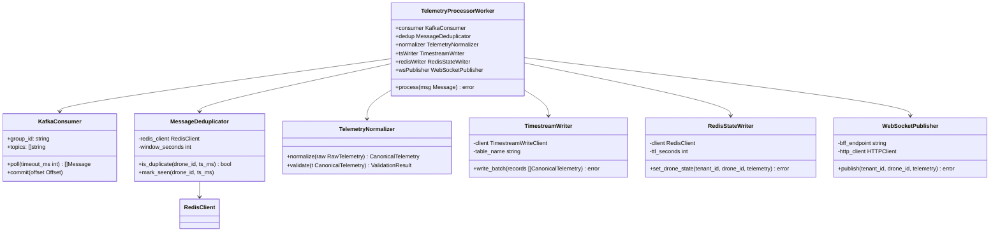
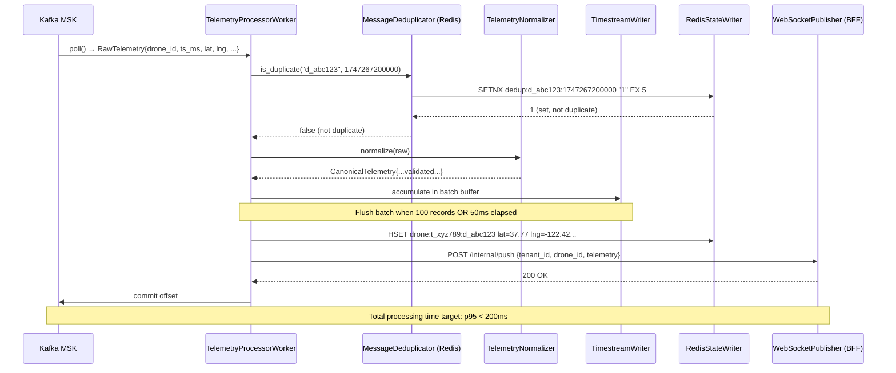
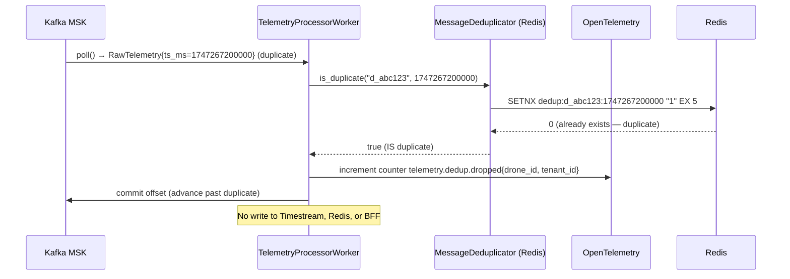
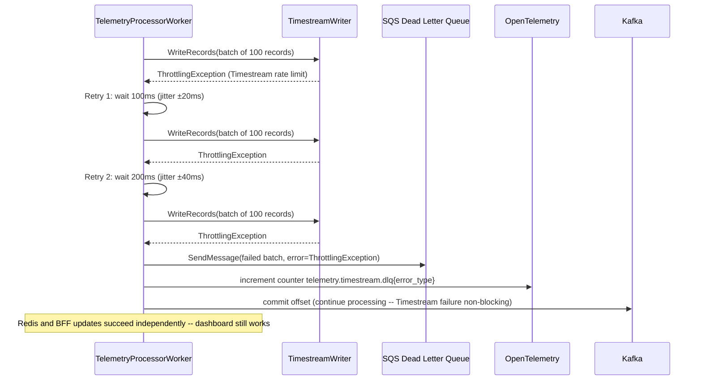

# DroneOps — LLD: Telemetry Processor Service

| Field | Value |
|-------|-------|
| **Version** | 1.0 |
| **Author** | Arch Agent (Phase 3) |
| **Status** | Draft |
| **Date** | 2026-05-15 |
| **Related HLD** | Design_HLD.md |
| **Related ADRs** | ADR-002, ADR-003 |
| **Related Epics** | EP-01 (Telemetry Ingestion), EP-09 (NFR) |

---

## 1. Scope & Objectives

### 1.1 What This LLD Covers

The Telemetry Processor is the high-throughput core of the DroneOps platform. It consumes raw drone telemetry from Kafka, deduplicates and normalises it, writes to Timestream, updates Redis with last-known state, and fans out to WebSocket sessions via the Dashboard BFF.

### 1.2 What This LLD Does NOT Cover

- MQTT broker configuration (AWS IoT Core) — covered in Infrastructure IaC
- WebSocket connection management — owned by Dashboard BFF LLD
- Video stream processing — owned by Video Stream Service LLD

### 1.3 Business Context

Every drone position update visible on the operations dashboard flows through this service. It is the most performance-critical service in the platform. Failure or latency spikes here directly violate the sub-500ms telemetry SLA and could cause operations managers to make decisions based on stale drone positions.

### 1.4 Success Criteria

| # | Criterion | Measurement |
|---|-----------|-------------|
| 1 | End-to-end telemetry latency p95 < 500ms | CloudWatch metric `telemetry.pipeline.latency_p95` |
| 2 | Message loss rate < 1% at 25K msg/sec sustained 30 min | k6 load test |
| 3 | Kafka consumer lag < 10,000 messages during nominal load | CloudWatch MSK metric |
| 4 | Zero cross-tenant telemetry fan-out (isolation verified) | Tenant isolation test suite |

---

## 2. Assumptions, Constraints & Dependencies

### 2.1 Assumptions

- AWS IoT Core delivers messages to Kafka via Kinesis Firehose with at-least-once semantics
- Drone SDKs guarantee timestamps are monotonically increasing within a single drone session
- Kafka topic `telemetry.raw.<tenant_id>` already exists (provisioned at tenant onboarding)

### 2.2 Constraints

- Maximum processing latency budget: 200ms (of the 500ms end-to-end SLA)
- Stateless design mandatory — no local state between messages (enables horizontal scaling)
- Must handle 25,000 msg/sec peak with < 1% CPU headroom consumption above 60%

### 2.3 Dependencies

| Dependency | Owner | Status | Risk if Unavailable |
|-----------|-------|--------|---------------------|
| Kafka MSK (`telemetry.raw.*`) | Platform Engineering | Live | No telemetry processing; drones appear offline |
| Amazon Timestream | AWS Managed | Live | Telemetry history unavailable; dashboard still works (Redis) |
| Redis ElastiCache | Platform Engineering | Live | Last-known state unavailable; dashboard shows stale data after cache warm-up |
| Dashboard BFF (WebSocket) | Dashboard Team | Live | Real-time map updates stop; dashboards frozen |

---

## 3. Detailed Component Design

### 3.1 Component Architecture



**Design Rationale:**
Each component is a single-responsibility struct. The worker orchestrates them. This means Timestream can be replaced with ClickHouse by swapping `TimestreamWriter` alone — no other component changes. Go is chosen for this service specifically because goroutines handle 25K concurrent message callbacks with minimal memory overhead (~4KB per goroutine vs ~1MB per OS thread).

**Implementation Strategy:**
The service runs N worker goroutines where N = (Kafka partition count / pods). Each pod subscribes to a dedicated partition set via Kafka consumer group. Deduplication uses Redis SETNX with a 5-second TTL — if SETNX returns 0, the message is a duplicate and skipped. Timestream writes are batched: accumulate up to 100 records OR 50ms (whichever comes first), then write in a single `WriteRecords` API call (max 100 records per call per Timestream limit).

---

## 4. API Specification

The Telemetry Processor does not expose a public REST API. It exposes two internal HTTP endpoints:

| Method | Path | Purpose | Auth |
|--------|------|---------|------|
| GET | /healthz | Kubernetes liveness probe | None (cluster internal) |
| GET | /readyz | Kubernetes readiness probe | None (cluster internal) |
| GET | /metrics | Prometheus metrics scrape | None (cluster internal) |

**GET /healthz — Response:**
```json
{"status": "ok", "kafka_connected": true, "redis_connected": true}
```
Returns HTTP 200 if healthy, HTTP 503 if any dependency is down.

**GET /readyz — Response:**
```json
{"status": "ready", "consumer_lag": 1234, "processing_rate_mps": 5001}
```
Returns HTTP 200 only when consumer lag < 50,000 (prevents routing traffic to a lagging pod).

**Telemetry Kafka Message Schema (Avro):**
```json
{
  "namespace": "io.droneops.telemetry",
  "type": "record",
  "name": "RawTelemetry",
  "fields": [
    {"name": "drone_id",     "type": "string"},
    {"name": "tenant_id",    "type": "string"},
    {"name": "ts_ms",        "type": "long"},
    {"name": "lat",          "type": "double"},
    {"name": "lng",          "type": "double"},
    {"name": "altitude_m",   "type": "float"},
    {"name": "speed_ms",     "type": "float"},
    {"name": "heading_deg",  "type": "float"},
    {"name": "battery_pct",  "type": "int"},
    {"name": "signal_rssi",  "type": "int"},
    {"name": "vendor",       "type": {"type": "enum", "name": "Vendor", "symbols": ["DJI","PARROT","AUTEL"]}}
  ]
}
```

**Canonical Telemetry Schema (written to Timestream + Redis):**
```json
{
  "drone_id":    "d_abc123",
  "tenant_id":   "t_xyz789",
  "ts_ms":       1747267200000,
  "lat":         37.7749,
  "lng":         -122.4194,
  "altitude_m":  120.5,
  "speed_ms":    8.3,
  "heading_deg": 247.0,
  "battery_pct": 72,
  "signal_rssi": -65,
  "vendor":      "DJI",
  "processed_at_ms": 1747267200350
}
```

---

## 5. Database Schema

### 5.1 Amazon Timestream

```
Database: droneops_telemetry
Table:     drone_telemetry

Dimensions (indexed, no charge for storage):
  - tenant_id   VARCHAR
  - drone_id    VARCHAR
  - vendor      VARCHAR

Measures (actual telemetry values):
  - lat          DOUBLE
  - lng          DOUBLE
  - altitude_m   DOUBLE
  - speed_ms     DOUBLE
  - heading_deg  DOUBLE
  - battery_pct  BIGINT
  - signal_rssi  BIGINT

Time:    ts_ms (MILLISECONDS)

Memory Store Retention:  30 days  (p95 query <500ms, recent data)
Magnetic Store Retention: 90 days  (slower, cost-effective)
Archive:   S3 Glacier (scheduled export after 90 days)

Estimated row growth: 5,000 rows/sec nominal → 432M rows/day → 13B rows/month at peak
Estimated storage: ~200 bytes/row → 2.6 TB/month → within $1,300/month Timestream budget
```

**Query pattern (dashboard, 24h single drone):**
```sql
SELECT time, lat, lng, altitude_m, battery_pct
FROM "droneops_telemetry"."drone_telemetry"
WHERE tenant_id = 't_xyz789'
  AND drone_id  = 'd_abc123'
  AND time BETWEEN ago(24h) AND now()
ORDER BY time ASC
```
Timestream executes this against memory store (< 30 days) in < 200ms with dimension-indexed queries.

### 5.2 Redis State Store

```
Key:    drone:{tenant_id}:{drone_id}
Type:   Redis Hash
TTL:    60 seconds (refreshed on every telemetry message)
Fields: lat, lng, altitude_m, speed_ms, heading_deg, battery_pct, signal_rssi, ts_ms

Deduplication key:
  Key:   dedup:{drone_id}:{ts_ms}
  Type:  String (SETNX)
  TTL:   5 seconds
  Value: "1"

Estimated Redis memory: 500 tenants x 500 drones x ~200 bytes = 50 MB (well within 6.7GB r7g.large)
```

---

## 6. Sequence Diagrams

### 6.1 Happy Path: Single Telemetry Message



### 6.2 Error Path: Duplicate Message (GPS timestamp repeat)



### 6.3 Error Path: Timestream Write Failure



---

## 7. Error Handling & Resilience

| Failure | Retry Policy | Circuit Breaker | DLQ | User Impact |
|---------|-------------|-----------------|-----|-------------|
| Timestream write failure | 3 retries: 100ms, 200ms, 400ms (±20% jitter) | Open after 50% error rate over 10s window | SQS DLQ for failed batches; replayed by separate Lambda | Telemetry history unavailable; real-time map still works (Redis) |
| Redis write failure | 3 retries: 50ms, 100ms, 200ms | Open after 50% error rate over 10s | Log error; continue (Redis not critical path) | Last-known state stale; incidents may fire for "signal loss" |
| BFF WebSocket push failure | 2 retries: 100ms, 200ms | Open after 70% error rate over 5s | No DLQ (real-time; stale messages useless) | Dashboard position updates stop; BFF health check escalates |
| Kafka consumer group rebalance | No retry needed (Kafka handles) | N/A | N/A | Brief (~1-2s) processing pause per pod during rebalance |

**Idempotency:** Kafka consumer commits offset AFTER all writes succeed. If the pod restarts mid-processing, the message is reprocessed — deduplication via Redis SETNX prevents double-writes to Timestream.

**Backpressure:** If Kafka consumer lag exceeds 50,000 messages, the pod emits a readiness probe failure — Kubernetes routes new consumer groups to healthy pods while the lagging pod catches up.

---

## 8. Performance Design

### 8.1 Batching Strategy

```
Batch accumulation:
  - Max batch size: 100 records (Timestream WriteRecords API limit)
  - Max batch age: 50ms (prevents head-of-line blocking on low-traffic drones)
  - Implementation: goroutine per partition with channel-based accumulation

At 5,000 msg/sec nominal:
  - 50 batch flushes/sec to Timestream (100 records each)
  - Timestream WriteRecords latency: ~20ms p95
  - Net Timestream write budget: 20ms / 100ms batch window = 20% time → no bottleneck
```

### 8.2 Connection Pool Sizing

| Dependency | Pool Size | Reasoning |
|-----------|----------:|---------|
| Redis connections (per pod) | min=10, max=50 | 50 workers/pod; peak 50 concurrent Redis ops |
| Timestream HTTP client connections | max=20 | Timestream batching reduces concurrency need |
| BFF HTTP client connections | max=100 | Fan-out to BFF is the highest-concurrency operation |

### 8.3 Memory Profile

```
Per pod (50 worker goroutines):
  - Goroutine stack: 50 × 4KB = 200KB
  - Kafka message buffer: 100 msgs × 500 bytes = 50KB
  - Timestream batch buffer: 100 records × 200 bytes = 20KB
  - Redis connection pool: 50 × 16KB = 800KB
  Total per pod: ~1.5MB working set + runtime overhead

Pod resource request:  500m CPU, 256Mi memory
Pod resource limit:    2000m CPU, 512Mi memory
HPA: min=3, max=50; scale on Kafka consumer lag metric (custom metric via KEDA)
```

**Design Rationale for KEDA:**
Standard Kubernetes HPA scales on CPU/memory. For a Kafka consumer, the correct scaling signal is consumer lag — a pod can have low CPU but high lag (slow processing). KEDA (Kubernetes Event-Driven Autoscaling) enables HPA based on Kafka consumer lag metric directly from MSK.

---

## 9. Security Implementation

### 9.1 Auth Flow

```
Telemetry Processor has NO user-facing endpoints.
Internal /healthz, /readyz, /metrics are accessible only within the cluster namespace.
Kubernetes NetworkPolicy:
  - Ingress: allow from kube-system (metrics scraper) only
  - Egress: allow to Kafka MSK, Redis ElastiCache, Timestream, Dashboard BFF namespace

Service account: telemetry-processor-sa (IAM role via IRSA)
IAM permissions:
  - timestream:WriteRecords (specific table ARN)
  - secretsmanager:GetSecretValue (Kafka credentials, Redis TLS cert)
  - sqs:SendMessage (DLQ ARN only)
  - NO s3:*, NO rds:*, NO iam:*
```

### 9.2 Tenant Isolation in Fan-Out

**Critical:** When pushing telemetry to the Dashboard BFF, the tenant_id from the Kafka message header is included in the push payload and used by the BFF to route to the correct WebSocket sessions. The Telemetry Processor NEVER queries which sessions belong to which tenant — that mapping lives in the BFF. This prevents the Telemetry Processor from being a cross-tenant data leakage vector.

```go
// Tenant-scoped push — always include tenant_id from Kafka message, never lookup
func (w *WebSocketPublisher) publish(tenantID, droneID string, t CanonicalTelemetry) error {
    payload := PushPayload{TenantID: tenantID, DroneID: droneID, Telemetry: t}
    // BFF enforces that only sessions with matching tenantID receive this push
    return w.httpClient.Post("/internal/push", payload)
}
```

### 9.3 Secrets Management

All credentials (Kafka SASL, Redis TLS cert, Timestream region config) retrieved at startup from AWS Secrets Manager. Rotation: service picks up new secrets within 60 seconds via `aws-secrets-manager-csi-driver` volume mount — no restart required.

---

## 10. Testing Strategy

| Test Type | What | Coverage Target | Tool |
|-----------|------|:--------------:|------|
| Unit | Normalizer, Deduplicator, batch accumulation logic | 90% branch | Go testing + testify |
| Integration | Kafka consume → Timestream write → Redis set (against real MSK + Timestream in test account) | Critical paths | Go test + localstack for Redis; real MSK |
| Load | 25,000 msg/sec for 30 min; verify p95 < 200ms processing, < 1% message loss | N/A (pass/fail) | k6 + custom Kafka producer |
| Tenant isolation | Publish telemetry for Tenant A; assert Tenant B's WebSocket session receives nothing | 100% (all API endpoints) | Go integration test suite in CI |
| Chaos | Kill 1 pod mid-processing; verify no message loss (Kafka offset not committed) | N/A | Chaos Toolkit + kubectl delete pod |

---

## 11. Observability

### 11.1 Log Schema

```json
{
  "ts": "2026-05-15T07:00:00.350Z",
  "level": "INFO",
  "service": "telemetry-processor",
  "pod": "telemetry-processor-7d4b9c-xkq2p",
  "trace_id": "4bf92f3577b34da6a3ce929d0e0e4736",
  "tenant_id": "t_xyz789",
  "drone_id": "d_abc123",
  "msg": "Telemetry processed",
  "processing_ms": 42,
  "batch_size": 87,
  "kafka_offset": 1234567,
  "kafka_partition": 3
}
```

PII policy: `lat` and `lng` are NOT logged. Only `tenant_id` and `drone_id` (opaque identifiers). GPS coordinates appear only in Timestream and Redis (encrypted at rest).

### 11.2 Metrics

| Metric Name | Type | Labels | Alert |
|-------------|------|--------|-------|
| `telemetry.messages.processed_total` | Counter | tenant_id, drone_id | — |
| `telemetry.messages.dedup_dropped_total` | Counter | tenant_id | — |
| `telemetry.processing.latency_ms` | Histogram | — | p95 > 200ms → P2 alert |
| `telemetry.batch.size` | Histogram | — | — |
| `telemetry.timestream.write_errors_total` | Counter | error_type | > 10/min → P2 alert |
| `telemetry.dlq.messages_sent_total` | Counter | — | > 0/min → P1 alert |
| `kafka.consumer.lag` | Gauge | consumer_group, partition | > 10K → P2; > 50K → P1 |

### 11.3 Trace Spans

| Span Name | Parent | Key Attributes |
|-----------|--------|---------------|
| `telemetry-processor.consume` | root | kafka.topic, kafka.partition, kafka.offset |
| `telemetry-processor.deduplicate` | consume | drone_id, ts_ms, result=hit/miss |
| `telemetry-processor.normalize` | consume | vendor, validation_result |
| `telemetry-processor.write_timestream` | consume | batch_size, latency_ms |
| `telemetry-processor.write_redis` | consume | key, ttl_seconds |
| `telemetry-processor.push_bff` | consume | tenant_id, drone_id, latency_ms |

### 11.4 Alert Rules

| Alert | Condition | Severity | Action |
|-------|-----------|:--------:|--------|
| TelemetryProcessingLatencyHigh | p95 > 200ms for 2 min | P2 | Slack #alerts; check Kafka lag + Timestream |
| KafkaConsumerLagCritical | lag > 50,000 for 1 min | P1 | PagerDuty; scale KEDA immediately |
| TimestreamDLQNonEmpty | DLQ messages > 0 | P1 | PagerDuty; check Timestream throttling |
| TelemetryProcessorPodDown | < 3 pods Ready | P1 | PagerDuty; Kubernetes auto-restarts check |

---

## 12. Deployment Notes

### 12.1 Dockerfile (multi-stage)

```dockerfile
# Build stage
FROM golang:1.22-alpine AS builder
WORKDIR /app
COPY go.mod go.sum ./
RUN go mod download
COPY . .
RUN CGO_ENABLED=0 GOARCH=arm64 go build -o telemetry-processor ./cmd/processor

# Runtime stage (distroless — no shell, minimal attack surface)
FROM gcr.io/distroless/static:nonroot
COPY --from=builder /app/telemetry-processor /telemetry-processor
ENTRYPOINT ["/telemetry-processor"]
```

Image size target: < 15 MB (distroless Go binary).

### 12.2 Key Environment Variables (from Secrets Manager)

| Variable | Source | Description |
|----------|--------|-------------|
| `KAFKA_BROKERS` | Secrets Manager | MSK bootstrap servers |
| `KAFKA_SASL_USERNAME` | Secrets Manager | MSK SASL/SCRAM credentials |
| `KAFKA_SASL_PASSWORD` | Secrets Manager | MSK SASL/SCRAM credentials |
| `REDIS_ADDR` | Secrets Manager | ElastiCache cluster endpoint |
| `REDIS_TLS_CERT` | Secrets Manager | Redis TLS client certificate |
| `TIMESTREAM_REGION` | ConfigMap | AWS region |
| `BFF_PUSH_ENDPOINT` | ConfigMap | Dashboard BFF internal push URL |
| `DEDUP_WINDOW_SEC` | ConfigMap | Default: 5 |
| `BATCH_MAX_SIZE` | ConfigMap | Default: 100 |
| `BATCH_MAX_AGE_MS` | ConfigMap | Default: 50 |

### 12.3 Kubernetes Resources

```yaml
resources:
  requests:
    cpu: "500m"
    memory: "256Mi"
  limits:
    cpu: "2000m"
    memory: "512Mi"

livenessProbe:
  httpGet:
    path: /healthz
    port: 8080
  initialDelaySeconds: 10
  periodSeconds: 10
  failureThreshold: 3

readinessProbe:
  httpGet:
    path: /readyz
    port: 8080
  initialDelaySeconds: 5
  periodSeconds: 5
  failureThreshold: 2

# KEDA ScaledObject (scale on Kafka consumer lag)
triggers:
  - type: kafka
    metadata:
      bootstrapServers: "msk-broker:9092"
      consumerGroup: "telemetry-processor"
      topic: "telemetry.raw.*"
      lagThreshold: "500"     # scale-out: 500 lag per pod
      activationLagThreshold: "100"
minReplicaCount: 3
maxReplicaCount: 50
```

---

*Archpilot LLD v4.0 | Telemetry Processor Service*
*Generated by Arch Agent (Phase 3) | Governed by rules/04-lld-standards.md*
