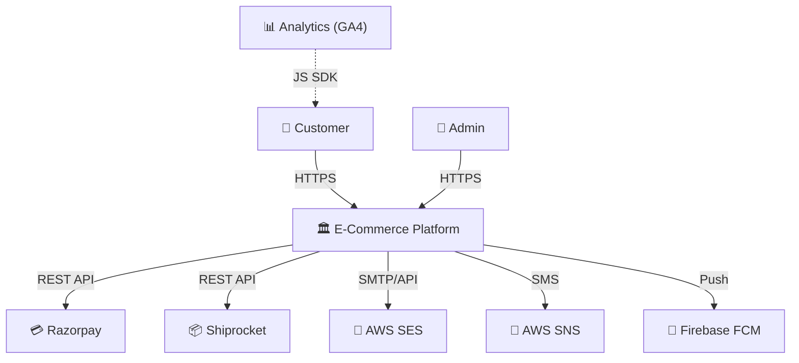
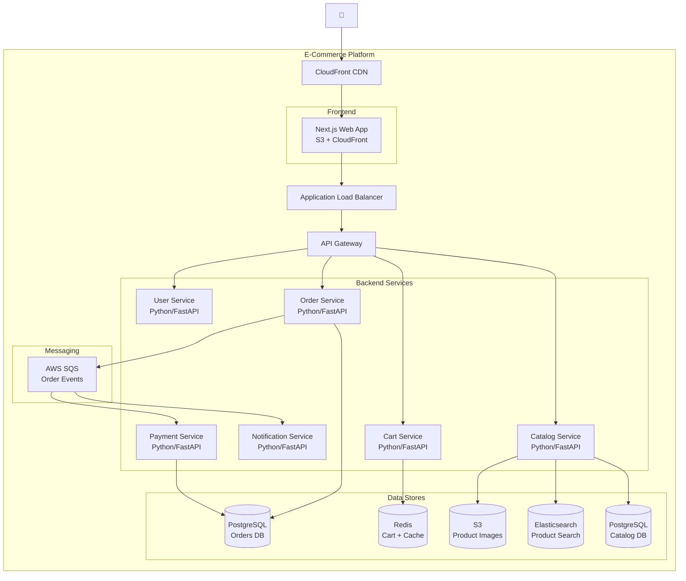
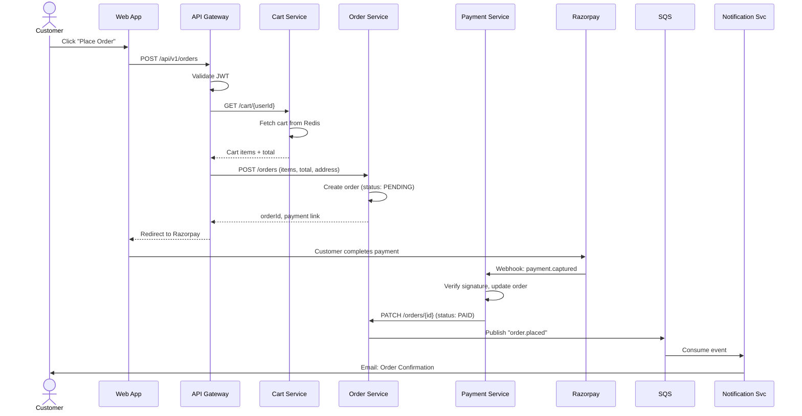
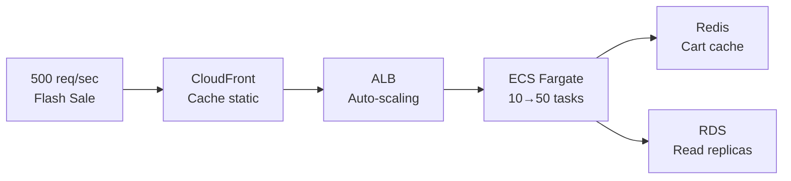
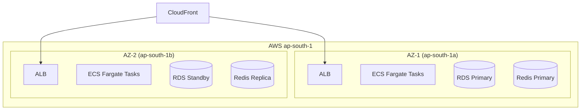

# E-Commerce Platform — High-Level Design

| Field | Value |
|-------|-------|
| **Version** | 1.0 |
| **Author** | Gaurav Sharma |
| **Reviewers** | Platform Lead, Security Architect |
| **Status** | Approved |
| **Date** | 2026-03-11 |

---

## 1. Executive Summary

This HLD describes a cloud-native e-commerce platform serving B2C customers in India.
The platform enables product browsing, cart management, checkout with payment processing,
and order fulfillment. It is designed for 50,000 daily active users with a peak of
500 concurrent orders during flash sales, deployed on AWS with a multi-AZ architecture
targeting 99.9% availability.

---

## 2. Business Context

### 2.1 Business Drivers
- Launch a direct-to-consumer channel replacing dependency on marketplace platforms (30% fee reduction)
- Support flash sales with 10x normal traffic spike lasting 2-4 hours
- Regulatory compliance: GST invoicing, data residency in India (ap-south-1)

### 2.2 Key Use Cases

| # | Use Case | Actor | Priority |
|---|----------|-------|:--------:|
| UC-01 | Browse and search products | Customer | Must |
| UC-02 | Add to cart and checkout | Customer | Must |
| UC-03 | Pay via UPI, cards, wallets | Customer | Must |
| UC-04 | Track order status | Customer | Must |
| UC-05 | Manage product catalog | Admin | Must |
| UC-06 | View sales analytics | Admin | Should |

---

## 3. System Context Diagram (C4 Level 1)

**External Dependencies:**

| System | Protocol | Purpose | SLA |
|--------|----------|---------|:---:|
| Razorpay | REST API | Payment processing (UPI, cards, wallets) | 99.9% |
| Shiprocket | REST API | Shipping label generation, tracking | 99.5% |
| AWS SES | SMTP/API | Transactional emails | 99.9% |
| AWS SNS | API | SMS notifications | 99.9% |
| Firebase FCM | API | Mobile push notifications | 99.5% |

---

## 4. Container Diagram (C4 Level 2)

| Container | Technology | Responsibility |
|-----------|-----------|---------------|
| Web App | Next.js on S3 + CloudFront | Server-side rendered storefront |
| API Gateway | AWS API Gateway | Auth, rate limiting, routing |
| Catalog Service | Python / FastAPI | Product CRUD, category management |
| Cart Service | Python / FastAPI | Cart add/remove/update, stored in Redis |
| Order Service | Python / FastAPI | Order creation, lifecycle, fulfillment |
| Payment Service | Python / FastAPI | Razorpay integration, refunds |
| Notification Service | Python / FastAPI | Email, SMS, push via SQS consumer |
| User Service | Python / FastAPI | Registration, login, profile, preferences |
| PostgreSQL (Catalog) | AWS RDS (db.r6g.large) | Products, categories, inventory |
| PostgreSQL (Orders) | AWS RDS (db.r6g.large) | Orders, payments, shipping |
| Redis | AWS ElastiCache (r6g.large) | Cart storage, API response cache |
| Elasticsearch | AWS OpenSearch (t3.medium.search) | Full-text product search |
| SQS | AWS SQS | Async event delivery (orders → notifications) |
| S3 | AWS S3 | Product images, static assets |

---

## 5. Data Flow

### 5.1 Checkout Flow (Happy Path)

### 5.2 Flash Sale Traffic Handling

- **Auto-scaling:** ECS Fargate scales from 10 to 50 tasks based on CPU > 60%
- **Caching:** Product pages cached at CDN (TTL: 5 min during sales)
- **Rate limiting:** API Gateway: 100 req/sec per user during flash sales
- **Queue buffering:** Orders written async to SQS, processed at service pace

---

## 6. Technology Stack

| Layer | Technology | Rationale |
|-------|-----------|-----------|
| Frontend | Next.js 14 (React) | SSR for SEO, fast page loads |
| API Gateway | AWS API Gateway | Managed auth, rate limiting, no ops overhead |
| Backend Services | Python 3.12 + FastAPI | Team expertise, async support, type safety |
| Primary Database | PostgreSQL 16 (RDS) | ACID, complex queries, team familiarity |
| Cache | Redis 7 (ElastiCache) | Sub-ms cart access, API response caching |
| Search | OpenSearch (Elasticsearch) | Full-text product search with facets |
| Object Storage | S3 + CloudFront | Product images, static assets |
| Messaging | SQS + SNS | Managed, reliable, no Kafka ops overhead |
| Payments | Razorpay | UPI, cards, wallets — India-focused |
| Shipping | Shiprocket | Multi-carrier aggregator |
| Container Orchestration | ECS Fargate | Serverless containers, no EC2 management |
| CI/CD | GitHub Actions | Team uses GitHub, built-in Actions |
| Monitoring | CloudWatch + Datadog | Metrics, logs, APM, alerting |
| IaC | Terraform | Multi-service provisioning, state management |

---

## 7. Integration Architecture

| Integration | Protocol | Auth | Direction | Data Format | SLA |
|------------|----------|------|-----------|-------------|:---:|
| Razorpay | REST + Webhooks | API Key + HMAC | Bidirectional | JSON | 99.9% |
| Shiprocket | REST | API Token | Outbound | JSON | 99.5% |
| AWS SES | SMTP/API | IAM Role | Outbound | HTML/Text | 99.9% |
| Firebase FCM | REST | Service Account | Outbound | JSON | 99.5% |

---

## 8. Non-Functional Requirements

| Category | Requirement | Target |
|----------|-----------|--------|
| **Availability** | System uptime | 99.9% (8.76 hrs/yr downtime) |
| **Latency** | Product page load (p95) | < 2 seconds |
| **Latency** | API response (p95) | < 500ms |
| **Throughput** | Normal concurrent users | 5,000 |
| **Throughput** | Peak (flash sale) | 50,000 concurrent, 500 orders/sec |
| **Scalability** | Growth without redesign | 10x (500K daily users) |
| **Data Retention** | Order history | 7 years |
| **Data Retention** | Logs | 30 days hot, 90 days archived |
| **RPO** | Maximum data loss | < 5 minutes |
| **RTO** | Maximum downtime | < 30 minutes |
| **Compliance** | Data residency | India (ap-south-1) |
| **Compliance** | Payment | PCI-DSS (via Razorpay tokenization) |

---

## 9. Security Architecture

| Concern | Approach |
|---------|----------|
| **Authentication** | AWS Cognito (OAuth2 + OIDC), JWT access tokens (15 min expiry) |
| **Authorization** | RBAC: customer, admin, super_admin roles |
| **Encryption (transit)** | TLS 1.3 everywhere (CloudFront → ALB → Services) |
| **Encryption (rest)** | RDS: AES-256 via KMS; S3: SSE-S3; Redis: at-rest encryption |
| **Network Security** | VPC with public/private/data subnets, no public DB access |
| **Secrets** | AWS Secrets Manager, rotated every 90 days |
| **PCI Compliance** | Razorpay handles card data (tokenization), no PAN stored |
| **WAF** | AWS WAF on CloudFront + API Gateway (OWASP rules) |

---

## 10. Deployment Architecture

| Environment | Purpose | Scale |
|------------|---------|-------|
| Development | Developer testing | 1 instance per service, shared RDS |
| Staging | Pre-production validation | Production-like (2 instances, separate DB) |
| Production | Live customers | Multi-AZ, auto-scaling (2-50 tasks) |

---

## 11. Cost Estimate

| Service | Monthly (Normal) | Monthly (Peak) |
|---------|:----------------:|:--------------:|
| ECS Fargate (6 services × 2-10 tasks) | $800 | $2,000 |
| RDS PostgreSQL (2 × db.r6g.large, Multi-AZ) | $600 | $600 |
| ElastiCache Redis (r6g.large, Multi-AZ) | $300 | $300 |
| OpenSearch (t3.medium.search × 2) | $200 | $200 |
| CloudFront + S3 | $150 | $400 |
| API Gateway | $100 | $300 |
| SQS/SNS | $20 | $50 |
| CloudWatch + Datadog | $200 | $200 |
| Secrets Manager + KMS | $30 | $30 |
| Data transfer | $100 | $300 |
| **Total** | **$2,500** | **$4,380** |

**3-Year TCO:** ~$108,000 (with reserved instances: ~$75,000)

---

## 12. Key Architecture Decisions

| # | Decision | Rationale | ADR |
|---|----------|-----------|-----|
| 1 | ECS Fargate over EKS | Simpler ops, team doesn't need K8s features | ADR-001 |
| 2 | PostgreSQL over DynamoDB | Complex product queries, team SQL expertise | ADR-002 |
| 3 | SQS over Kafka | Lower ops, sufficient for our throughput | ADR-003 |
| 4 | Razorpay over Stripe | Better UPI support, India-focused pricing | ADR-004 |
| 5 | Monorepo for backend services | Shared utilities, easier cross-service changes | ADR-005 |

---

## 13. Risks & Mitigations

| # | Risk | Probability | Impact | Mitigation |
|---|------|:-----------:|:------:|-----------|
| 1 | Flash sale overwhelms database | Medium | High | Read replicas, Redis caching, API rate limiting |
| 2 | Razorpay downtime during checkout | Low | High | Queue pending payments, retry, show "processing" |
| 3 | Product search latency spikes | Medium | Medium | OpenSearch auto-scaling, fallback to DB queries |
| 4 | Data residency violation | Low | Critical | All resources in ap-south-1, S3 bucket policies |

---

## 14. Roadmap

| Phase | Scope | Timeline |
|-------|-------|----------|
| Phase 1 (MVP) | Catalog, Cart, Checkout, Payments, Basic admin | 12 weeks |
| Phase 2 | Search, Reviews, Wishlist, Analytics dashboard | 8 weeks |
| Phase 3 | Mobile app (React Native), Push notifications, Loyalty | 10 weeks |

---

*Generated using Archpilot HLD Standards v1.0*
