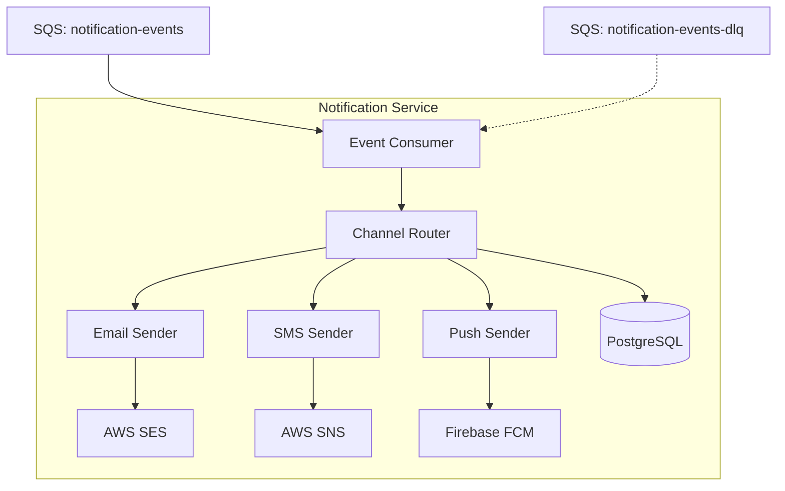
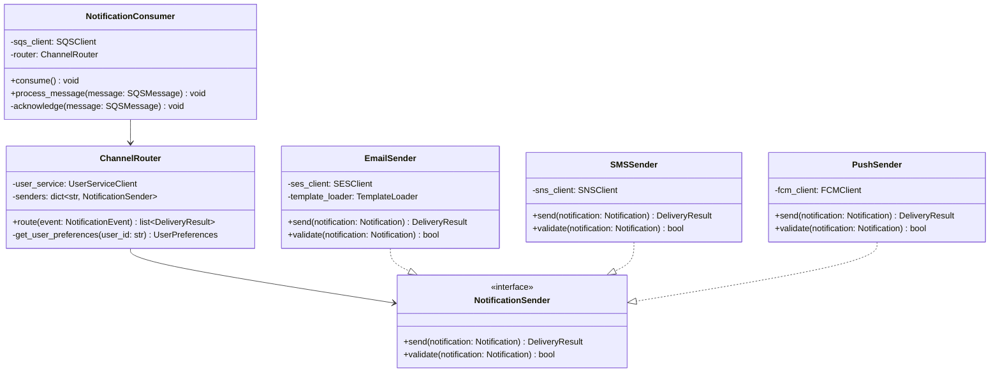
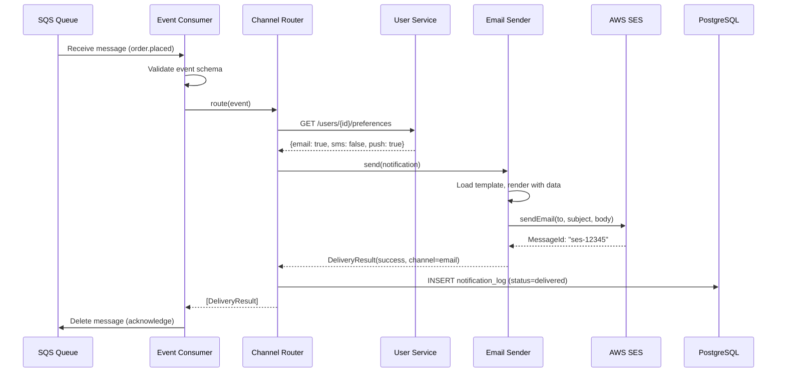
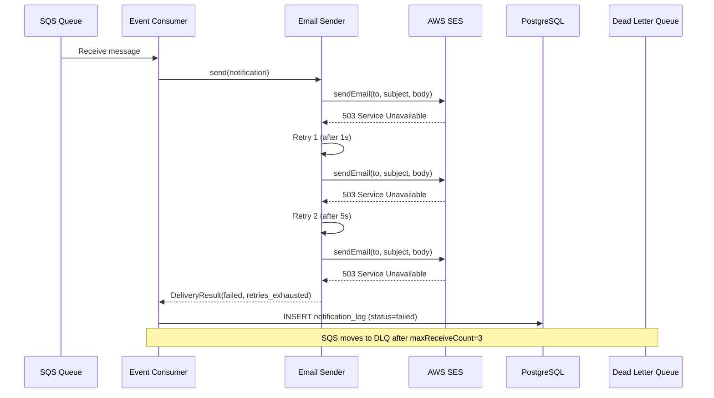
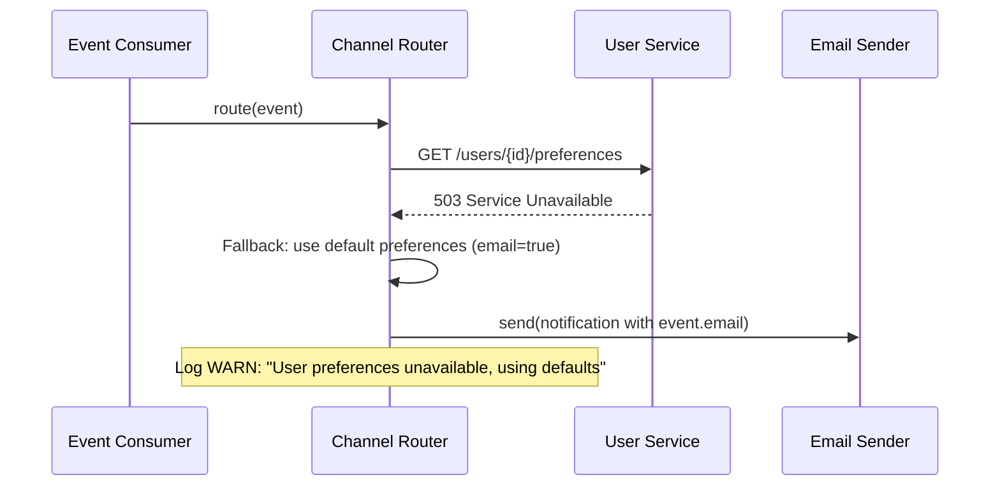
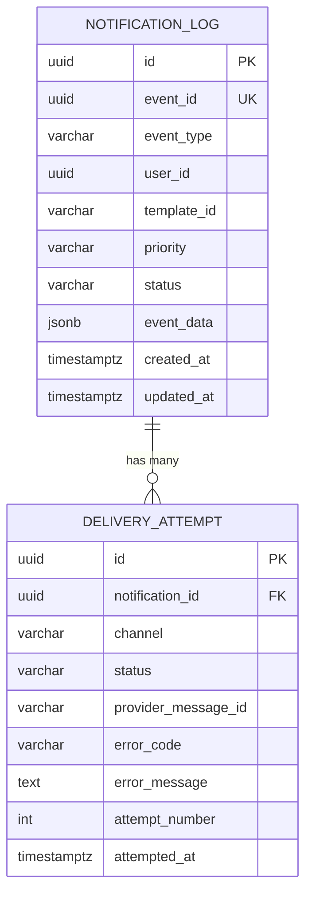

# Notification Service — Low-Level Design

| Field | Value |
|-------|-------|
| **Version** | 1.0 |
| **Author** | Gaurav Sharma |
| **Reviewers** | Platform Team Lead, Security Architect |
| **Status** | Approved |
| **Date** | 2026-03-11 |
| **Related ADRs** | ADR-005: Use SQS for Async Notification Delivery |
| **Related HLD** | Platform HLD v2.3 — Section 4.5 |

---

## 1. Scope & Objectives

### 1.1 What This LLD Covers
Design of a Notification Service that handles sending email, SMS, and in-app push
notifications triggered by domain events from other microservices.

### 1.2 What This LLD Does NOT Cover
- Notification content/template management (handled by Content Service)
- User preference management UI (handled by User Service)
- Billing for SMS/email (handled by vendor directly)

### 1.3 Business Context
Users need timely notifications for critical events (order confirmations, payment receipts,
security alerts). Current implementation sends notifications synchronously within the
Order Service, causing 2-3 second latency spikes and failed notifications when email
providers are slow.

### 1.4 Success Criteria

| # | Criterion | Measurement |
|---|-----------|-------------|
| 1 | Notification delivery within 30 seconds of trigger event | p95 < 30s |
| 2 | 99.9% delivery rate (excluding invalid addresses) | Monthly report |
| 3 | Zero impact on source service latency | No sync calls from producers |

---

## 2. Assumptions, Constraints & Dependencies

### 2.1 Assumptions
- User notification preferences (email/SMS/push opt-in) are managed by User Service
- Email templates are stored in S3 and managed by the Content team
- SES, SNS, and Firebase are pre-provisioned and API keys available

### 2.2 Constraints
- Budget: $500/month for notification infrastructure
- Must use existing AWS infrastructure (SES for email, SNS for SMS)
- Cannot store notification content longer than 90 days (data retention policy)

### 2.3 Dependencies

| Dependency | Owner | Status | Risk if Unavailable |
|-----------|-------|--------|---------------------|
| AWS SES | AWS (managed) | Available | Email delivery fails → DLQ |
| AWS SNS | AWS (managed) | Available | SMS delivery fails → DLQ |
| Firebase Cloud Messaging | Google (managed) | Available | Push delivery fails → DLQ |
| User Service API | Platform Team | Available | Cannot fetch preferences → use defaults |

---

## 3. Detailed Design

### 3.1 Component Architecture



| Component | Responsibility | Tech Stack |
|-----------|---------------|------------|
| Event Consumer | Consume events from SQS, validate, route | Python + boto3 |
| Channel Router | Determine channels based on user preferences | Python |
| Email Sender | Render template, send via SES | Python + Jinja2 + boto3 |
| SMS Sender | Format message, send via SNS | Python + boto3 |
| Push Sender | Build payload, send via FCM | Python + firebase-admin |
| Notification DB | Store delivery status and audit trail | PostgreSQL (RDS) |

### 3.2 Class / Module Design



**Design Patterns Used:**
- ✅ Strategy Pattern — `NotificationSender` interface with channel-specific implementations
- ✅ Consumer/Worker Pattern — SQS message processing with acknowledgement
- ✅ Repository Pattern — `NotificationRepository` for delivery status persistence

### 3.3 Sequence Diagrams

#### 3.3.1 Happy Path — Email Notification



#### 3.3.2 Error Path — Email Provider Failure



#### 3.3.3 Error Path — Invalid User (User Service Down)



---

## 4. API Specification

### 4.1 Internal Event Schema (SQS Message)

This service does NOT expose HTTP APIs. It consumes events from SQS.

**Event Schema:**
```json
{
  "eventId": "550e8400-e29b-41d4-a716-446655440000",
  "eventType": "order.placed",
  "version": "1.0",
  "timestamp": "2026-03-11T09:00:00Z",
  "source": "order-service",
  "correlationId": "req-abc123",
  "data": {
    "userId": "usr-789",
    "userEmail": "gaurav@example.com",
    "orderId": "ord-456",
    "orderTotal": 9999,
    "currency": "INR",
    "items": [
      {"name": "Widget Pro", "quantity": 2}
    ]
  },
  "notification": {
    "templateId": "order-confirmation-v2",
    "priority": "high",
    "channels": ["email", "push"]
  }
}
```

### 4.2 Health Check Endpoint

| Field | Value |
|-------|-------|
| **Method** | GET |
| **Path** | `/health` |
| **Authentication** | None (internal only) |

**Response — 200:**
```json
{
  "status": "healthy",
  "version": "1.4.2",
  "dependencies": {
    "database": "connected",
    "sqs": "connected",
    "ses": "available"
  }
}
```

---

## 5. Database Design

### 5.1 Entity Relationship Diagram



### 5.2 Table: `notification_log`

| Column | Type | Nullable | Default | Constraints |
|--------|------|:--------:|---------|------------|
| `id` | UUID | No | `gen_random_uuid()` | PK |
| `event_id` | UUID | No | | UNIQUE |
| `event_type` | VARCHAR(100) | No | | NOT NULL |
| `user_id` | UUID | No | | NOT NULL |
| `template_id` | VARCHAR(100) | No | | NOT NULL |
| `priority` | VARCHAR(20) | No | `'normal'` | CHECK (low, normal, high, critical) |
| `status` | VARCHAR(20) | No | `'pending'` | CHECK (pending, delivered, partial, failed) |
| `event_data` | JSONB | No | | NOT NULL |
| `created_at` | TIMESTAMPTZ | No | `NOW()` | |
| `updated_at` | TIMESTAMPTZ | No | `NOW()` | |

**Indexes:**
| Name | Columns | Type | Purpose |
|------|---------|------|---------|
| `idx_notif_event_id` | `event_id` | B-tree (unique) | Idempotency check |
| `idx_notif_user_id` | `user_id` | B-tree | Query by user |
| `idx_notif_status` | `status` | B-tree | Failed notification retry |
| `idx_notif_created` | `created_at` | B-tree | Time-range queries, cleanup |

**Data Projections:**
| Timeframe | Estimated Rows | Storage |
|-----------|:--------------:|---------|
| Launch | 10,000 | < 50 MB |
| 1 year | 5,000,000 | ~2 GB |
| 3 years | 15,000,000 | ~6 GB |

**Partitioning:** Range by `created_at` (monthly partitions after 10M rows).
**Retention:** 90 days hot, archived to S3 after 90 days, deleted after 1 year.
**PII Columns:** `event_data` may contain user email — masked in non-prod environments.

---

## 6. Event / Message Design

### 6.1 Incoming Event: `*.notification` (SQS)

| Field | Value |
|-------|-------|
| **Queue** | `notification-events` |
| **DLQ** | `notification-events-dlq` |
| **Producers** | Order Service, Payment Service, Auth Service |
| **Delivery Guarantee** | At-least-once |
| **Ordering** | None required |
| **Retry Policy** | 3 receives, then DLQ |
| **Visibility Timeout** | 60 seconds |

---

## 7. Error Handling Strategy

| Error Category | Action | Log Level |
|---------------|--------|:---------:|
| Invalid event schema | Reject to DLQ, do not retry | ERROR |
| User not found | Use default preferences, continue | WARN |
| Email provider timeout | Retry 3x with backoff (1s, 5s, 30s) | WARN → ERROR |
| SMS provider failure | Retry 3x, move to DLQ | ERROR |
| Push token invalid | Mark token as invalid, skip push | WARN |
| Database write failure | Retry 2x, log and continue (notification still sent) | ERROR |
| Duplicate event (same eventId) | Skip silently (idempotent) | INFO |

---

## 8. Security Considerations

| Concern | Implementation |
|---------|---------------|
| **Authentication** | IAM role for SQS/SES/SNS access (no API keys) |
| **Authorization** | Service role with scoped permissions per AWS service |
| **Input Validation** | JSON schema validation on incoming events |
| **Sensitive Data** | Email addresses encrypted in event_data (JSONB), masked in logs |
| **Secrets Management** | Firebase credentials via AWS Secrets Manager |
| **Audit Logging** | All delivery attempts logged with event_id and outcome |

---

## 9. Performance Considerations

### 9.1 Throughput Targets

| Scenario | Events/sec | Notes |
|----------|:----------:|-------|
| Normal load | 10 | ~36K notifications/hour |
| Peak load (flash sale) | 100 | ~360K notifications/hour |

### 9.2 Caching Strategy

| Data | Cache | TTL | Invalidation |
|------|-------|:---:|-------------|
| User preferences | In-memory (LRU) | 5 min | TTL expiry |
| Email templates | In-memory | 15 min | TTL expiry |

---

## 10. Observability Plan

### 10.1 Key Metrics

| Metric | Type | Alert Threshold |
|--------|------|:---------------:|
| `notification_events_consumed_total` | Counter | — |
| `notification_delivery_duration_seconds` | Histogram | p99 > 30s |
| `notification_delivery_failures_total` | Counter | Rate > 5% for 5 min |
| `notification_dlq_depth` | Gauge | > 0 for 10 min |
| `notification_channel_success_rate` | Gauge | < 95% per channel |

### 10.2 Alerts

| Alert | Condition | Severity | Action |
|-------|-----------|:--------:|--------|
| High failure rate | Failure > 5% for 5 min | 🔴 P1 | Page on-call, check provider status |
| DLQ not empty | DLQ depth > 0 for 10 min | 🟠 P2 | Investigate failed messages |
| Consumer lag | Queue depth > 1000 for 5 min | 🟡 P3 | Scale consumers |

---

## 11. Testing Strategy

| Test Type | Scope | Tools |
|-----------|-------|-------|
| Unit | Channel router logic, template rendering | pytest + moto (AWS mocks) |
| Integration | SQS consumer → DB write flow | Testcontainers (PostgreSQL, LocalStack) |
| Contract | Event schema validation | JSON Schema validator |
| Load | 100 events/sec sustained for 10 min | Locust + LocalStack |

---

## 12. Deployment & Rollout

| Field | Value |
|-------|-------|
| **Strategy** | Rolling update (ECS) |
| **Feature Flags** | `enable_sms_channel`, `enable_push_channel` |
| **Rollback** | ECS task definition rollback to previous version |
| **DB Migration** | Run before deploy (additive changes only) |
| **Smoke Tests** | Publish test event to SQS, verify delivery log in DB |
| **Monitoring (30 min)** | Watch: failure rate, DLQ depth, consumer lag |

---

## 13. Open Questions & Risks

| # | Question / Risk | Impact | Owner | Resolution |
|---|----------------|:------:|-------|------------|
| 1 | Should we support WhatsApp as a channel? | Low | Product | Deferred to Phase 2 |
| 2 | SES sending limits in ap-south-1 region | Medium | DevOps | Requested limit increase, approved |

---

*Generated using Archpilot LLD Standards v1.0*
