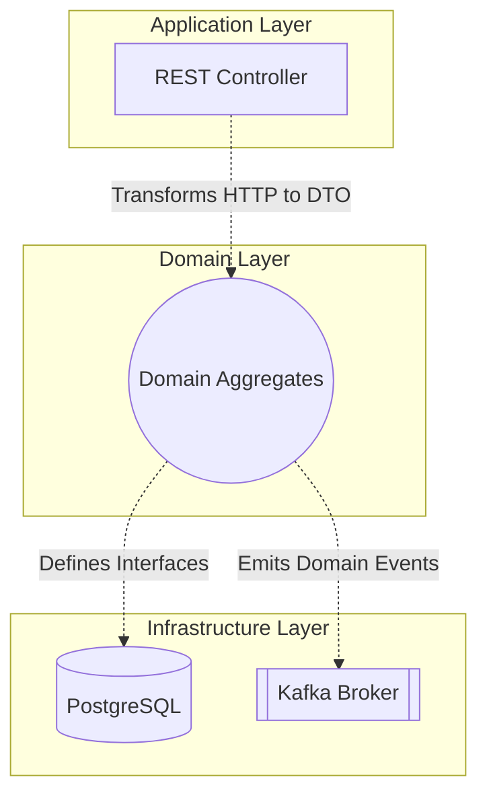

# Architecture Principles — Enterprise Standard

> **Purpose:** These are the foundational rules that govern ALL architecture decisions.
> When used as LLM context, these principles ensure every generated design, document,
> and recommendation is grounded in rigorous, quantitative enterprise-grade engineering physics.
> Violation of these principles requires a formal Exception Request to the Architecture Review Board (ARB).

---

## How to Use This File

- **Claude Projects:** Upload this file as project knowledge
- **ChatGPT:** Paste into Custom GPT instructions or conversation context
- **VS Code / Cursor:** Reference in `.github/copilot-instructions.md` or `.cursorrules`
- **Any LLM:** Prefix your prompt with: *"Follow these architecture principles: [paste this file]"*

---

## Related Standards

| Standard | Relationship |
|----------|-------------|
| [04 — LLD Standards](./04-lld-standards.md) | Applies these principles at the component level |
| [03 — HLD Standards](./03-hld-standards.md) | Applies these principles at the system level |
| [07 — Security Architecture](./07-security-architecture.md) | Expands Security Principles (§5) |
| [14 — Cost Optimization](./14-cost-optimization.md) | Expands FinOps Principles (§8) |
| [02 — ADR Standards](./02-adr-standards.md) | Implements Decision-Making Framework (§2) |

---

## 1. Design Principles

### 1.1 Separation of Concerns (SoC) & Topological Isolation
- Every module, service, or component MUST have a single, well-defined responsibility.
- Business logic MUST be separated from infrastructure concerns (databases, messaging, HTTP).
- Presentation, application, domain, and infrastructure layers MUST be independently deployable or replaceable.
- **Enterprise Physics:** We mandate Ring/Hexagonal topologies. For any bounded context, Afferent Coupling ($C_a$) and Efferent Coupling ($C_e$) dictate Instability: $I = C_e / (C_a + C_e)$. Core domain models MUST maintain $I = 0.0$ to $0.2$. Infrastructure adapters MUST maintain $I = 0.8$ to $1.0$.



- **Fitness Function Validation:** This must be enforced automatically in the CI pipeline. Use `ArchUnit` (Java).
```java
// ArchUnit Example: Domain must be pure
@AnalyzeClasses(packages = "com.enterprise.order")
public class ArchitectureTests {
    @ArchTest
    static final ArchRule domain_should_not_depend_on_infrastructure =
        noClasses().that().resideInAPackage("..domain..")
        .should().dependOnClassesThat().resideInAPackage("..infrastructure..")
        .because("Domain logic must remain entirely agnostic of databases and web frameworks.");
}
```

### 1.2 Loose Coupling, High Cohesion
- Components SHOULD communicate through well-defined interfaces (APIs, events, contracts), not shared state.
- Internal details of a component MUST NOT leak into its public interface.
- Related functionality SHOULD be grouped together; unrelated functionality MUST be separated.
- **Temporal Decoupling:** Components MUST NOT depend on the immediate availability of another component to function. Use asynchronous messaging where business processes span multiple domains.
- **Data Encapsulation:** Data structures used for database storage MUST map to completely separate DTOs for network transit. Returning database entities directly via APIs is strictly forbidden.
  - *Anti-Pattern:* `return userRepository.findById(id);` (Leaks DB schema, annotations, and passwords).
  - *Pro-Pattern:* `return UserMapper.toPublicDto(userRepository.findById(id));`

### 1.3 API-First Design
- All inter-service communication MUST be defined through versioned API contracts BEFORE implementation.
- API contracts SHOULD be the single source of truth — code is generated from contracts, not the other way around.
- Internal APIs follow the same rigor as external APIs.
- **Protocol Limits:** Explicit limits on payload sizes (Max 2MB per request) must be defined in the contract to prevent memory exhaustion (OOM crashes) in the compute tier.
- **Linting Automation:** OpenAPI schemas MUST be linted in CI using tools like `Spectral` to enforce standard error payloads.
```yaml
# spectral.yaml example configuration
rules:
  no-http-verbs-in-paths: true
  path-params: true
  operation-tags: true
  enforce-rfc-7807-errors:
    description: All 4xx and 5xx responses must return RFC 7807 Problem Details.
    given: $.paths.*.*.responses[?(@property >= 400 && @property < 600)].content
    then:
      field: application/problem+json
      function: truthy
```

### 1.4 Configuration Over Code
- Environment-specific values (URLs, credentials, feature flags, thresholds) MUST be externalized into configuration.
- Configuration MUST be environment-aware (dev, staging, production) and NEVER hardcoded.
- Secrets MUST be managed through a secrets manager (AWS Secrets Manager, HashiCorp Vault, Azure Key Vault), NEVER in config files or environment variables in plain text.
- **Immutable Artifacts:** Build an artifact once; deploy that exact same binary/image across Dev, Staging, and Prod. Behavior changes via injected configuration, not recompilation (12-Factor App methodology).
- **Zero-Secret Commits:** Pre-commit hooks (e.g., `trufflehog`, `git-secrets`) MUST block any hardcoded credentials. Any leaked secret must trigger automatic credential rotation.

### 1.5 Convention Over Configuration
- Adopt framework and language conventions by default. Override only when there is a documented, justified reason.
- Naming conventions (files, classes, APIs, database tables) MUST be consistent across the entire system.
- Directory structures SHOULD follow the established patterns of the chosen framework/language.
- **Automation Enforcement:** Enforce via strict, non-bypassable CI/CD linting (ESLint, SonarQube with blocking quality gates).

### 1.6 Fail Fast, Recover Gracefully
- Systems MUST validate inputs at the boundary (API gateway, service entry points) and reject invalid data immediately.
- Failures MUST be detected quickly through health checks, circuit breakers, and timeouts.
- Recovery mechanisms (retries, fallbacks, graceful degradation) MUST be designed into every external dependency interaction.
- **Crash Early:** If a service cannot reach its required dependencies on startup, it must fail to start (crash loop) rather than starting in a zombie, degraded state.
- **Probe Accuracy:** Orchestrators like Kubernetes must be configured with precise Liveness (Is it crashed?) and Readiness (Can it take traffic?) probes.
```yaml
# Kubernetes Liveness/Readiness Probe Standard
livenessProbe:
  httpGet:
    path: /health/liveness
    port: 8080
  initialDelaySeconds: 15
  periodSeconds: 10
  failureThreshold: 3
readinessProbe:
  httpGet:
    path: /health/readiness
    port: 8080
  initialDelaySeconds: 5
  periodSeconds: 5
  successThreshold: 2
```

### 1.7 Design for Observability
- Every service MUST emit structured logs, metrics, and distributed traces from day one — not retrofitted later.
- Observability is a FIRST-CLASS architectural concern, not an afterthought.
- Each service MUST expose a health check endpoint and readiness probe.
- **W3C Trace Context:** `100%` of ingress and egress requests must carry W3C Trace Context headers (`traceparent`, `tracestate`) to allow cross-service transaction tracing.
- **High-Cardinality Metrics:** Every Prometheus/OpenMetrics histogram bucket MUST include Trace ID exemplars so that P99 latency alerts can be linked directly to the exact failing request.

### 1.8 Principle of Least Privilege
- Every component, service, user, and process MUST operate with the minimum permissions required.
- Service-to-service authentication MUST use short-lived tokens or mutual TLS, not shared API keys.
- Database access SHOULD use role-based accounts with query-level restrictions where possible.

---

## 2. Decision-Making Framework

### 2.1 Trade-Off Analysis (Mandatory)
Every significant architecture decision MUST document:
1. **Options Considered** — at least 2-3 alternatives
2. **Evaluation Criteria** — weighted factors (cost, complexity, team skill, scalability, time-to-market)
3. **Decision** — the chosen option with clear rationale
4. **Consequences** — both positive and negative impacts
5. **Reversibility** — how easy is it to change this decision later?

### 2.2 Build vs. Buy vs. Adopt Matrix
Use this decision matrix for technology selection:

| Factor | Weight | Evaluate |
|--------|--------|----------|
| Core vs. Peripheral | High | Is this a core differentiator or a commodity capability? |
| Team Expertise | High | Does the team have production experience with this technology? |
| Total Cost of Ownership | High | Include licensing, ops, training, and migration costs over 3 years |
| Community & Support | Medium | Is there active development, documentation, and enterprise support? |
| Lock-in Risk | Medium | How difficult is it to migrate away from this technology? |
| Time to Production | Medium | How quickly can we deliver with this choice? |
| Compliance | High | Does it meet regulatory and security requirements? |
| Integration Cost | High | How difficult is it to integrate the SaaS tool with our existing IAM and logging systems? |

**Rule:** Build only when the capability is a core differentiator AND no mature solution exists.
**Rule:** Default to managed/SaaS services for non-differentiating capabilities (e.g., Auth0/Okta for Identity, Stripe for Payments, SendGrid for Email).

### 2.3 Reversibility Principle
- **Two-way door decisions** (easily reversible): Move fast, optimize for speed. (e.g., Tuning a JVM garbage collector, choosing a Javascript utility library).
- **One-way door decisions** (hard to reverse): Invest in analysis, get stakeholder alignment, document thoroughly via ADR. (e.g., Adopting AWS DynamoDB as the primary datastore, implementing a Micro-Frontend architecture).
- When in doubt, choose the option that preserves the most future flexibility.

### 2.4 Standardization vs. Innovation Tolerance
- **The Core Constraint:** 80% of all applications MUST utilize the organization's standard tech stack (e.g., Java/Spring Boot + Postgres + React). This ensures developers can easily rotate between teams without massive cognitive friction.
- **The Innovation Budget:** 20% of new projects may use experimental or non-standard technologies, provided there is an ADR justifying the specific architectural need (e.g., using Rust for a high-performance network proxy where Java's GC pauses are unacceptable).

---

## 3. Scalability Principles

### 3.1 Design for 10x
- Architecture SHOULD handle 10x the current load without fundamental redesign.
- Identify bottlenecks early: single databases, synchronous chains, shared state.
- Horizontal scaling SHOULD be the primary scaling strategy; vertical scaling is a temporary measure.
- **Load Testing SLA:** Load tests MUST mathematically prove linear horizontal scalability up to 3x expected peak load before a production release is authorized.
- **Auto-Scaling Metrics:** CPU usage is often a lagging indicator. Auto-scaling groups should be bound to concurrent request counts or SQS queue depth (`ApproximateNumberOfMessagesVisible`) to preemptively scale before CPU exhaustion.

### 3.2 Statelessness
- Application services MUST be stateless. All state MUST be externalized to databases, caches, or message brokers.
- Session state MUST NOT be stored in-memory on application servers (e.g., HTTP Session).
- Any instance of a service MUST be replaceable without data loss.
- **Chaos Validation:** Services MUST survive random pod termination (Chaos Monkey/Spot instance interruption) at any time with zero dropped transactions.

### 3.3 Asynchronous by Default
- Operations that don't require an immediate response SHOULD be processed asynchronously.
- Use message queues or event streams for inter-service communication where real-time response is not required.
- Design for eventual consistency where strong consistency is not a business requirement.
- **Little's Law Enforcement:** Unbounded queues are memory leaks. The buffer size ($L$) must strictly equal maximum arrival rate ($\lambda$) multiplied by acceptable processing latency ($W$). 
- **Queue SLAs:** Async processing queues MUST have explicit CloudWatch/Datadog SLA alarms for queue depth and message age.

### 3.4 Caching Strategy
- Identify hot data paths and implement caching at the appropriate layer (CDN, API gateway, application, database).
- Every cache MUST have a defined TTL and invalidation strategy.
- Cache-aside pattern is the default; write-through or write-behind MUST be justified.
- **Edge Computing:** Push computation and data as close to the user as possible using Edge functions (Cloudflare Workers, Lambda@Edge) for A/B testing routing and JWT validation.

### 3.5 Idempotency Key Mathematics
- **The Constraint:** Network timeouts mean the client does not know if the server processed the transaction. ALL mutating endpoints (POST, PUT, PATCH, DELETE) MUST be mechanically idempotent.
- **Implementation:** 
  1. Client passes an `Idempotency-Key` UUID.
  2. Server attempts to acquire a distributed lock on the UUID.
  3. Server checks state. If processed previously, returns cached 200/201 response.
  4. If not, processes transaction, caches response against the UUID, releases lock.
  5. TTL for idempotency keys is strictly 24 hours.

---

## 4. Reliability Principles

### 4.1 Resilience Patterns (Mandatory for Production)
Every production service MUST implement:

| Pattern | Purpose | Enterprise Implementation Physics |
|---------|---------|-----------------------------------|
| **Circuit Breaker** | Prevent cascade failures | Open after 50% failure rate. Minimum evaluated window MUST be $\max(100 \text{ requests}, \text{Expected TPS} \times 10s)$ to prevent false flapping. |
| **Retry with Backoff** | Handle transient failures | Exponential backoff with random decorrelated jitter. Max 3 retries. Total retries must not exceed 10% of total throughput. |
| **Timeout** | Prevent hanging requests | Explicit P99 timeout limits on ALL remote calls. Default infinite timeouts are a Sev-1 violation. |
| **Bulkhead** | Isolate failures | Separate thread pools/connection pools per dependency. |
| **Fallback** | Provide degraded service | Cached data, default values, or reduced functionality. |

### 4.2 Data Durability
- All business-critical data MUST be replicated across at least 2 availability zones.
- Backup strategy MUST define RPO (Recovery Point Objective) and RTO (Recovery Time Objective).
- Backup restoration MUST be tested at least quarterly.
- **Uptime Math:** Target Availability dictates the operational error budget:
  - 99.9% = 43.8 minutes downtime/month
  - 99.99% = 4.38 minutes downtime/month. Requires automated geographic failover.

### 4.3 Graceful Degradation
- Systems MUST continue to serve core functionality even when non-critical dependencies fail.
- Feature flags SHOULD be used to disable non-essential features during incidents.
- Load shedding strategy MUST be defined for traffic exceeding capacity.
- **Backpressure Mechanism:** When internal buffers reach 85% capacity, the system MUST physically exert backpressure by returning `HTTP 429 Too Many Requests` rather than crashing out of memory.

---

## 5. Security Principles

### 5.1 Zero Trust Architecture
- NEVER trust network location. Authenticate and authorize every request, even internal ones.
- All communication between services MUST be encrypted (TLS 1.2+ minimum, TLS 1.3 preferred).
- Service identity MUST be verified through certificates or tokens, not IP allowlists.
- **SPIFFE/SPIRE:** Service identity MUST be cryptographically proven. Every microservice MUST be assigned a SPIFFE ID and explicitly authorized for its specific actions.

### 5.2 Defense in Depth
- Security controls MUST exist at every layer: network, application, data, identity.
- No single security control should be the only protection against a threat.
- Input validation MUST happen at every trust boundary.
- **Timing Attacks:** Authentication logic must execute in constant time. When validating HMACs or tokens, the code MUST use cryptographic constant-time string comparison functions.

### 5.3 Secure by Default
- All new services MUST start with the most restrictive security configuration.
- Access is denied by default; permissions are explicitly granted.
- Default passwords, keys, and configurations MUST be changed before deployment.
- **Infrastructure Auditing:** Automated infrastructure scanning (e.g., Checkov, tfsec, OPA) MUST run in the CI pipeline and explicitly block insecure IaC deployments.

### 5.4 Data Classification & Envelope Encryption
Every data element MUST be classified:

| Classification | Handling | Encryption Physics |
|---------------|----------|--------------------|
| **Public** | No restrictions | TLS 1.2+ in transit. |
| **Internal** | Authenticated access only | AES-256 at rest. |
| **Confidential** | Role-based access, encrypted at rest | AES-256 via Envelope Encryption (DEK encrypted by KEK in an HSM/KMS). |
| **Restricted** | Strict access control, audit logging | Column-level encryption. KEK rotated every 90 days. |

---

## 6. Data Architecture Principles

### 6.1 Data Ownership
- Every data entity MUST have a single owning service. Only the owner can write to it.
- Other services access data through the owner's API or through published events.
- No shared databases between services. Each service owns its data store.
- **CQRS and Event Sourcing:** For complex domains, do not conflate read and write workloads. Separate the read model (denormalized for sub-ms querying) from the write model (strict consistency).

### 6.2 Schema Evolution
- Database schemas MUST support backward-compatible evolution (additive changes preferred).
- Breaking schema changes MUST follow a migration strategy with zero-downtime deployment (Expand-Contract pattern).
- All schema changes MUST be versioned and applied through migration scripts (e.g., Flyway, Liquibase), never manually.

### 6.3 Data Quality & The Outbox Pattern
- Data validation MUST happen at the ingestion boundary.
- Data contracts MUST be defined between producers and consumers.
- Data lineage SHOULD be traceable for compliance and debugging.
- **Transactional Outbox:** Saving to a DB and publishing to Kafka in the same function is a dual-write failure condition. You MUST use the Transactional Outbox Pattern combined with CDC (Change Data Capture) tailing the WAL.

---

## 7. Operational Principles

### 7.1 Infrastructure as Code (IaC)
- ALL infrastructure MUST be defined in code (Terraform, Pulumi, CloudFormation, CDK).
- No manual changes to production infrastructure (ClickOps is forbidden). All changes go through the IaC pipeline.
- Infrastructure code MUST be reviewed, tested, and version-controlled like application code.
- **Drift Detection:** Automated drift detection must run daily to identify and overwrite manual changes.

### 7.2 Deployment Principles
- Every deployment MUST be automated, repeatable, and rollback-capable.
- Blue-green or canary deployments for production. Never big-bang releases.
- Feature flags for separating deployment from feature release.
- **DORA Metrics Enforcement:** Commits that drop deployment frequency or dramatically increase lead time must flag architectural reviews.

### 7.3 Incident Response
- Every production system MUST have a runbook with common failure scenarios and resolution steps.
- Post-incident reviews (blameless) MUST happen within 48 hours of every major incident.
- Action items from post-mortems MUST be tracked and prioritized in the backlog.

---

## 8. Cost & GreenOps Principles (FinOps)

### 8.1 Cost-Aware Architecture
- Every architecture decision MUST consider Total Cost of Ownership (3-year projection).
- Cost MUST be a first-class architectural attribute, alongside performance and security.
- Resource tagging MUST be enforced for cost attribution by team, project, and environment. Untagged non-prod resources must be automatically terminated by a daily reaping script.

### 8.2 Right-Sizing & Network Physics
- Start with the smallest viable resource size and scale based on observed metrics.
- Over-provisioning for "just in case" scenarios is an architecture smell — use auto-scaling instead.
- **Data Transfer Costs:** Inter-AZ transfer and Internet egress are expensive. Locality routing MUST be used via a service mesh so a request in `us-east-1a` routes only to a downstream pod in `us-east-1a`.

### 8.3 Managed Over Self-Hosted
- Default to managed services (RDS over self-hosted PostgreSQL, SQS over self-hosted RabbitMQ).
- Self-hosting is justified only when: cost savings exceed 40% at scale, or compliance prevents managed service use.

### 8.4 GreenOps and Sustainability
- **The Principle:** Architecture must be carbon-aware.
- **Idle Eradication:** Non-production environments MUST automatically spin down during non-working hours.
- **Efficiency:** Prefer ARM-based compute (AWS Graviton) over x86, which yields up to 60% better energy efficiency per watt.

---

## 9. Platform Engineering & Developer Experience (DX)

### 9.1 The "Golden Path" Strategy
- **The Principle:** Do not mandate standards without providing the tooling to achieve them.
- **Implementation:** The architecture team MUST provide "Golden Paths"—paved roads in the form of repository templates (e.g., using Backstage Software Templates) that automatically generate a new microservice with CI/CD, observability, and security pre-configured.
- **Self-Service:** Developers MUST be able to provision infrastructure (databases, queues, caches) via self-service Internal Developer Portals (IDP) rather than opening IT support tickets. If it takes more than 5 minutes to get a Postgres database in dev, the platform has failed.

### 9.2 Local Development Fidelity
- **The Constraint:** The architecture must not hinder developer velocity. A developer should be able to spin up the entire local environment or test suite within 5 minutes.
- **Containerization:** All external dependencies (Redis, Postgres, Kafka) MUST be run locally via `docker-compose` or Testcontainers. Mocking databases in unit tests is discouraged; use ephemeral Testcontainers to test actual SQL dialects.
- **Mocks vs Stubs:** External HTTP APIs MUST be mocked using contract-testing tools like WireMock. A developer should never have to connect to a Staging environment API to run local unit tests.

---

## 10. Chaos Engineering & GameDays

### 10.1 The Continuous Verification Mandate
- **The Principle:** If you do not test failure, failure will test you in production.
- **Fault Injection:** Every Tier-1 service MUST have fault injection capabilities integrated into its staging environment.
- **Chaos Experiments:** You must explicitly inject the following faults:
  - 10% packet loss to the database.
  - Adding 500ms artificial latency to downstream HTTP calls.
  - Hard crashing the Redis caching tier.
  - Terminating the active database writer node (to test failover time).

### 10.2 GameDay Operations
- **The Ritual:** Once per quarter, the engineering team MUST execute a "GameDay" in a non-production environment.
- **Execution:** A designated "Chaos Engineer" triggers undocumented faults. The team must use their observability tools to identify, triage, and resolve the issue without looking at the underlying chaos scripts.
- **Validation:** If the system MTTR (Mean Time to Recover) exceeds the Service Level Objective (SLO), the GameDay is marked as a failure, and hardening tasks are immediately added to the sprint backlog.

---

## Quick Reference: Decision Checklist

Before finalizing any architecture decision, verify:

- [ ] Does it follow Separation of Concerns (verified by fitness functions)?
- [ ] Is it loosely coupled with mathematically bounded $C_a$ and $C_e$?
- [ ] Is configuration externalized and completely secret-free?
- [ ] Does it fail fast and recover gracefully meeting exact MTTR targets?
- [ ] Is observability built in (logs, metrics, W3C traces, exemplars)?
- [ ] Does it follow the Principle of Least Privilege and Zero Trust mTLS?
- [ ] Has a trade-off analysis been documented via ADR?
- [ ] Can it handle 10x load without redesign?
- [ ] Are quantitative resilience patterns (circuit breakers, timeouts, decorrelated jitter) active?
- [ ] Is all communication encrypted and utilizing Envelope Encryption for data at rest?
- [ ] Is data ownership clear and shared databases completely avoided?
- [ ] Are you using the Transactional Outbox pattern to prevent dual-write corruption?
- [ ] Is infrastructure strictly defined as code with automated drift detection?
- [ ] Has the 36-month TCO cost impact and cross-AZ data egress been estimated?
- [ ] Are mutating API operations mechanically protected by 24-hour Idempotency Keys?
- [ ] Have you tested the system against randomized Chaos Monkey pod termination?
- [ ] Are Golden Paths available for developers to adopt this architecture seamlessly?

---

*Archpilot — Enterprise Architecture Standards Library*
*Created by Gaurav Sharma*
