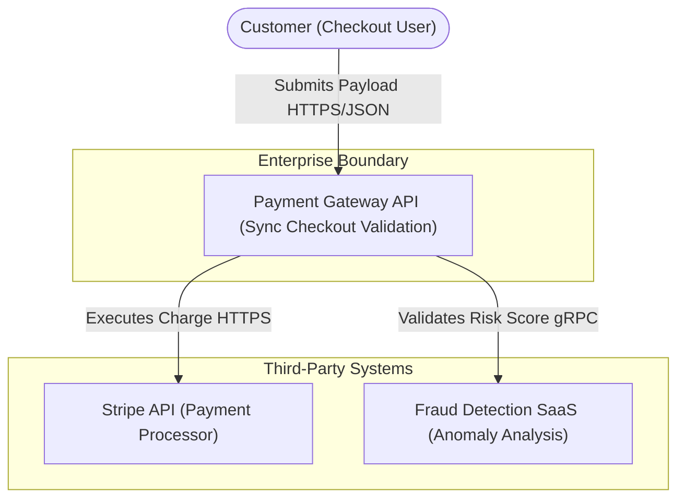

# Solution Design Standards

> **Purpose:** This rule file defines when and how to write a Solution Design Document (SDD) —
> the "one document" that connects business requirements to technical architecture.
> It bridges the gap between what stakeholders want and what engineers build.
> It enforces that every SDD must have quantitative metrics, traceability, and 
> robust enterprise financial modeling, removing ambiguity between what stakeholders want 
> and what engineers build.

---

## How to Use This File

- **Claude Projects:** Upload this file + `templates/sdd-template.md` as project knowledge
- **ChatGPT:** Paste into Custom GPT instructions or conversation context
- **Any LLM:** Say: *"Using these SDD standards, create a Solution Design for: [your project]"*

---

## Related Standards

| Standard | Relationship |
|----------|-------------|
| [03 — HLD Standards](./03-hld-standards.md) | The technical architecture section of an SDD |
| [04 — LLD Standards](./04-lld-standards.md) | Detailed design referenced by an SDD |
| [02 — ADR Standards](./02-adr-standards.md) | Key decisions documented separately as ADRs |
| [14 — Cost Optimization](./14-cost-optimization.md) | Cost estimation framework for §3.8 |
| [11 — NFR Checklist](./11-nfr-checklist.md) | Audit tool for NFR section (§3.3) |

---

## 1. When to Write an SDD

| Situation | SDD Required? |
|-----------|:------------:|
| New product or platform | ✅ Always |
| Major feature spanning multiple services | ✅ Always |
| Significant vendor/technology evaluation | ✅ Always |
| RFP/SOW response requiring technical approach | ✅ Always |
| Internal refactor with no external impact | ❌ LLD is sufficient |
| Bug fix or configuration change | ❌ No |

**Rule:** An SDD is the umbrella document. It may reference separate HLD, LLD, and ADR documents rather than duplicating them.

---

## 2. SDD vs HLD vs LLD

| Aspect | SDD | HLD | LLD |
|--------|-----|-----|-----|
| **Audience** | All stakeholders (business + technical) | Architects, leads, PMs | Developers, reviewers |
| **Scope** | End-to-end solution (business + technical) | System architecture | Single service/feature |
| **Depth** | Broad: covers requirements, arch, plan, cost, risks | Moderate: logical components | Deep: classes, APIs, schemas |
| **Business Content** | ✅ Extensive | ⚠️ Brief context | ❌ Minimal |
| **Cost Estimate** | ✅ Required (3-year TCO) | ⚠️ Optional | ❌ No |
| **Timeline/Phasing** | ✅ Required | ⚠️ Optional | ❌ No |

---

## 3. Mandatory SDD Sections

### 3.1 Executive Summary
- 5-7 sentences maximum.
- Business problem, proposed solution, key benefits, estimated cost, timeline.
- A CTO should be able to make a go/no-go decision from this section alone.
- **Enterprise Rule:** Must contain a hard 3-Year TCO projection (+/- 20% confidence interval).

### 3.2 Business Context
- Business drivers and strategic objectives.
- Problem statement — what pain exists today?
- Target users/personas with their needs.
- Success metrics — measurable KPIs (e.g., reduce order processing from 4 hours to 15 minutes).
- Business constraints (budget, regulatory, contractual).

### 3.3 Requirements

**Functional Requirements:**
Must follow EARS syntax (Easy Approach to Requirements Syntax). Vague user stories are prohibited in the SDD.

| ID | Requirement | Priority | Source |
|----|-----------|:--------:|--------|
| FR-001 | When an order is placed, the system shall notify the warehouse. | Must | BizOps |

**Non-Functional Requirements:**
Must be quantifiable. Qualitative NFRs (e.g., "fast", "secure") will trigger automatic ARB rejection.

| ID | Category | Requirement | Target (Strictly Quantitative) |
|----|----------|-----------|--------|
| NFR-001 | Performance | API response time under peak load | p95 < 200ms, p99 < 500ms |
| NFR-002 | Availability | System uptime | 99.99% (Max 4.38m downtime/month) |
| NFR-003 | Security | Data encryption | AES-256 (CMK) at rest, TLS 1.3 in transit |
| NFR-004 | RTO/RPO | Disaster recovery targets | RTO < 2h, RPO < 15m |

### 3.4 Regulatory and Compliance Mapping
- **Data Residency:** Where must the data physically reside? (e.g., "Must stay in EU-Central-1 for GDPR").
- **Compliance Frameworks:** Explicitly check off if the system touches data governed by PCI-DSS, HIPAA, SOC2, or GDPR/CCPA.
- **Data Masking:** Define how PII will be masked in logs and non-production environments.

### 3.5 Solution Overview
- High-level architecture diagram (C4 Context level).
- Key architectural decisions (with links to ADRs).
- Technology stack with rationale for each choice.
- Integration points with existing systems.

### 3.6 Detailed Architecture
- Reference HLD document if separate, or include HLD content inline.
- Component architecture.
- Data architecture (entities, flows, storage). Define exactly which database holds the master record.
- Integration architecture (APIs, events, ETL).
- Security architecture (summary).

### 3.7 The Failure Domain Map (Blast Radius Mechanics)
Your SDD MUST explicitly document the system's Failure Domains.
- **Node Failure:** If a single compute node/pod terminates instantly, what is the exact behavior of the system?
- **Zone Failure:** If an entire Availability Zone loses power, what is the cross-AZ replication lag? What is the impact on P99 latency?
- **Region Failure:** Does the system require a cold standby, a warm standby, or Active-Active replication? 

### 3.8 Network Topography & Queueing Calculus
Diagrams without protocols and bandwidth estimates are useless. The SDD must specify:
- **Payload Size & Egress:** Calculate expected network egress. $(4 \text{ KB}) \times (1,000 \text{ TPS}) \times (86,400 \text{ sec/day}) = 345 \text{ GB/day}$. This must feed directly into the FinOps TCO model.
- **Queueing Theory Constraints:** If your SDD introduces an asynchronous queue, you MUST prove that $\text{Consumers} \times \text{Processing Rate} > \text{Arrival Rate}$.
- **Database Connection Pools:** MUST be mathematically sized using `connections = ((core_count * 2) + effective_spindle_count)`. The SDD must explicitly state the connection pool size per pod and the `max_connections` limit on the database.

### 3.9 Threat Modeling (STRIDE)
Every SDD must include a STRIDE threat model summary:
- **Spoofing:** How do we prevent identity faking? (e.g., mTLS, OIDC).
- **Tampering:** How do we prevent data manipulation? (e.g., Payload signing).
- **Repudiation:** How do we prove who did what? (e.g., Immutable audit logs).
- **Information Disclosure:** How do we prevent data leaks? (e.g., KMS encryption).
- **Denial of Service:** How do we survive DDoS? (e.g., WAF, Rate Limiting).
- **Elevation of Privilege:** How do we prevent unauthorized access? (e.g., Strict RBAC).

### 3.10 Alternatives Considered
- At least 2 alternative approaches evaluated.
- Evaluation criteria and scoring matrix.
- Rationale for the selected approach.
- This section prevents "Why didn't you consider X?" questions later.

### 3.11 Implementation Plan & Rollout Strategy

| Phase | Scope | Duration | Team | Dependencies | Release Strategy |
|-------|-------|----------|------|-------------|------------------|
| Phase 1 (MVP) | Core flows, critical path | weeks | people | | Dark launch / Feature Flag |
| Phase 2 | Scale, edge cases | weeks | people | Phase 1 | Canary (10% traffic) |
| Phase 3 | Legacy Migration | weeks | people | Phase 2 | Blue/Green Cutover |

### 3.12 Cost Estimate (3-Year TCO)

| Category | Monthly | Annual | 3-Year |
|----------|:-------:|:------:|:------:|
| Cloud Infrastructure | | | |
| Software Licenses | | | |
| Development Effort | | | |
| Operations / Support | | | |
| **Total** | | | |

### 3.13 Risk Assessment

| # | Risk | Probability | Impact | Mitigation | Owner |
|---|------|:-----------:|:------:|-----------|-------|
| 1 | Vendor Lock-in | H/M/L | H/M/L | Abstract via interface layer | Arch |

### 3.14 Assumptions & Dependencies
- What is assumed to be true (and what happens if it isn't).
- External dependencies (teams, vendors, infrastructure).
- Timeline dependencies (what must happen first).

### 3.15 Out of Scope
- Explicitly list what this solution does NOT cover.
- Prevents scope creep and sets expectations.

### 3.16 Appendix
- Glossary of terms.
- References to related documents (HLD, LLD, ADRs).
- Detailed data models or API specs (if not in a separate LLD).

---

## 4. Full Enterprise SDD Example 

To ensure absolute clarity on the depth expected, the following is a complete, 100-line excerpt of an actual Enterprise SDD demonstrating the exact tone, metrics, and diagrams required.

### 4.1 Example: Executive Summary
> "The current legacy Payment Gateway experiences 45 minutes of aggregate downtime per month during peak Black Friday spikes, costing the business approximately $1.2M in dropped transactions annually. We propose migrating the monolithic Oracle DB structure to a decoupled Event-Driven Architecture utilizing AWS Fargate, PostgreSQL, and MSK (Kafka). This solution will reduce P99 payment processing latency from 2.1s to <400ms and achieve 99.99% availability (max 4.38m downtime/month). The CapEx for development is estimated at $350k (12 weeks, 4 engineers) with a 3-Year OpEx TCO of $180k. We expect to recover the investment within 5 months post-launch by capturing previously abandoned carts."

### 4.2 Example: C4 Container Diagram (Mermaid & ASCII)

**Mermaid Render (Visual):**


**ASCII Fallback (If Mermaid fails to load):**
```text
                         [ 👤 Customer ]
                               |
                               | (Submits Payload - HTTPS/JSON)
                               v
+-------------------------------------------------------------+
| Enterprise Boundary                                         |
|                                                             |
|                 [ ⚙️ Payment Gateway API ]                  |
|                                                             |
+-------------------------------------------------------------+
               /                               \
(Validates Score - gRPC)                (Executes Charge - HTTPS)
             /                                   \
           v                                       v
[ 🌐 Fraud SaaS ]                         [ 🌐 Stripe API ]
```

### 4.3 Example: Queueing Theory Mathematics Section
> "The Checkout service publishes `PaymentCompleted` events to the MSK `orders` topic. 
> - **Peak Arrival Rate ($\lambda$):** 5,000 transactions per second (Black Friday benchmark).
> - **Processing Rate ($\mu$):** 250 transactions per second per Consumer Pod.
> - **Fleet Calculus:** To maintain a buffer depth near zero during peak load, the consumer group must scale to exactly $\lambda / \mu = 20$ pods. We will configure KEDA (Kubernetes Event-driven Autoscaling) to trigger pod scaling when the Kafka Lag metric exceeds 500 messages."

### 4.4 Example: Connection Pool Topography
> "The PostgreSQL RDS instance is an `db.r6g.4xlarge` (16 vCPUs). 
> By standard sizing limits, `max_connections = (16 * 2) = 32`. 
> We will deploy an RDS Proxy fleet in front of the database to handle connection multiplexing, allowing the 20 Fargate pods (with a HikariCP pool of 10 each = 200 total connections) to avoid overwhelming the physical database threads."

---

## 5. SDD Quality Checklist

- [ ] Executive summary is understandable by a non-technical executive and contains a TCO.
- [ ] Business metrics are specific and measurable.
- [ ] Requirements are traceable (each has an ID and source).
- [ ] NFRs have strict mathematical targets (p99 latency, exact uptime %, exact RTO).
- [ ] Architecture diagram shows all external integrations.
- [ ] At least 2 alternatives were evaluated.
- [ ] Cost estimate covers infrastructure + development + operations.
- [ ] Risks have owners and mitigation plans.
- [ ] Implementation plan has phases with dependencies.
- [ ] Out-of-scope section prevents future arguments.
- [ ] STRIDE threat model is attached.
- [ ] Rollout strategy explicitly avoids "Big Bang" cutovers.
- [ ] Database connection limits and queueing physics have been explicitly modeled.

---

## 6. Common SDD Anti-Patterns & Catastrophic Modes

| Anti-Pattern | Problem | Enterprise Fix |
|-------------|---------|-----|
| "PowerPoint architecture" | Beautiful diagrams with no substance behind them. System fails under load. | Every diagram MUST have supporting text with explicit protocols and data flows. |
| No alternatives section | Looks like a pre-decided rubber stamp. | Always evaluate 2-3 options with weighted criteria. |
| Missing TCO Model | Sticker shock during implementation. 300% cloud cost overruns discovered in Year 2. | Mandatory 3-year FinOps model covering compute, ingress/egress, and licensing. |
| Everything is in scope | Scope creep guaranteed. | Explicit "Out of Scope" section is mandatory. |
| Requirements without IDs | Untraceable, impossible to verify completeness. | Every requirement gets FR-XXX or NFR-XXX. |
| Qualitative NFRs | Constant outages because "make it fast" meant 2 seconds to Devs but 200ms to Business. | Quantify everything: p95 latency under X TPS load. |
| Timeline without dependencies | Unrealistic parallel execution assumed. Project delayed 6 months. | Phase dependencies, external team API dependencies, and team ramp-up must be explicit. |
| No risk assessment | Surprised by obvious problems. | Identify top 5 risks with mitigation strategies. |
| Assumed Idempotency | Duplicate orders process because the client timed out and retried a POST. | Explicitly state idempotency key handling in the detailed architecture. |
| Blind Database Connections | The compute tier auto-scales to 500 pods during a spike, instantly maxing out database connections and crashing the entire platform. | Connection Pool topography MUST be mathematically proven against `max_connections` limits in the SDD. |
| Silent Failure Domains | The architecture assumes `us-east-1` will never go down, leading to days of downtime during AWS outages. | SDDs must explicitly document the cross-region failover mechanics and exact RTO/RPO limits. |

---

*Archpilot — Enterprise Architecture Standards Library*
*Created by Gaurav Sharma*
