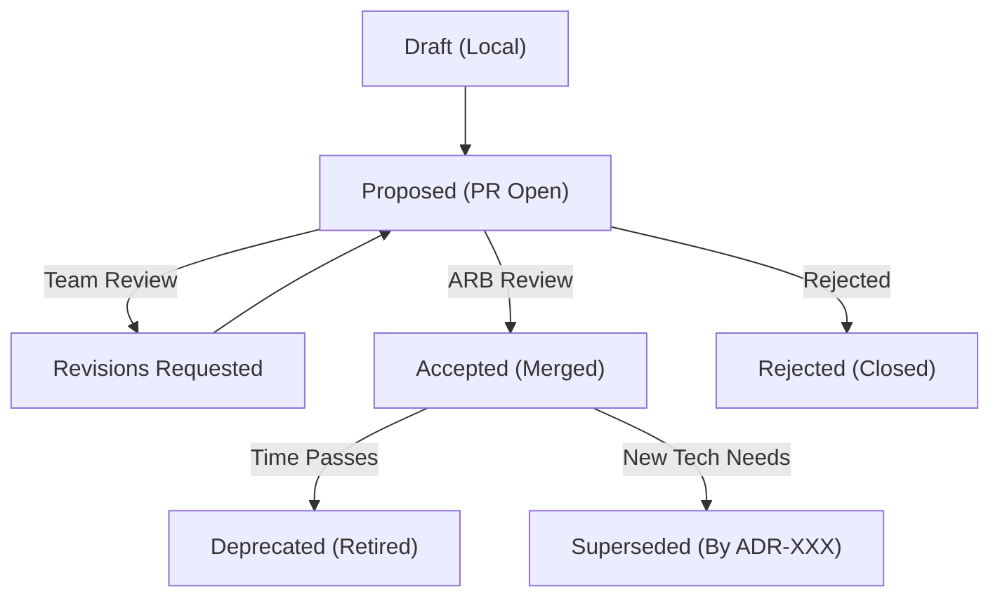

# Architecture Decision Records (ADR) — Enterprise Standard

> **Purpose:** This rule file defines the exact lifecycle, mathematical scoring mechanisms, and mandatory structure of Architecture Decision Records (ADRs). 
> An enterprise without ADRs operates on oral tradition and hallway conversations, leading to catastrophic technical debt. This standard enforces immutable, verifiable decision governance.

---

## 1. What is an ADR?

An Architecture Decision Record (ADR) is a short text file that captures an important architectural decision made along with its context and consequences.

ADRs are:
- **Immutable records** — once accepted, they are not edited (they are superseded by new ADRs). Once merged to `main`, a server-side Git hook MUST reject any commit attempting to alter the `Context` or `Decision` text of an `[Accepted]` ADR.
- **Version controlled** — stored in the repository alongside the code they govern (`docs/adr/`).
- **Sequentially numbered** — ADR-001, ADR-002, etc.
- **Graph Nodes** — ADRs form a Directed Acyclic Graph (DAG) of technical debt. When ADR-042 supersedes ADR-012, it must contain a pointer back to ADR-012. The CI pipeline MUST build and validate this graph using tools like `log4brains`.

---

## 2. When to Write an ADR

### MUST Write an ADR (Non-Negotiable)
- Choosing a database technology (PostgreSQL vs DynamoDB vs MongoDB)
- Choosing a messaging system (Kafka vs RabbitMQ vs SQS)
- Choosing an architectural pattern (monolith vs microservices vs modular monolith)
- Choosing an authentication strategy (JWT vs session vs OAuth2 flow)
- Choosing a cloud provider or region
- Choosing a deployment strategy (K8s vs serverless vs VMs)
- Introducing a new framework or library that affects multiple teams
- Changing a data model that impacts multiple services
- Any decision that alters the 36-month TCO projection by more than 15%.
- Any decision that is costly to reverse (1-Way Door).

### SHOULD Write an ADR
- Choosing between two approaches within a single service (if non-trivial)
- Adopting a specific design pattern for a domain problem (e.g., Saga vs Two-Phase Commit)
- Selecting a third-party service or SaaS tool
- Deciding on a caching strategy

### Do NOT Write an ADR
- Variable naming conventions (code style guide is better)
- Minor library version bumps (dependabot handles this)
- Bug fixes or feature implementation details
- Decisions that are trivially reversible (2-Way Doors taking < 1 engineering week to undo)

---

## 3. ADR Lifecycle & ARB Protocol



| Status | Meaning |
|--------|---------|
| **Proposed** | Under review in a Pull Request. Code implementing this CANNOT be merged. |
| **Accepted** | Approved by architecture review (ARB), currently active and binding. |
| **Deprecated** | No longer relevant (technology retired, feature removed). |
| **Superseded** | Replaced by a newer ADR. The old ADR MUST link to the new one. |

### The ARB (Architecture Review Board) Protocol
- ADRs categorized as "Cross-Cutting" must be reviewed in the weekly ARB meeting.
- The author has 5 minutes to present the Context and Alternatives.
- The ARB does not design the system; the ARB challenges the assumptions, specifically the scoring weights in the Evaluation Matrix.
- **Deadlock Resolution:** If the ARB cannot reach consensus within 30 minutes, the tie-breaker defers strictly to the individual bearing the highest operational pager-duty risk for the system. Dissenting members record their dissent in the ADR, and the team commits to execution.

**Rules:**
- Never delete an ADR. Mark it as deprecated or superseded.
- When an ADR is superseded, update the old ADR's status AND link to the new one.
- CI/CD pipelines MUST contain automated checks to ensure no ADRs have been deleted.

---

## 4. ADR Structure (Mandatory Sections)

### 4.1 Title
- Format: `ADR-{number}: {concise decision statement}`
- The title MUST be a statement, not a question.
- Good: `ADR-003: Use PostgreSQL for User Profile Storage`
- Bad: `ADR-003: Database Selection` (too vague)

### 4.2 Status
One of: `Proposed | Accepted | Deprecated | Superseded by ADR-XXX`

### 4.3 Date
ISO 8601 format: `YYYY-MM-DD`

### 4.4 Context
**What this section MUST include:**
- The business or technical problem driving this decision.
- Current state — what exists today.
- Constraints — strict hard boundaries (e.g., Budget max $5k/month, data MUST reside in EU).
- Forces — what tensions exist (speed vs quality, cost vs capability, etc.).

### 4.5 The Decision & Rationale
- State the decision clearly in 1-2 sentences.
- Then explain the reasoning — connect it back to the context and constraints.
- Reference the evaluation criteria that led to this choice.

### 4.6 Alternatives Considered & The Evaluation Matrix (The Math)
MUST include at least 2 alternatives (including the chosen option). Presenting a single option is an automatic failure.

Create a weighted scoring matrix. Assign a weight (1-5) to each criterion, and score each option (1-5).
*Formula: Score = Weight × Option Rating* OR use the *Weighted Product Model* $P(x) = \prod (C_i)^{w_i}$ for critical systems.

| Evaluation Criterion | Weight (1-5) | Option A | Option B | Option C |
|----------------------|:------------:|:--------:|:--------:|:--------:|
| Technical Fit | 5 | 5 (25) | 1 (5) | 2 (10) |
| Operational Complexity | 3 | 3 (9) | 5 (15) | 3 (9) |
| Latency at Scale | 4 | 3 (12) | 5 (20) | 4 (16) |
| Team Expertise | 4 | 5 (20) | 2 (8) | 4 (16) |
| 3-Year TCO Cost | 3 | 4 (12) | 2 (6) | 3 (9) |
| **Total Score** | | **78** | **54** | **60** |

**Rules:**
- Never present a single option.
- Every tech has downsides. Be honest about them.
- Any performance claims MUST link to a reproducible GitHub repository containing the load testing script (`k6` or `Gatling`).

### 4.7 Consequences
You must define the physical, architectural, and human consequences of the decision.
**Positive consequences** — what we gain.
**Negative consequences (Technical Debt)** — what pain are we explicitly agreeing to accept? (e.g., "We accept the operational burden of managing replication, taking roughly 10 hours/month of DBA time").
**Risks & Mitigations** — list risks with likelihood and impact.

### 4.8 Compliance & Enterprise Standards
Explicitly define how this decision aligns with the global standards:
- Does it meet Rule 07 (Zero Trust)?
- Does it meet SOC2/HIPAA bounds?
- Does it align with Rule 14 (Cost Optimization)?

### 4.9 References
- Links to RFCs, blog posts, benchmarks, vendor documentation, or related ADRs.

---

## 5. File Naming, Storage, & CI Validation

### Naming Convention
```
docs/adr/NNN-short-description.md
```
**Rules:**
- Sequential numbering, zero-padded to 3 digits.
- Lowercase, kebab-case.

### Storage Location
- **Service-Level ADRs:** MUST live in the individual service's Git repository (`my-service/docs/adr/`).
- **Enterprise-Level ADRs:** Cross-cutting decisions MUST live in a central, globally readable Architecture repository.
- **Backstage Integration:** The enterprise Internal Developer Portal (IDP) must use the Backstage ADR plugin to index and display all ADRs globally.

### Architectural Drift Detection
- Use tools like `ArchUnit` or `NetArchTest` to ensure that if `ADR-042` mandates `PostgreSQL` and bans `MongoDB`, there are zero imports of `org.mongodb.*` in the codebase. If the code drifts from the ADR graph, the CI build MUST fail.

---

## 6. Massive Enterprise Example: A Flawless ADR

To demonstrate exactly what the ARB expects, here is a complete, real-world example of an ADR that satisfies all rigorous requirements.

### ADR-014: Adopt Confluent Cloud Kafka over AWS SQS for Order Processing
**Status:** Accepted
**Date:** 2026-11-04
**Authors:** Gaurav Sharma (Principal Architect)

#### Context
The core Order Processing engine currently uses AWS SQS to buffer incoming transactions. As business volume has grown to 5k TPS, we are hitting severe limitations:
1. SQS does not support message replay natively. If a downstream consumer deploys a bug, we cannot simply "rewind" the topic to reprocess the lost state.
2. SQS limits us to a single consumer per queue unless we fan out via SNS, which adds complexity and cost.
3. SQS ordering (FIFO) is strictly limited to 3k TPS. We need 10k TPS headroom.

**Constraints:**
- Must handle 10,000 TPS with p99 latency < 50ms.
- Must allow message replay for up to 7 days.
- Must not exceed $10,000/month in infrastructure costs.

#### Evaluation Matrix

| Evaluation Criterion | Weight (1-5) | Option A: Kafka (Self-Hosted) | Option B: Kafka (Confluent Cloud) | Option C: AWS Kinesis |
|----------------------|:------------:|:-----------------------------:|:---------------------------------:|:---------------------:|
| Replay Capability | 5 | 5 (25) | 5 (25) | 4 (20) |
| Latency @ 10k TPS | 5 | 5 (25) | 5 (25) | 2 (10) |
| Operational Complexity| 5 | 1 (5)  | 5 (25) | 4 (20) |
| Team Expertise | 3 | 2 (6)  | 3 (9)  | 4 (12) |
| 3-Year TCO | 4 | 2 (8)  | 4 (16) | 3 (12) |
| **Total Score** | | **69** | **100**| **74** |

#### Decision
We will adopt **Confluent Cloud Kafka**. 

While AWS Kinesis meets our replay needs and is fully managed, its strict shard limits and higher p99 latency at 10k TPS make it unsuitable for our latency requirements. Self-hosting Kafka scores highly technically but fails completely on Operational Complexity (Weight 5); we do not have the SRE headcount to manage Zookeeper/KRaft quorums, partition rebalancing, and OS patching. Confluent Cloud provides the performance of Kafka without the operational burden.

#### Consequences
**Positive:**
- We achieve multi-consumer pub/sub semantics.
- We gain 7-day infinite replayability for incident recovery.
- We meet our 10k TPS at <20ms latency requirement.

**Negative (Technical Debt Accepted):**
- We accept vendor lock-in to Confluent.
- Data egress costs will increase by approximately $1,200/month as data moves between AWS and the Confluent VPC.

**Reversibility Assessment:**
This is a **1-Way Door**. Replacing the event broker will require refactoring 14 downstream microservices, taking approximately 12 Engineering Weeks. We accept this lock-in risk based on Confluent's SLA guarantees.

---

## 7. Quality Checklist

Before approving an ADR, verify:

- [ ] Title is a clear decision statement (not a question or vague topic)
- [ ] Context includes the problem, explicit constraints, and forces
- [ ] At least 2 alternatives are evaluated with a mathematical weighted scoring matrix
- [ ] Consequences include BOTH positive and negative impacts explicitly
- [ ] Reversibility (1-Way vs 2-Way Door) is explicitly declared
- [ ] Risks have mitigation strategies
- [ ] The decision is traceable to a business need or incident
- [ ] Status is correctly set
- [ ] References and load-test benchmark scripts are included
- [ ] Spectral CI Linter rules pass successfully for the markdown structure

---

## 8. Common ADR Anti-Patterns & Catastrophes

| Anti-Pattern | Problem / Catastrophic Result | Enterprise Fix |
|-------------|---------|-----|
| The "Echo Chamber" / Single Option | Confirmation bias. The business adopts suboptimal tech. | The ARB MUST reject any ADR lacking a weighted scoring matrix with at least 2 viable options. |
| The "Hype Driven" Choice | Adopting a technology "because Google uses it," leading to massive over-engineering. | Force the author to score "Team Expertise" and "3-Year TCO" with high weights. |
| All pros, no cons | Dishonest, hides future problems. The team is blindsided later. | The "Negative Consequences" section is mandatory. If omitted, the ADR is rejected. |
| 500-word context, 1-line decision | Effort in wrong place. | Decision + reasoning MUST be the strongest section based on the matrix. |
| The Oral Tradition | "We decided in a meeting." Lost institutional knowledge. | If it takes longer than 15 minutes of debate, it requires an ADR. No code merges without it. |
| The Zombie ADR | Stale decisions cause confusion. Developers implement deprecated patterns. | Review quarterly, mark deprecated/superseded using `log4brains`. |
| The Overloaded ADR | Trying to choose the Database, Auth provider, and Frontend in one document. | Break decisions down. One ADR = One Decision. |
| The "Missing Benchmark" | Claiming "Tech X is 10x faster than Y" without proof. | Require linked, reproducible `k6` load testing scripts for any performance claims. |

---

## 9. Spectral Linter YAML Configuration

To mechanically enforce this structure in your CI pipeline, add the following to your `.spectral.yaml`.

```yaml
rules:
  adr-title-format:
    description: "ADR Title must start with ADR-"
    given: "$.title"
    then:
      function: pattern
      functionOptions:
        match: "^ADR-\\d{3}:"
  adr-requires-status:
    description: "ADR must contain a formal status"
    given: "$.status"
    then:
      function: enumeration
      functionOptions:
        values: ["Proposed", "Accepted", "Rejected", "Deprecated", "Superseded"]
  adr-requires-consequences:
    description: "ADR must explicitly list negative consequences"
    given: "$.consequences.negative"
    then:
      function: truthy
  adr-requires-reversibility:
    description: "Must declare if decision is a 1-Way or 2-Way door"
    given: "$.reversibility"
    then:
      function: truthy
```

---

*Archpilot — Enterprise Architecture Standards Library*
*Created by Gaurav Sharma*
