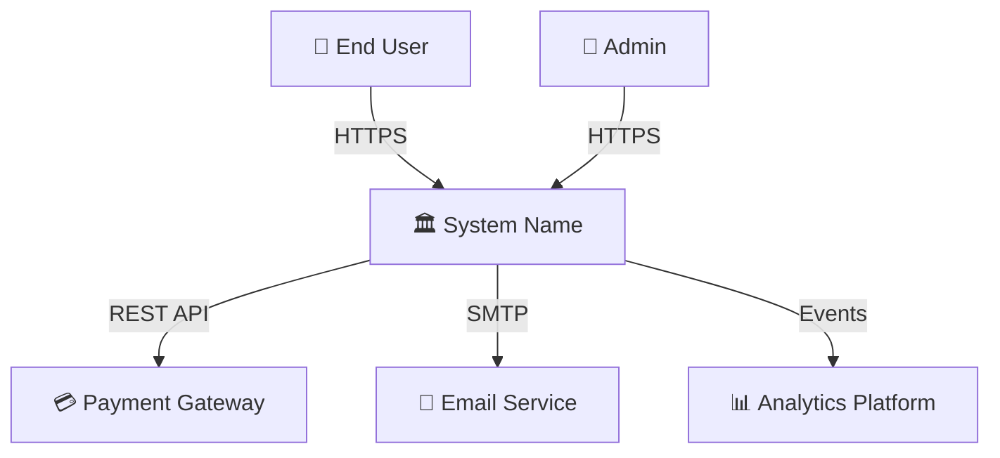
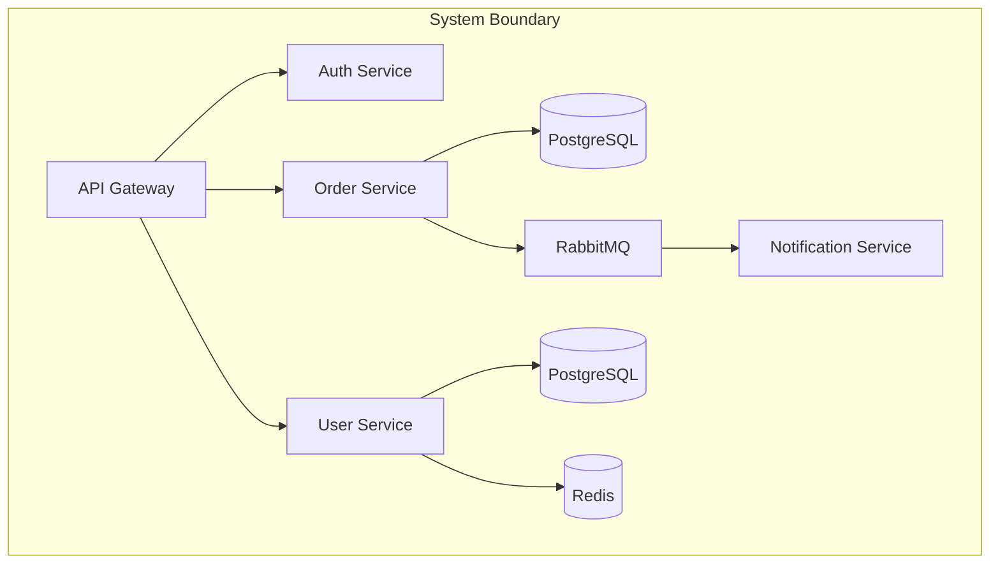

# High-Level Design (HLD) Standards

> **Purpose:** This rule file defines the standards for creating High-Level Design documents.
> HLDs communicate architecture decisions to stakeholders, PMs, and cross-team engineers.
> They operate at the C4 Context + Container level — logical components and data flows, NOT implementation details.

---

## How to Use This File

- **Claude Projects:** Upload this file + `templates/hld-template.md` as project knowledge
- **ChatGPT:** Paste into Custom GPT instructions or conversation context
- **Any LLM:** Say: *"Using these HLD standards, create an HLD for: [your system]"*

---

## Related Standards

| Standard | Relationship |
|----------|-------------|
| [01 — Solution Design](./01-solution-design.md) | SDD is the umbrella; HLD is the architecture section |
| [04 — LLD Standards](./04-lld-standards.md) | LLD provides implementation detail for each HLD component |
| [08 — Cloud Architecture](./08-cloud-architecture.md) | Cloud deployment details for §2.10 |
| [11 — NFR Checklist](./11-nfr-checklist.md) | Audit tool for §2.8 NFR Summary |
| [templates/hld-template.md](../templates/hld-template.md) | Ready-to-fill HLD template |

---

## 1. When to Write an HLD

| Situation | HLD Required? |
|-----------|:------------:|
| New product or platform | ✅ Always |
| New microservice/module with external integrations | ✅ Always |
| Major re-architecture or migration | ✅ Always |
| Cross-team feature requiring coordination | ✅ Always |
| Single-service internal refactor | ❌ LLD only |
| Bug fix or config change | ❌ No |

**Rule:** If it involves 2+ teams or 2+ services, it needs an HLD.

---

## 2. Mandatory HLD Sections

### 2.1 Executive Summary
- 3-5 sentence overview: What, Why, How (at the highest level).
- Business value — what problem does this solve and for whom?
- Key architectural decisions summarized.

### 2.2 Business Context & Requirements
- Business drivers and goals.
- Key user stories or use cases (top 5-7).
- Stakeholder map — who cares about this system and what do they care about?

### 2.3 System Context Diagram (C4 Level 1)
- The system as a single box.
- All external actors (users, admin, third-party systems).
- All external system integrations.
- Communication protocols between actors and the system.

### 2.4 Container Diagram (C4 Level 2)
- Break the system into deployable units (services, databases, queues, CDNs).
- Show communication patterns (sync/async, protocols).
- Show data stores and their technology choices.

### 2.5 Data Flow Diagrams
- Show how data moves through the system for key use cases.
- Include both synchronous and asynchronous flows.
- Indicate where data is persisted, cached, or transformed.
- Show data classification (public, internal, confidential, restricted).

### 2.6 Integration Architecture
For every external integration:

| Integration | Protocol | Auth | Direction | Data Format | SLA |
|------------|----------|------|-----------|-------------|-----|
| Payment Gateway | REST/HTTPS | mTLS + API Key | Outbound | JSON | 99.9% |
| Email Service | SMTP/API | API Key | Outbound | Template | Best effort |
| Analytics | Event Stream | Token | Outbound | Avro | Eventual |

### 2.7 Technology Stack

| Layer | Technology | Rationale |
|-------|-----------|-----------|
| Frontend | | |
| API Gateway | | |
| Backend Services | | |
| Database | | |
| Cache | | |
| Message Broker | | |
| Search | | |
| CDN | | |
| Container Orchestration | | |
| CI/CD | | |
| Monitoring | | |

### 2.8 Non-Functional Requirements Summary

| NFR | Target | Approach |
|-----|--------|----------|
| **Availability** | 99.9% (8.76 hrs downtime/yr) | Multi-AZ, health checks, auto-scaling |
| **Latency** | p95 < 500ms | Caching, CDN, connection pooling |
| **Throughput** | 1000 req/sec peak | Horizontal scaling, async processing |
| **Data Retention** | 7 years for financial data | Tiered storage, archival |
| **Recovery** | RPO: 1 hour, RTO: 4 hours | Automated backups, DR runbook |
| **Security** | SOC2 Type II compliant | Zero trust, encryption, audit logging |
| **Scalability** | 10x current load | Stateless services, auto-scaling groups |

### 2.9 Security Architecture (Summary)
- Authentication mechanism (OAuth2, SAML, API Keys).
- Authorization model (RBAC, ABAC, policies).
- Data encryption strategy (at rest, in transit).
- Network security (VPC, subnets, security groups, WAF).
- Compliance requirements (GDPR, SOC2, PCI-DSS).

### 2.10 Deployment Architecture
- Environment strategy (dev, staging, production).
- Infrastructure diagram (cloud regions, AZs, networks).
- CI/CD pipeline overview.
- Deployment strategy (blue-green, canary).

### 2.11 Cost Estimate

| Service | Monthly (Normal) | Monthly (Peak) | Yearly |
|---------|:----------------:|:--------------:|:------:|
| Compute | | | |
| Database | | | |
| Storage | | | |
| Networking | | | |
| Monitoring | | | |
| **Total** | | | |

### 2.12 Risks & Mitigations

| # | Risk | Probability | Impact | Mitigation |
|---|------|:-----------:|:------:|-----------|
| 1 | | H/M/L | H/M/L | |

### 2.13 Key Architecture Decisions
- List the top 5-10 architecture decisions with 1-2 sentence rationale.
- Link to detailed ADRs where they exist.
- Flag decisions that are still open / pending review.

### 2.14 Roadmap & Phasing

| Phase | Scope | Timeline | Dependencies |
|-------|-------|----------|-------------|
| Phase 1 (MVP) | | | |
| Phase 2 | | | |
| Phase 3 | | | |

---

## 3. HLD Quality Checklist

- [ ] Executive summary is understandable by a non-technical stakeholder
- [ ] C4 Context diagram shows ALL external actors and systems
- [ ] C4 Container diagram shows ALL deployable units
- [ ] Data flows cover both happy path and key error scenarios
- [ ] Every external integration has protocol, auth, and SLA documented
- [ ] Technology choices have rationale (not just "we like it")
- [ ] NFR targets are specific and measurable (not "high availability")
- [ ] Security architecture covers auth, authz, encryption, and compliance
- [ ] Cost estimate covers all major cloud services
- [ ] Risks have mitigation strategies
- [ ] Key decisions link to ADRs or have inline rationale

---

## 4. Common HLD Anti-Patterns

| Anti-Pattern | Problem | Fix |
|-------------|---------|-----|
| Too much detail | HLD becomes an LLD, overwhelming stakeholders | Stay at container level, defer detail to LLD |
| Too little detail | Rubber stamp doc with no real design | Every section should have specific technologies and numbers |
| Missing integrations | "We'll figure out integrations later" | Map all external touchpoints upfront |
| No NFR targets | "We need high performance" | Quantify: p95 < 500ms, 99.9% uptime, 1000 req/sec |
| Diagram-only | Beautiful pictures with no written rationale | Diagrams + text explaining WHY these components |
| No cost estimate | Sticker shock during implementation | Rough estimate at HLD stage prevents budget surprises |

---

*Archpilot — Enterprise Architecture Standards Library*
*Created by Gaurav Sharma*
