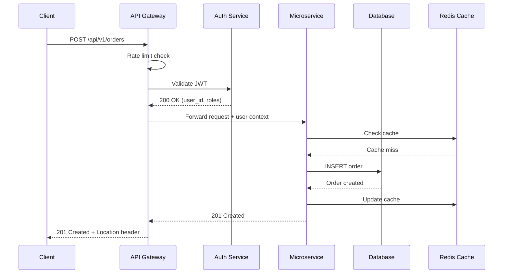

# API Design Standards

> **Purpose:** This rule file defines how APIs (REST, GraphQL, gRPC) should be designed,
> documented, and governed. When used as LLM context, it ensures every API specification
> generated is production-ready, consistent, and enterprise-compliant.

---

## How to Use This File

- **Claude Projects:** Upload as project knowledge for API design reviews and generation
- **Code Reviews:** Reference when reviewing API pull requests
- **Any LLM:** Say: *"Using these API standards, design the API for: [your service]"*

---

## Related Standards

| Standard | Relationship |
|----------|-------------|
| [04 — LLD Standards](./04-lld-standards.md) | API spec is a mandatory section (§3.4.4) of every LLD |
| [07 — Security Architecture](./07-security-architecture.md) | Auth, rate limiting, input validation details |
| [10 — Integration Patterns](./10-integration-patterns.md) | API Gateway and BFF patterns |
| [15 — Code Review](./15-code-review-guidelines.md) | API-specific review checks |

---

## 1. General API Principles

### 1.1 Consumer-First Design
- Design APIs from the consumer's perspective, not the database schema.
- API responses SHOULD return what the consumer needs, not a dump of internal state.
- Group endpoints by business domain, not by internal service boundaries.

### 1.2 Contract-First Development
- API contracts (OpenAPI/protobuf) MUST be defined and reviewed BEFORE implementation.
- Code SHOULD be generated from contracts, not contracts from code.
- Contract changes MUST go through a review process (like code review).

### 1.3 Backward Compatibility is Sacred
- New versions MUST NOT break existing consumers.
- Additive changes (new fields, new endpoints) are always safe.
- Removing or renaming fields is a BREAKING CHANGE — requires versioning.
- Required fields MUST NOT be added to existing request bodies.

---

## 2. REST API Standards

### 2.1 URL Structure
```
https://{host}/api/{version}/{resource}
```

**Rules:**
| Rule | Good | Bad |
|------|------|-----|
| Use plural nouns for collections | `/users` | `/user`, `/getUsers` |
| Use kebab-case for multi-word | `/payment-methods` | `/paymentMethods`, `/payment_methods` |
| Nest resources logically | `/users/{id}/orders` | `/getUserOrders` |
| Max nesting depth: 2 | `/users/{id}/orders` | `/users/{id}/orders/{id}/items/{id}/details` |
| No verbs for CRUD operations | `POST /orders` | `/createOrder` |
| Verbs only for actions | `POST /orders/{id}/cancel` | `DELETE /orders/{id}/cancel` |
| No trailing slashes | `/users` | `/users/` |

### 2.2 HTTP Methods

| Method | Usage | Idempotent | Safe | Request Body |
|--------|-------|:----------:|:----:|:------------:|
| `GET` | Read resource(s) | ✅ | ✅ | ❌ |
| `POST` | Create resource | ❌ | ❌ | ✅ |
| `PUT` | Full replace of resource | ✅ | ❌ | ✅ |
| `PATCH` | Partial update | ❌ | ❌ | ✅ |
| `DELETE` | Remove resource | ✅ | ❌ | ❌ |

### 2.3 Status Codes

**Success:**
| Code | When |
|------|------|
| `200 OK` | Successful GET, PUT, PATCH |
| `201 Created` | Successful POST (resource created) — include `Location` header |
| `202 Accepted` | Async operation accepted, processing not complete |
| `204 No Content` | Successful DELETE or PUT with no response body |

**Client Errors:**
| Code | When |
|------|------|
| `400 Bad Request` | Malformed syntax, invalid JSON |
| `401 Unauthorized` | Missing or invalid authentication |
| `403 Forbidden` | Authenticated but insufficient permissions |
| `404 Not Found` | Resource doesn't exist |
| `405 Method Not Allowed` | HTTP method not supported for this endpoint |
| `409 Conflict` | Duplicate resource, state conflict, optimistic lock failure |
| `422 Unprocessable Entity` | Valid syntax but semantic validation failure |
| `429 Too Many Requests` | Rate limit exceeded — include `Retry-After` header |

**Server Errors:**
| Code | When |
|------|------|
| `500 Internal Server Error` | Unexpected failure — generic message to client |
| `502 Bad Gateway` | Upstream service returned invalid response |
| `503 Service Unavailable` | Service is down or overloaded — include `Retry-After` |
| `504 Gateway Timeout` | Upstream service did not respond in time |

### 2.4 Error Response Format

ALL APIs MUST use this consistent error format:

```json
{
  "error": {
    "code": "VALIDATION_FAILED",
    "message": "One or more fields failed validation.",
    "details": [
      {
        "field": "email",
        "value": "not-an-email",
        "issue": "Must be a valid email address."
      },
      {
        "field": "age",
        "value": -5,
        "issue": "Must be a positive integer."
      }
    ],
    "correlationId": "req-8f4e12a3-b567-4c89-d012-3e4f56789abc",
    "timestamp": "2026-03-11T09:00:00Z",
    "documentation": "https://docs.api.example.com/errors/VALIDATION_FAILED"
  }
}
```

**Rules:**
- `code` is a machine-readable error code (UPPER_SNAKE_CASE).
- `message` is a human-readable description (safe to show to end users).
- `details` array provides field-level errors for validation failures.
- `correlationId` MUST be present for tracing.
- NEVER expose stack traces, internal paths, or database error messages.

### 2.5 Pagination

**Use cursor-based pagination** (preferred over offset-based):

```
GET /api/v1/orders?limit=20&cursor=eyJpZCI6MTAwfQ
```

**Response:**
```json
{
  "data": [...],
  "pagination": {
    "limit": 20,
    "hasMore": true,
    "nextCursor": "eyJpZCI6MTIwfQ",
    "prevCursor": "eyJpZCI6ODB9",
    "totalCount": 1547
  }
}
```

**Rules:**
- Default page size: 20. Maximum page size: 100.
- `totalCount` is optional (expensive for large datasets).
- Cursor values MUST be opaque to the client (base64-encoded).
- Offset-based pagination (`?page=5&size=20`) is acceptable for admin/internal APIs only.

### 2.6 Filtering, Sorting, Searching

**Filtering:**
```
GET /api/v1/orders?status=pending&created_after=2026-01-01
```

**Sorting:**
```
GET /api/v1/orders?sort=created_at:desc,total:asc
```

**Searching:**
```
GET /api/v1/users?q=gaurav&search_fields=name,email
```

### 2.7 Versioning

**Use URL path versioning** (simplest, most explicit):
```
/api/v1/users
/api/v2/users
```

**Rules:**
- Only major versions in the URL (`v1`, `v2`). Minor changes are backward-compatible.
- Support at most 2 major versions simultaneously.
- Deprecation notice: minimum 6 months before sunsetting a version.
- Include `Sunset` header for deprecated versions: `Sunset: Sat, 01 Jan 2027 00:00:00 GMT`

### 2.8 Request/Response Conventions

**Naming:** camelCase for JSON fields.
```json
{
  "firstName": "Gaurav",
  "lastName": "Sharma",
  "createdAt": "2026-03-11T09:00:00Z"
}
```

**Dates:** ISO 8601 with timezone: `2026-03-11T09:00:00Z`

**IDs:** UUID v4 preferred over auto-increment integers (prevents enumeration attacks).

**Enums:** lowercase_snake_case: `"status": "in_progress"`

**Money:** Represent as integer minor units (cents/paisa) with currency code:
```json
{
  "amount": 9999,
  "currency": "INR"
}
```

**Null vs Absent:** Absent field = not provided. Null = explicitly empty. Don't mix.

### 2.9 Rate Limiting

**Mandatory for all public and partner APIs.**

| Header | Description |
|--------|-------------|
| `X-RateLimit-Limit` | Maximum requests per window |
| `X-RateLimit-Remaining` | Remaining requests in current window |
| `X-RateLimit-Reset` | Unix timestamp when the window resets |
| `Retry-After` | Seconds to wait (on 429 response) |

**Default limits:**
| Tier | Limit |
|------|-------|
| Free | 60 req/min |
| Standard | 600 req/min |
| Premium | 6000 req/min |
| Internal | 30000 req/min |

### 2.10 Authentication & Authorization Headers

| Header | Usage |
|--------|-------|
| `Authorization: Bearer {token}` | JWT or OAuth2 access token |
| `X-API-Key: {key}` | API key authentication (service-to-service) |
| `X-Request-Id: {uuid}` | Client-generated correlation ID |
| `X-Idempotency-Key: {key}` | Idempotency key for POST/PATCH mutations |

---

## 3. API Security Checklist

- [ ] All endpoints require authentication (unless explicitly public)
- [ ] Authorization is checked at endpoint level (RBAC/ABAC)
- [ ] Input validation on all request parameters (type, length, range, format)
- [ ] Output encoding to prevent XSS in any HTML-consuming client
- [ ] Rate limiting on all endpoints
- [ ] Request size limits enforced (default: 1MB max body)
- [ ] SQL injection prevention (parameterized queries, ORM)
- [ ] No sensitive data in URLs (tokens, passwords, PII in query params)
- [ ] CORS configured restrictively (specific origins, not `*`)
- [ ] Security headers set (HSTS, X-Content-Type-Options, X-Frame-Options)
- [ ] API keys and tokens have expiration
- [ ] Audit logging on all mutation operations

---

## 4. API Documentation Requirements

Every API MUST have:
- [ ] OpenAPI 3.0+ specification file
- [ ] Description for every endpoint, parameter, and schema
- [ ] Example request and response for every endpoint
- [ ] Error response examples for common failure cases
- [ ] Authentication section with setup instructions
- [ ] Rate limit documentation
- [ ] Changelog for version updates

---

## 5. API Request Lifecycle



---

## 6. Common API Anti-Patterns

| Anti-Pattern | Problem | Fix |
|-------------|---------|-----|
| **Chatty APIs** | 10+ calls to render one page | BFF pattern or composite endpoints |
| **God endpoint** | `POST /api/do-everything` with action parameter | Fine-grained RESTful resources |
| **Ignoring pagination** | Returning 10,000 records in one response | Cursor-based or offset pagination |
| **Verbs in URLs** | `/api/getUsers`, `/api/createOrder` | Use HTTP methods: `GET /users`, `POST /orders` |
| **Breaking changes without versioning** | Removing fields, changing types | Additive changes only; use semantic versioning |
| **Leaking internal data model** | API response = database row | Design API contracts independent of DB schema |
| **No error standardization** | Different error formats per endpoint | Use RFC 7807 Problem Details consistently |
| **Authentication via query param** | `?api_key=secret123` in URL (logged everywhere) | Use `Authorization` header |
| **No rate limiting** | Single client can DoS your API | Per-client rate limits with 429 responses |
| **Ignoring idempotency** | Duplicate POST creates duplicate orders | Idempotency keys for write operations |

---

*Archpilot — Enterprise Architecture Standards Library*
*Created by Gaurav Sharma*
