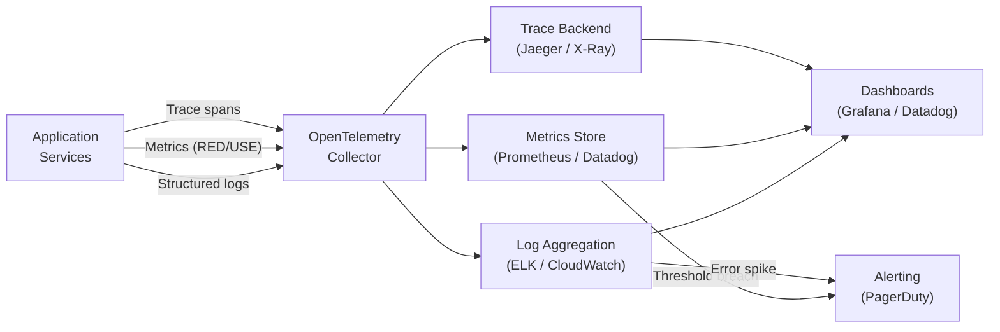

# Observability Standards

> **Purpose:** Standards for structured logging, metrics, distributed tracing, alerting,
> and dashboards. Ensures every system is observable from day one.

---

## How to Use This File

- **Claude Projects:** Upload for observability architecture and monitoring design
- **Any LLM:** Say: *"Using these observability standards, design the monitoring for: [your service]"*

---

## Related Standards

| Standard | Relationship |
|----------|-------------|
| [04 — LLD Standards](./04-lld-standards.md) | Observability plan is mandatory LLD section (§3.8) |
| [09 — Microservices Patterns](./09-microservices-patterns.md) | Distributed tracing across services |
| [13 — DevOps & CI/CD](./13-devops-cicd.md) | Post-deploy monitoring and alerting |
| [11 — NFR Checklist](./11-nfr-checklist.md) | 8 observability checks in the audit |

---

## 1. The Three Pillars of Observability

| Pillar | What | Why | Technology |
|--------|------|-----|-----------|
| **Logs** | Discrete events with context | Debug specific issues, audit trail | ELK, CloudWatch, Datadog |
| **Metrics** | Numerical measurements over time | Trends, dashboards, SLO tracking | Prometheus, Datadog, CloudWatch |
| **Traces** | Request path across services | Understand latency, debug distributed flows | Jaeger, Zipkin, Datadog APM |

**Rule:** ALL three pillars are MANDATORY for production services. They are correlated via a shared `correlationId` / `traceId`.

---

## 2. Structured Logging Standards

### 2.1 Format
- ALL logs MUST be structured JSON (not plain text).
- Logs MUST go to stdout/stderr (not files) — the platform handles collection.

### 2.2 Mandatory Log Fields

```json
{
  "timestamp": "2026-03-11T09:30:00.123Z",
  "level": "INFO",
  "service": "order-service",
  "version": "1.4.2",
  "environment": "production",
  "correlationId": "req-abc123",
  "traceId": "4bf92f3577b34da6a3ce929d0e0e4736",
  "spanId": "00f067aa0ba902b7",
  "userId": "usr-456",
  "action": "order.create",
  "duration_ms": 145,
  "outcome": "success",
  "message": "Order created successfully"
}
```

### 2.3 Log Levels

| Level | When | Example | Volume Target |
|-------|------|---------|:-------------:|
| **ERROR** | Something failed that needs attention | Database connection lost, payment failed | < 1% of logs |
| **WARN** | Something unexpected but recovered | Retry succeeded, cache miss, fallback used | < 5% of logs |
| **INFO** | Normal business events | Request received, order processed, user logged in | ~90% of logs |
| **DEBUG** | Detailed diagnostic information | Variable values, query parameters | Disabled in production |

### 2.4 What to Log vs What NOT to Log

| ✅ DO Log | ❌ NEVER Log |
|----------|-------------|
| Request method, path, status code | Passwords or credentials |
| User ID (not email/name) | Full credit card numbers |
| Operation duration | Access tokens or JWTs |
| Error messages and codes | PII (email, phone, address) |
| Correlation and trace IDs | Database connection strings |
| Business event milestones | Session tokens |
| Cache hit/miss | Health check requests (too noisy) |

### 2.5 Log Retention

| Environment | Retention |
|------------|:---------:|
| Development | 7 days |
| Staging | 14 days |
| Production (application) | 30 days hot, 90 days warm |
| Production (audit/security) | 1-3 years (compliance dependent) |

---

## 3. Metrics Standards

### 3.1 The RED Method (for Services)

| Metric | What | Alert Threshold |
|--------|------|:---------------:|
| **R**ate | Requests per second | N/A (baseline + anomaly) |
| **E**rror | Error rate (% of requests) | > 5% for 5 minutes |
| **D**uration | Latency (p50, p95, p99) | p99 > 2s for 10 minutes |

### 3.2 The USE Method (for Resources)

| Metric | What | Alert Threshold |
|--------|------|:---------------:|
| **U**tilization | % of resource capacity used | > 80% for 15 minutes |
| **S**aturation | Queue depth, pending work | > 1000 items for 5 minutes |
| **E**rrors | Hardware/resource errors | Any error rate increase |

### 3.3 Metric Naming Convention
```
{service}_{subsystem}_{metric}_{unit}
```

| Examples | Type |
|----------|------|
| `order_service_http_requests_total` | Counter |
| `order_service_http_request_duration_seconds` | Histogram |
| `order_service_db_connections_active` | Gauge |
| `order_service_queue_messages_pending` | Gauge |
| `order_service_cache_hits_total` | Counter |

**Rules:**
- Counters end with `_total`.
- Duration metrics use `_seconds` (not milliseconds).
- Use labels for dimensions: `method`, `path`, `status_code`, `service`.
- Avoid high-cardinality labels (user IDs, request IDs).

### 3.4 Standard Service Metrics (Mandatory)

Every service MUST expose:

| Metric | Type | Labels |
|--------|------|--------|
| HTTP request count | Counter | method, path, status |
| HTTP request latency | Histogram | method, path |
| Error count | Counter | type, method |
| DB query duration | Histogram | query_type, table |
| DB connection pool (active/idle) | Gauge | pool_name |
| Cache hit/miss ratio | Counter | cache_name, result |
| External call duration | Histogram | service, method |
| Circuit breaker state | Gauge | service, state |
| Queue depth | Gauge | queue_name |
| Memory/CPU usage | Gauge | — (infra level) |

---

## 4. Distributed Tracing Standards

### 4.1 Trace Propagation
- Use W3C Trace Context standard (`traceparent`, `tracestate` headers).
- ALL inter-service calls (HTTP, gRPC, message queues) MUST propagate trace context.
- Every service MUST create a span for: incoming requests, database calls, external HTTP calls, message consumption.

### 4.2 Span Naming Convention
```
{method} {operation}
```

| Examples |
|----------|
| `HTTP GET /api/v1/orders` |
| `PostgreSQL SELECT orders` |
| `Redis GET user:profile:123` |
| `Kafka CONSUME order.placed` |
| `HTTP POST payment-service/charge` |

### 4.3 Span Attributes (Mandatory)

| Attribute | Value |
|-----------|-------|
| `service.name` | Service name |
| `service.version` | Deployed version |
| `http.method` | GET, POST, etc. |
| `http.url` | Request URL (scrub PII) |
| `http.status_code` | Response code |
| `db.system` | postgresql, redis, dynamodb |
| `db.statement` | Query (scrubbed/truncated) |
| `error` | true/false |
| `error.message` | Error description (if error) |

---

## 5. Alerting Standards

### 5.1 Alert Severity Levels

| Severity | Response Time | Action | Example |
|:--------:|:------------:|--------|---------|
| **P1 — Critical** | 15 minutes | Page on-call, war room | Service down, data loss |
| **P2 — High** | 1 hour | Notify team, investigate | Error rate > 5%, latency spike |
| **P3 — Medium** | Business hours | Investigate, create ticket | Disk space > 80%, cert expiring |
| **P4 — Low** | Next sprint | Track in backlog | Minor performance degradation |

### 5.2 Alert Rules

| Rule | Standard |
|------|---------|
| Every alert MUST have a runbook link | Shows responder what to do |
| No flapping alerts | Require sustained condition (e.g., "for 5 minutes") |
| No duplicate alerts | Deduplicate across services for same root cause |
| Alert on symptoms, not causes | "High error rate" not "CPU high" |
| Every alert MUST be actionable | If nobody can do anything, it's not an alert — it's a log |
| Review alert fatigue monthly | Tune thresholds, remove noisy alerts |

### 5.3 SLO-Based Alerting

| SLO | Error Budget | Alert |
|-----|:----------:|-------|
| 99.9% availability (8.76 hrs/yr) | 744 min/month | Alert when burn rate exceeds 2x normal |
| p99 latency < 500ms | 4,320 slow requests/month at 1K rps | Alert when burn rate exceeds 2x |

---

## 6. Dashboard Standards

Every production service MUST have:

### 6.1 Service Health Dashboard

| Panel | Metric |
|-------|--------|
| Request Rate (req/sec) | `http_requests_total` rate |
| Error Rate (%) | Error count / total count |
| Latency (p50, p95, p99) | `http_request_duration_seconds` quantiles |
| Availability (%) | Uptime over rolling 24h/7d/30d |
| Active connections | DB pool, HTTP connections |
| Dependency health | Circuit breaker states |

### 6.2 Business Dashboard

| Panel | Example |
|-------|---------|
| Business KPI | Orders processed/hour |
| Revenue metric | Payments completed/day |
| User activity | Active users, signups |
| Funnel metrics | Cart → Checkout → Payment → Success |

---

## 7. Observability Pipeline



---

## 8. Observability Anti-Patterns

| Anti-Pattern | Problem | Fix |
|-------------|---------|-----|
| **Unstructured logs** | `print("error occurred")` — can't search, can't parse | JSON structured logging with correlation IDs |
| **Log everything at DEBUG** | Storage costs explode, signal lost in noise | INFO in production, DEBUG only when troubleshooting |
| **No correlation ID** | Can't trace a request across services | Generate at API Gateway, propagate through all services |
| **Alert fatigue** | 50 alerts/day → all ignored | Every alert must be actionable; tune thresholds ruthlessly |
| **Monitoring only in production** | Staging issues discovered too late | Same observability in staging as production |
| **No business metrics** | Can tell CPU is fine, can't tell if orders are failing | Include business KPIs (orders/min, revenue/hour) |
| **Dashboard without owners** | 20 dashboards, nobody maintains them | Each dashboard has an owner and a review date |
| **Metrics without context** | "Error rate is 5%" — is that bad? | Establish baselines, define SLOs, alert on deviations |
| **Logging PII** | Customer email, phone numbers in logs | PII masking rules in the logging pipeline |
| **No distributed tracing** | "It's slow" but no idea which service | Implement OpenTelemetry tracing across all services |

---

*Archpilot — Enterprise Architecture Standards Library*
*Created by Gaurav Sharma*
