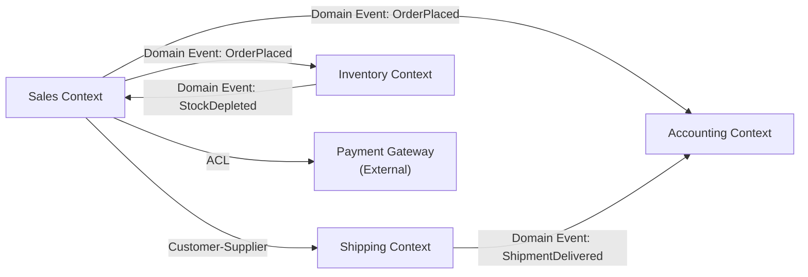

# Domain-Driven Design (DDD) Standards

> **Purpose:** Standards for applying Domain-Driven Design — bounded contexts,
> aggregates, domain events, context mapping, and strategic/tactical patterns.
> Essential for teams decomposing monoliths or designing microservices with clean boundaries.

---

## How to Use This File

- **System Design:** Say to an LLM: *"Using these DDD standards, identify bounded contexts and aggregates for: [your domain]"*
- **Microservices:** Use context mapping to define service boundaries and communication patterns

---

## Related Standards

| Standard | Relationship |
|----------|-------------|
| [09 — Microservices Patterns](./09-microservices-patterns.md) | Service boundaries = bounded contexts |
| [10 — Integration Patterns](./10-integration-patterns.md) | Domain events, anti-corruption layer |
| [06 — Data Architecture](./06-data-architecture.md) | Aggregate persistence patterns |
| [17 — Migration & Modernization](./17-migration-modernization.md) | DDD for decomposition strategy |

---

## 1. Strategic DDD

### 1.1 Ubiquitous Language

- Each bounded context has its OWN vocabulary
- The same word can mean different things in different contexts:

| Word | Sales Context | Shipping Context | Accounting Context |
|------|-------------|-----------------|-------------------|
| **Order** | Deal with line items, discounts | Package to ship, weight, address | Invoice, tax line items |
| **Customer** | Lead, prospect, account | Recipient, delivery address | Billing entity, tax ID |
| **Product** | SKU, pricing, catalog | Dimensions, weight, fragility | Revenue category, tax code |

**Rule:** Never force a single data model across contexts. Each context owns its own model.

### 1.2 Bounded Contexts

A bounded context is a boundary within which a domain model is consistent and meaningful.

```
┌─────────────────┐     ┌─────────────────┐     ┌─────────────────┐
│   Sales Context  │     │ Shipping Context │     │Accounting Context│
│                  │     │                  │     │                  │
│  Order           │     │  Shipment        │     │  Invoice         │
│  Customer        │     │  Package         │     │  Payment         │
│  Product         │     │  Route           │     │  LineItem        │
│  Discount        │     │  Carrier         │     │  TaxRecord       │
│                  │     │                  │     │                  │
│ Language: "deal" │     │ Language: "ship" │     │ Language: "book" │
│ "close", "quote" │     │ "dispatch"       │     │ "reconcile"      │
└────────┬────────┘     └────────┬────────┘     └────────┬────────┘
         │ Domain Event          │ Domain Event          │
         └──── OrderPlaced ──────┘──── ShipmentSent ─────┘
```

### 1.3 Context Mapping Patterns

| Pattern | Relationship | Use When |
|---------|-------------|----------|
| **Partnership** | Two contexts evolve together, mutual dependency | Teams closely collaborate |
| **Customer-Supplier** | Upstream (supplier) serves downstream (customer) | Clear producer-consumer |
| **Conformist** | Downstream adopts upstream's model as-is | Integrating with external system you can't change |
| **Anti-Corruption Layer** | Downstream translates upstream's model to its own | Legacy integration, protect your domain |
| **Open Host Service** | Upstream provides a well-defined API/protocol | Publishing a stable API for many consumers |
| **Published Language** | Shared schema/format (OpenAPI, protobuf, Avro) | Event schemas, API contracts |
| **Shared Kernel** | Two contexts share a small subset of the model | Common types (Money, Address) — keep TINY |
| **Separate Ways** | No integration, contexts are independent | Unrelated domains, no data dependency |

### 1.4 Context Map Example



---

## 2. Tactical DDD

### 2.1 Building Blocks

| Pattern | What | Example |
|---------|------|---------|
| **Entity** | Object with unique identity (persists, changes over time) | `Order(id)`, `Customer(id)` |
| **Value Object** | Immutable, defined by attributes, no identity | `Money(amount, currency)`, `Address(street, city)` |
| **Aggregate** | Cluster of entities/VOs treated as a single unit | `Order` (contains `OrderLines`, `ShippingAddress`) |
| **Aggregate Root** | Entry point to the aggregate; only entity accessed externally | `Order` is the root; access `OrderLine` through `Order` |
| **Domain Event** | Something meaningful that happened in the domain | `OrderPlaced`, `PaymentReceived`, `ShipmentDispatched` |
| **Repository** | Persistence abstraction for aggregates | `OrderRepository.find_by_id(order_id)` |
| **Domain Service** | Logic that doesn't belong to a single entity | `PricingService.calculate_total(order, discounts)` |
| **Application Service** | Orchestrates use cases (thin, delegates to domain) | `PlaceOrderUseCase(order_repo, payment_service)` |

### 2.2 Aggregate Design Rules

| Rule | Description |
|------|-----------|
| **Small aggregates** | Prefer small aggregates (1-3 entities). Large aggregates = contention |
| **Reference by ID** | Aggregates reference other aggregates by ID, not by object reference |
| **One transaction = one aggregate** | Don't modify multiple aggregates in a single transaction |
| **Eventual consistency between aggregates** | Use domain events for cross-aggregate updates |
| **Root controls access** | External code accesses entities only through the aggregate root |

### 2.3 Example: E-Commerce Domain

```
Aggregate: Order (Root: Order)
├── Entity: Order
│   ├── id: UUID           ← Identity
│   ├── status: OrderStatus
│   ├── customerId: UUID   ← Reference by ID (not Customer object)
│   └── placedAt: DateTime
├── Value Object: OrderLine
│   ├── productId: UUID
│   ├── quantity: int
│   └── unitPrice: Money
├── Value Object: ShippingAddress
│   ├── street: string
│   ├── city: string
│   └── postalCode: string
└── Value Object: Money
    ├── amount: int (minor units)
    └── currency: string
```

### 2.4 Domain Events

```python
# Domain Event
@dataclass(frozen=True)
class OrderPlaced:
    order_id: UUID
    customer_id: UUID
    total_amount: Money
    items: list[OrderLineDTO]
    occurred_at: datetime

# Publishing
class Order:
    def place(self):
        self.status = OrderStatus.PLACED
        self.events.append(OrderPlaced(
            order_id=self.id,
            customer_id=self.customer_id,
            total_amount=self.total,
            items=self._line_dtos(),
            occurred_at=datetime.utcnow()
        ))
```

**Domain Event Rules:**
- Named in past tense (facts that happened): `OrderPlaced`, not `PlaceOrder`
- Immutable — once published, never modified
- Contain enough data for consumers to act without calling back
- Published after the aggregate is persisted (outbox pattern recommended)

---

## 3. Event Storming (Discovery Technique)

### 3.1 Process

```
Step 1: Write DOMAIN EVENTS on orange sticky notes (past tense verbs)
Step 2: Identify COMMANDS that trigger events (blue sticky notes)
Step 3: Identify ACTORS who issue commands (yellow sticky notes)
Step 4: Identify AGGREGATES that handle commands (pale yellow)
Step 5: Draw BOUNDED CONTEXT boundaries around clusters
Step 6: Identify POLICIES (when X happens, do Y — purple sticky notes)
```

### 3.2 Example Output

```
Actor: Customer
  → Command: Place Order
    → Aggregate: Order
      → Event: Order Placed
        → Policy: When OrderPlaced → Reserve Inventory
          → Command: Reserve Stock
            → Aggregate: Inventory
              → Event: Stock Reserved
        → Policy: When OrderPlaced → Process Payment
          → Command: Charge Customer
            → Aggregate: Payment
              → Event: Payment Completed
```

---

## 4. DDD Anti-Patterns

| Anti-Pattern | Problem | Fix |
|-------------|---------|-----|
| **Anemic domain model** | Entities are just data bags; logic in services | Put behavior IN the entities/aggregates |
| **God aggregate** | One aggregate contains 20+ entities | Break into smaller aggregates, reference by ID |
| **Cross-aggregate transactions** | Modifying 3 aggregates in one DB transaction | Use domain events + eventual consistency |
| **Shared database across contexts** | Tight coupling, can't evolve independently | Each context owns its data store |
| **Universal data model** | One `Customer` class used everywhere | Different models per bounded context |
| **Ignoring ubiquitous language** | Tech terms in domain code (`UserDTO`, `OrderDAO`) | Use domain language (`PlaceOrder`, `Customer`) |
| **DDD everywhere** | Applying DDD to CRUD apps | DDD is for complex domains; simple CRUD is fine for simple domains |

---

## 5. When to Use DDD

| Complexity | Approach |
|:----------:|---------|
| **Simple CRUD** | Don't use DDD. Use standard repository/service pattern |
| **Moderate complexity** | Use tactical patterns (aggregates, value objects, domain services) |
| **High complexity** | Full DDD: strategic (bounded contexts, context mapping) + tactical |
| **Multiple teams** | Strategic DDD is essential for service boundaries |

---

*Archpilot — Enterprise Architecture Standards Library*
*Created by Gaurav Sharma*
