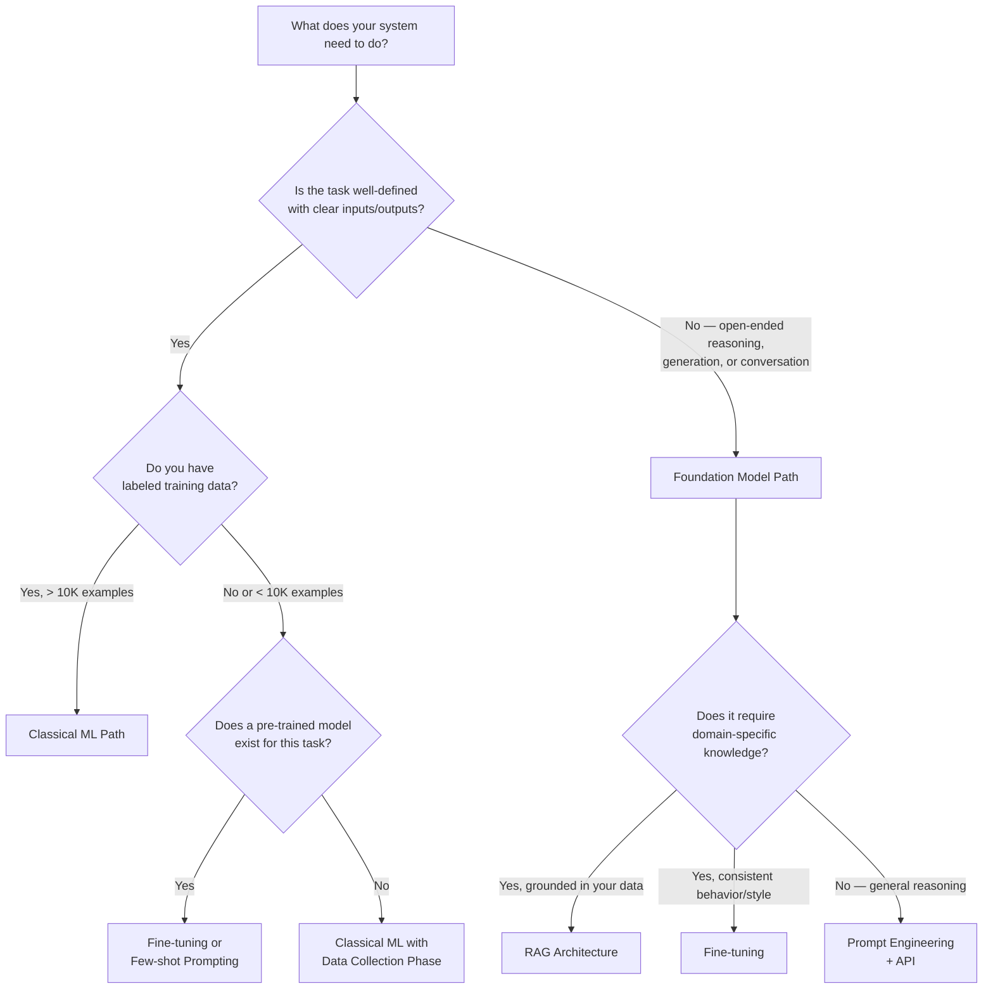
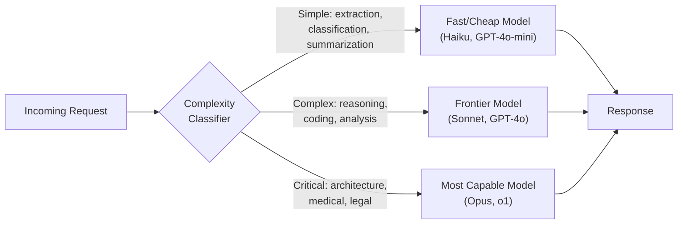
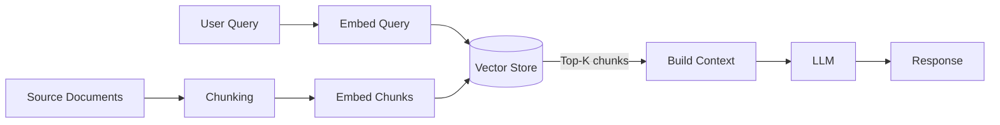
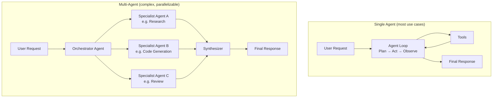
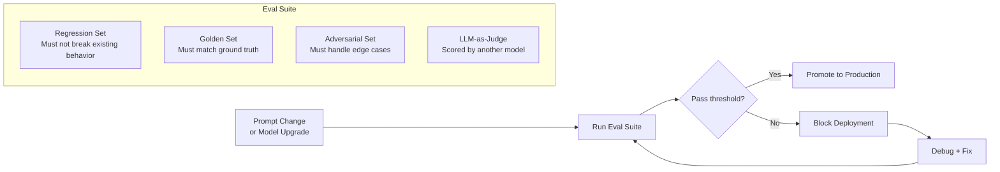

# AI/ML Architecture Standards

> **Purpose:** Architecture standards for AI/ML *systems* — covering both classical ML pipelines
> and the foundation model era: LLM integration, RAG, agentic systems, prompt governance,
> cost architecture, and responsible AI. Updated for 2025.
>
> **Scope note:** This file is for designing systems that *use* AI. For auditing code *generated*
> by AI development tools (Cursor, Copilot, Claude, Windsurf), see
> [`27-ai-assisted-development.md`](./27-ai-assisted-development.md).

---

## How to Use This File

- **System Design:** *"Using these AI/ML architecture standards, design the LLM-powered [feature] for [use case]"*
- **Architecture Review:** Audit AI/ML systems against these standards for production readiness
- **Decision Framework:** Use the pattern selection tables to choose the right AI approach before building

---

## Related Standards

| Standard | Relationship |
|----------|-------------|
| [06 — Data Architecture](./06-data-architecture.md) | Data pipelines, storage for training data, vector databases |
| [07 — Security Architecture](./07-security-architecture.md) | Prompt injection defense, data privacy for training data, PII in prompts |
| [12 — Observability](./12-observability-standards.md) | Model monitoring, LLM cost tracking, evaluation pipelines |
| [13 — DevOps & CI/CD](./13-devops-cicd.md) | MLOps and LLMOps pipelines extend CI/CD |
| [09 — Microservices Patterns](./09-microservices-patterns.md) | Agent orchestration, tool service design |

---

## Part A — AI Approach Selection

### A.1 Choosing the Right AI Pattern

Before designing infrastructure, choose the right AI approach. Most teams over-engineer this decision.



| Approach | When | Latency | Cost | Complexity |
|----------|------|:-------:|:----:|:----------:|
| **Prompt + API** | General tasks, prototyping, low volume | 0.5–10s | Medium | Low |
| **RAG** | Domain-specific Q&A, grounded in your data | 1–5s | Medium | Medium |
| **Fine-tuning** | Consistent tone/format, specialized vocabulary, high volume | 0.2–2s | High upfront, low per-call | High |
| **Classical ML** | Structured predictions, tabular data, high throughput | 1–200ms | Low | Medium |
| **Agentic** | Multi-step tasks, tool use, autonomous workflows | 5–120s | High | Very High |

**Rule:** Start with prompt engineering. Fine-tune only when you have evidence prompting is insufficient. Build agents only when sequential prompting fails.

---

## Part B — Foundation Model & LLM Architecture

### B.1 Model Selection Framework

| Dimension | Considerations |
|-----------|---------------|
| **Task complexity** | Simple extraction/classification → smaller, faster models. Complex reasoning → frontier models |
| **Latency requirement** | < 500ms → distilled/smaller models or cached responses. Async workflows → frontier models acceptable |
| **Privacy/data residency** | PII or regulated data → self-hosted models (Llama, Mistral) or Azure/AWS-hosted APIs with DPA |
| **Cost at scale** | Model routing: use expensive models for complex requests only. Route simple tasks to cheaper models |
| **Context window** | Long-document processing → models with 128K+ context. Most tasks fit in 8–32K |

**Model Routing Pattern** — never hardcode one model for all requests:



### B.2 Prompt Architecture

System prompts are **architectural contracts** — version them like code.

| Rule | Standard |
|------|---------|
| Version system prompts | Store in version control with semantic versioning. Never edit in a dashboard. |
| Environment parity | Separate prompts per environment (dev/staging/prod). Changes flow through CI. |
| Prompt registry | Central store for all prompts — no inline strings in application code |
| Structured outputs | Prefer JSON schema-constrained outputs over free-form parsing |
| Prompt length budget | Track input tokens per prompt version. Alert when approaching model limits. |
| Test before deploy | Prompt changes require eval suite pass before promotion to production |

**Prompt Registry Pattern:**

```
prompts/
├── v1/
│   ├── system-base.md          # Base system instructions
│   ├── tool-definitions.json   # Tool schemas
│   └── few-shot-examples.json  # Curated examples
├── v2/
│   └── ...
└── evals/
    ├── regression-suite.json   # Must pass before promoting v2 → prod
    └── golden-set.json         # Curated ground truth
```

### B.3 Context Window Management

Context window is a finite resource. Treat it like memory allocation.

| Pattern | When | Trade-off |
|---------|------|-----------|
| **Selective context** | Large knowledge bases | Requires good retrieval; irrelevant context degrades quality |
| **Sliding window** | Long conversations | Loses early context; can break coherence |
| **Summarization** | Conversation history > 50% of window | Lossy; summaries may miss detail |
| **Structured truncation** | Fixed-schema inputs | Safe for structured data; not for open-ended |
| **External memory** | Long-running agents, returning users | Adds latency; requires retrieval quality investment |

**Context window budget allocation:**

```
Total context: 128K tokens
├── System prompt:      2K  (fixed)
├── Tool definitions:   3K  (fixed)
├── Retrieved context:  40K (RAG results — top-N chunks)
├── Conversation history: 20K (sliding window, summarized beyond)
├── User input:         5K  (current turn)
└── Output budget:      58K (reserved for response)
```

Rule: **Reserve output tokens explicitly.** Models that hit the context limit mid-generation produce truncated, corrupted outputs with no error signal.

### B.4 RAG Architecture

#### Basic RAG (sufficient for most cases)



#### Advanced RAG (when basic RAG quality is insufficient)

| Technique | Problem It Solves | Added Complexity |
|-----------|-------------------|:---------------:|
| **HyDE (Hypothetical Document Embeddings)** | Query-document embedding space mismatch | Low |
| **Reranking** (Cohere, cross-encoder) | Top-K by similarity ≠ Top-K by relevance | Low |
| **Multi-hop retrieval** | Answers that require connecting multiple documents | High |
| **Hybrid search** (vector + BM25) | Keyword-specific terms missed by semantic search | Medium |
| **Metadata filtering** | Pre-filter by date, source, category before vector search | Low |
| **Contextual chunk headers** | Chunks lose meaning without document context | Low |

**RAG quality checklist before shipping:**
- [ ] Chunking strategy validated — chunk size tested for your content type
- [ ] Retrieval evaluated independently of generation (precision@K, recall@K)
- [ ] Reranker in place if retrieval quality is borderline
- [ ] Source citations in responses (grounding, not hallucination)
- [ ] Fallback when retrieval returns no relevant results ("I don't have information on this")
- [ ] Vector store has appropriate indexes for query patterns

#### RAG Chunking Rules

| Content Type | Strategy | Chunk Size |
|-------------|---------|:----------:|
| Prose documents | Recursive text splitter with overlap | 512–1024 tokens, 10–20% overlap |
| Code | AST-aware splitting (function/class boundaries) | Full function/class |
| Tables/structured data | Row-level or section-level | Row or logical group |
| Long-form articles | Semantic splitting (paragraph boundaries) | 256–512 tokens |

### B.5 LLM Cost Architecture

Token costs compound fast. Design cost controls from day one.

| Control | Implementation |
|---------|---------------|
| **Per-feature token budget** | Set max_tokens per feature. Enforce at application layer, not just model layer. |
| **Cost per request logging** | Log input_tokens, output_tokens, model, feature, tenant on every call |
| **Semantic caching** | Cache responses for semantically similar queries (cosine similarity > 0.95). Redis + embedding cache. |
| **Exact-match caching** | Cache deterministic responses (same system prompt + same input = same output). TTL-based. |
| **Model routing by cost tier** | Simple tasks → cheap models. Reserve expensive models for provably complex tasks. |
| **Token amplification prevention** | User input that expands into large internal prompts must be bounded. Max user input length enforced. |
| **Tenant-level spend limits** | In multi-tenant systems, per-tenant daily/monthly token quotas with hard cutoff |

**Cost monitoring thresholds:**

| Alert | Threshold |
|-------|-----------|
| Request cost spike | > 2× rolling 7-day average per feature |
| Daily spend | > 80% of monthly budget / 30 days |
| Token per request | > 3× P99 baseline for that feature |
| Cache hit rate drop | < 20% hit rate on a cacheable endpoint |

---

## Part C — Agentic Systems

### C.1 When to Build an Agent

Agents introduce orchestration complexity, latency variance, and failure modes that don't exist in single-turn LLM calls. Justify the complexity.

**Build an agent when:**
- The task requires 3+ sequential steps where each step depends on the output of the previous
- Steps involve tool use (web search, code execution, database queries, API calls)
- The path through the steps cannot be predetermined (dynamic control flow)

**Don't build an agent when:**
- A well-structured prompt chain solves the problem
- The sequence of steps is fixed (use a pipeline instead)
- Latency or cost constraints make multi-turn LLM calls impractical

### C.2 Agent Architecture Patterns



| Pattern | When | Risk |
|---------|------|------|
| **Single Agent** | Most use cases. One model, one loop. | Simpler failure modes. Start here. |
| **Orchestrator-Worker** | Parallelizable subtasks (research + write + review) | Orchestrator is a single point of failure |
| **Hierarchical** | Complex workflows with sub-goals | Context fragmentation; hard to debug |
| **Peer-to-Peer** | Debate/critique patterns (two models challenging each other) | Expensive; can loop without convergence |

### C.3 Agent Design Rules

| Rule | Standard |
|------|---------|
| **Bounded execution** | Set max_iterations per agent run. No infinite loops. |
| **Human-in-the-loop for irreversible actions** | Before any write, delete, send, or deploy action — require explicit human confirmation |
| **Tool call validation** | Validate tool inputs before execution. Never pass raw LLM output directly to a shell or database. |
| **Idempotent tools** | Design tools to be safe to retry. Track which tool calls have executed. |
| **Minimal tool permissions** | Each tool has only the permissions required for its function. No god-mode tools. |
| **Context poisoning defense** | Validate and sanitize all content injected into agent context (fetched URLs, DB results, file content) |
| **Audit log** | Log every tool call, input, output, and decision. Agents are opaque without this. |
| **Timeout enforcement** | Per-tool timeout and total agent run timeout. Surface timeouts as errors, not silent failures. |

### C.4 Agent Memory Patterns

| Memory Type | Storage | Scope | Use When |
|------------|---------|-------|---------|
| **In-context** | Active context window | Current session only | Short tasks, single turn |
| **External episodic** | Vector store (semantic search) | Across sessions | Returning users, personalization |
| **Structured state** | Database (key-value, relational) | Persistent, queryable | Workflow state, task progress |
| **Shared workspace** | File system, blob storage | Multi-agent coordination | Agents collaborating on artifacts |

**Memory retrieval rule:** Don't inject all memory into context. Retrieve the top-K relevant memories per turn. Stale or irrelevant memory degrades output quality.

### C.5 Agent Failure Modes

| Failure | Symptom | Mitigation |
|---------|---------|-----------|
| **Infinite loop** | Agent reruns same tool repeatedly | Max iteration counter + loop detection (same tool + same args twice = halt) |
| **Context poisoning** | Malicious content in tool output hijacks agent behavior | Sanitize all external content before injecting into context |
| **Hallucinated tool calls** | Agent calls a tool that doesn't exist or with wrong args | Strict tool schema validation; reject calls that don't match registered tools |
| **Action escalation** | Agent takes broader actions than authorized | Scope tools narrowly; human approval gate for high-impact actions |
| **Context exhaustion** | Agent runs out of context window mid-task | Track tokens actively; checkpoint and summarize before limit |
| **Sycophantic correction** | Agent reverses correct decisions when user pushes back | Evaluate agent stability under adversarial prompting before shipping |

---

## Part D — LLM Observability & Evaluation

### D.1 LLM-Specific Metrics

Standard application metrics (latency, error rate) are necessary but not sufficient for LLMs.

| Category | Metric | How to Measure |
|----------|--------|---------------|
| **Latency** | Time to first token (TTFT) | Measure from request send to first streamed token |
| **Latency** | Tokens per second (TPS) | Total tokens / total generation time |
| **Cost** | Cost per request | (input_tokens × input_price) + (output_tokens × output_price) |
| **Cost** | Cost per feature / per tenant | Tag all LLM calls with feature and tenant IDs |
| **Quality** | Task completion rate | Automated eval or sampling-based human review |
| **Quality** | Hallucination rate | LLM-as-judge or grounding checks against source |
| **Reliability** | Cache hit rate | (cached responses / total requests) × 100 |
| **Reliability** | Fallback rate | How often the primary model fails and fallback is used |

### D.2 Evaluation Framework

Ship no LLM feature without an eval suite. Evals are the test suite for AI behavior.



| Eval Type | What It Tests | When Required |
|-----------|--------------|:-------------:|
| **Regression** | Prompt change doesn't break existing passing cases | Every prompt change |
| **Golden set** | Output matches curated ground truth | Before first deploy |
| **LLM-as-judge** | Quality scoring by a separate model (avoid same model judging itself) | Ongoing quality monitoring |
| **Adversarial** | Jailbreaks, edge inputs, prompt injection attempts | Before public-facing features |
| **Latency/cost** | p99 latency and cost-per-request within budget | Every model upgrade |

### D.3 Logging Standards for LLM Systems

```json
{
  "timestamp": "2025-03-20T10:30:00Z",
  "trace_id": "abc-123",
  "feature": "document-summarizer",
  "model": "claude-sonnet-4-6",
  "tenant_id": "tenant-xyz",
  "input_tokens": 1240,
  "output_tokens": 380,
  "cost_usd": 0.0042,
  "ttft_ms": 320,
  "total_latency_ms": 1850,
  "cache_hit": false,
  "fallback_used": false,
  "finish_reason": "end_turn",
  "eval_score": 0.87
}
```

**Mandatory fields:** timestamp, trace_id, feature, model, input_tokens, output_tokens, cost_usd, latency_ms, finish_reason

**PII in logs:** Never log raw user input or model output in production without PII scrubbing. Use structured placeholders or hash PII fields.

---

## Part E — Classical ML Architecture

*(Retained for teams building classical ML systems alongside LLM features)*

### E.1 MLOps Maturity Levels

| Level | Description | Characteristics |
|:-----:|-----------|----------------|
| **0** | Manual | Notebooks, manual deploy, no versioning |
| **1** | ML Pipeline | Automated training, manual deploy |
| **2** | CI/CD for ML | Automated training + deploy + testing |
| **3** | Full MLOps | Drift-triggered retraining, A/B testing, feature store |

**Minimum:** Level 2 for production. Level 3 for revenue-critical ML systems.

### E.2 Pattern Selection

| Pattern | When | Latency | Complexity |
|---------|------|:-------:|:----------:|
| **Batch prediction** | Pre-compute scores for all users/items | Minutes–hours | Low |
| **Real-time inference** | Predict on-demand per request | 10–200ms | High |
| **Streaming inference** | Process events as they arrive | Seconds | High |
| **Edge inference** | On-device (mobile, IoT) | < 10ms | Medium |

### E.3 Pipeline Standards

| Rule | Standard |
|------|---------|
| Experiments tracked | MLflow, W&B, or Neptune. No undocumented runs. |
| Models versioned | Model registry with version history before deployment |
| Data versioned | DVC or equivalent. Same data + same code = reproducible model. |
| Evaluation automated | Automated comparison vs baseline before deploy |
| Training-serving parity | Features computed identically in training and serving. Feature store enforces this. |

### E.4 Model Monitoring

| Monitor | Alert When |
|---------|-----------|
| **Data drift** | KS test p-value < 0.05 or PSI > 0.2 on key features |
| **Concept drift** | Accuracy drops > 5% vs baseline over 7-day window |
| **Prediction distribution** | Output distribution shifts > 2 standard deviations |
| **Serving latency** | p99 exceeds SLA for > 5 minutes |
| **Feature freshness** | Input features older than defined freshness SLA |

### E.5 Feature Store Selection

| Tool | Best For |
|------|---------|
| **Feast** | Kubernetes environments, multi-cloud |
| **AWS SageMaker Feature Store** | AWS-native ML |
| **Vertex AI Feature Store** | GCP-native ML |
| **Databricks Feature Store** | Spark/Databricks environments |
| **Redis + PostgreSQL (custom)** | Small teams, simple feature sets |

---

## Part F — LLM Security

### F.1 Threat Model for LLM Systems

| Threat | Vector | Mitigation |
|--------|--------|-----------|
| **Prompt injection (direct)** | User input overwrites system instructions | Input sanitization; treat user input as untrusted data |
| **Prompt injection (indirect)** | Content fetched from web/DB contains instructions | Sanitize all external content before injecting into context; clearly delimit trusted vs untrusted content |
| **Data exfiltration** | Model coaxed into repeating system prompt or training data | Output filtering; test with extraction probes before launch |
| **Jailbreak** | Instructions that bypass safety guidelines | Red-team before launch; monitor for jailbreak pattern signatures |
| **Tool call injection** | Malicious tool output triggers unintended tool calls | Validate tool responses; don't chain tool outputs directly into tool inputs |
| **Insecure output handling** | LLM output rendered as HTML/SQL without sanitization | Treat all LLM output as untrusted user input before rendering or executing |

### F.2 LLM Security Checklist

- [ ] User input treated as untrusted — sanitized before injection into prompts
- [ ] External content (URLs, DB records, file content) clearly delimited in context with explicit distrust markers
- [ ] Tool permissions scoped to minimum required
- [ ] Irreversible tool actions require explicit human confirmation
- [ ] LLM output sanitized before rendering in UI (XSS) or executing as code
- [ ] System prompt not exposed in responses (extraction probe tested)
- [ ] Rate limiting per user/tenant on LLM endpoints
- [ ] Adversarial eval suite (jailbreak/injection) run before launch

---

## Part G — Responsible AI

### G.1 For Classical ML Systems

- [ ] Training data audited for demographic/geographic bias
- [ ] Model evaluated for fairness across protected groups (equal opportunity, demographic parity)
- [ ] Explainability implemented for decisions affecting users (SHAP, LIME for feature importance)
- [ ] Human-in-the-loop fallback for high-stakes decisions
- [ ] Training data does not contain PII without explicit consent and purpose limitation
- [ ] Model card documented (purpose, limitations, performance by subgroup)
- [ ] GDPR Article 22 compliance for automated decisions (right to explanation, human review)

### G.2 For LLM Systems

- [ ] Hallucination risk assessed for the feature — grounding and citations where accuracy is critical
- [ ] Output quality monitored continuously — not just at launch
- [ ] PII not passed to third-party model APIs without user consent and DPA
- [ ] EU AI Act risk classification completed (General Purpose AI, High-Risk, Minimal Risk)
- [ ] Model degradation escape hatch designed — what happens when model quality drops or API is unavailable?
- [ ] Bias audit on generated content — test for demographic disparities in output quality/tone
- [ ] Content moderation for user-facing outputs (inappropriate content, harmful advice)

### G.3 Model Card Template (LLM Feature Edition)

```markdown
# Model Card: [Feature Name]

## Overview
- **Feature:** [What this LLM integration does]
- **Model(s):** [e.g., claude-sonnet-4-6 with GPT-4o-mini fallback]
- **Owner:** [Team]
- **Last Reviewed:** [Date]
- **Risk Classification:** [EU AI Act tier]

## Inputs & Outputs
- **Input:** [What user data / context is passed to the model]
- **Output:** [What the model produces, how it's used]
- **PII in prompts:** [Yes/No — what data, what protections]

## Limitations
- [Known failure modes, edge cases]
- [Not suitable for...]
- [Requires human review when...]

## Escape Hatch
- [What happens if the model API is unavailable]
- [What happens if output quality degrades below threshold]
- [How users can request human review]

## Eval Baseline
| Metric | Score | Measured |
|--------|:-----:|:--------:|
| Task completion | 94% | 2025-03-01 |
| Hallucination rate | 2.1% | 2025-03-01 |
| P99 latency | 2.3s | 2025-03-01 |
```

---

## Part H — Anti-Patterns

| Anti-Pattern | Problem | Fix |
|-------------|---------|-----|
| **Model in a notebook** | Not reproducible, not deployable | MLOps pipeline, containerized serving |
| **Training-serving skew** | Features computed differently in training vs serving | Feature store, shared feature logic |
| **Prompt strings inline in code** | Unversioned, untestable, inconsistent across environments | Prompt registry with version control |
| **One model for all requests** | Overpaying for simple tasks; underserving complex ones | Model routing by complexity/cost tier |
| **No eval suite** | Prompt changes ship without regression testing | Eval suite required in CI before prompt promotion |
| **Agent with broad tool permissions** | One compromised input can take destructive actions | Minimal permissions per tool; human gate on irreversible actions |
| **Logging raw prompts** | PII/sensitive data in logs | Structured logging with PII scrubbing |
| **No token budget** | LLM costs scale with user behavior unpredictably | Per-feature, per-tenant token budgets enforced at application layer |
| **RAG without retrieval eval** | Poor retrieval is invisible in end-to-end metrics | Evaluate retrieval precision/recall independently |
| **Ignoring context window cost** | Large context = large cost; stale context degrades quality | Active context management; trim irrelevant history |
| **Determinism assumption** | Code that assumes same input → same LLM output | Set temperature=0 where determinism is required; design for variance |

---

*Archpilot — Enterprise Architecture Standards Library*
*Created by Gaurav Sharma | Updated March 2025*
