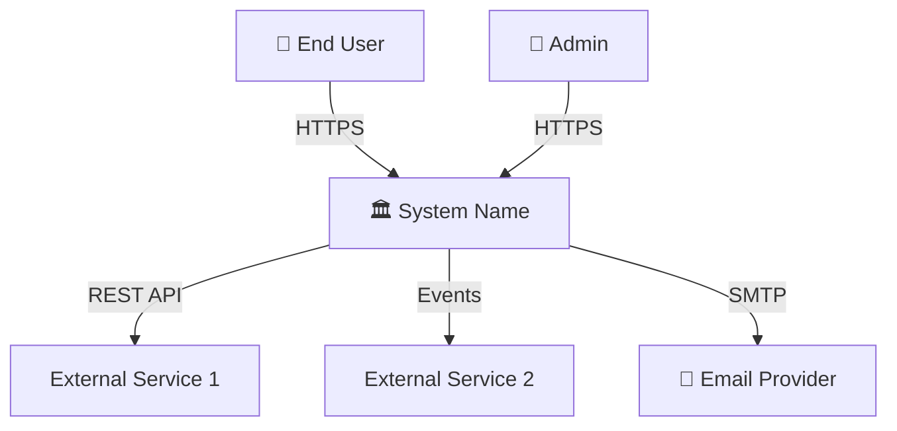
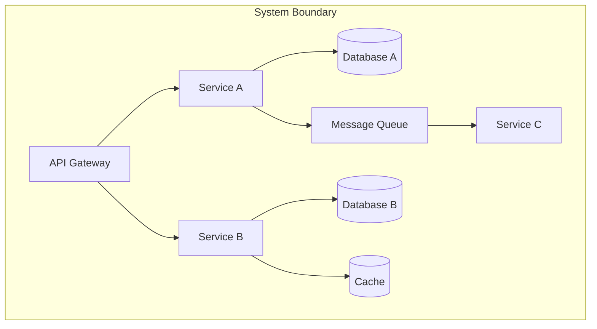
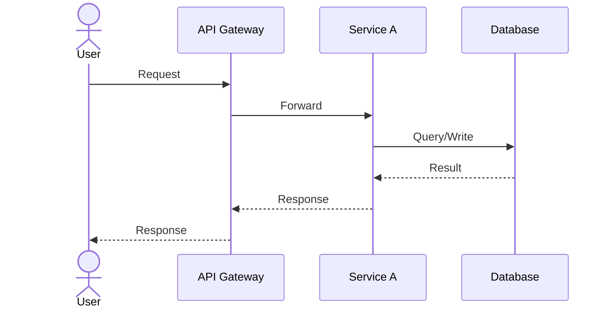
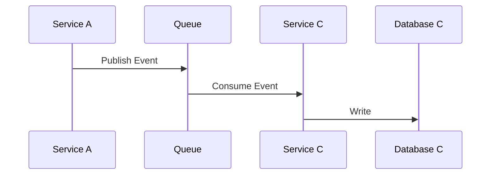
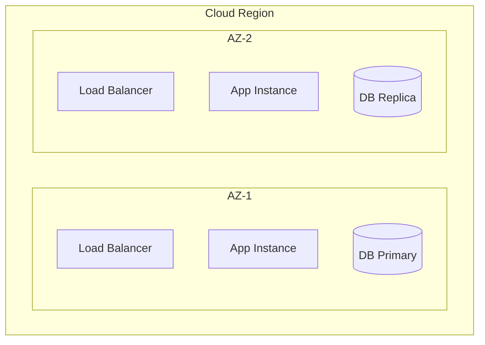

# [System Name] — High-Level Design

| Field | Value |
|-------|-------|
| **Version** | 1.0 |
| **Author** | [Name] |
| **Reviewers** | [Names] |
| **Status** | Draft &#124; In Review &#124; Approved &#124; Superseded |
| **Date** | YYYY-MM-DD |

---

## 1. Executive Summary

<!-- 3-5 sentences: What, Why, How (highest level). A CTO should understand the system from this section alone. -->

---

## 2. Business Context

### 2.1 Business Drivers
<!-- Why does this system exist? What business problem does it solve? -->

### 2.2 Key Use Cases

| # | Use Case | Actor | Priority |
|---|----------|-------|:--------:|
| UC-01 | | | Must |
| UC-02 | | | Must |
| UC-03 | | | Should |

### 2.3 Stakeholders

| Role | Name | Interest |
|------|------|----------|
| Product Owner | | Business requirements, priorities |
| Engineering Lead | | Technical feasibility, delivery |
| Security | | Compliance, data protection |
| Operations | | Reliability, monitoring |

---

## 3. System Context Diagram (C4 Level 1)

<!-- The system as a single box + all external actors and systems -->

---

## 4. Container Diagram (C4 Level 2)

<!-- Break the system into deployable containers: services, databases, queues, CDNs -->

| Container | Technology | Responsibility |
|-----------|-----------|---------------|
| API Gateway | | Request routing, auth, rate limiting |
| Service A | | |
| Service B | | |
| Database A | | |
| Cache | | |
| Message Queue | | |

---

## 5. Data Flow

### 5.1 Primary Data Flow (Happy Path)

### 5.2 Async Data Flow

---

## 6. Technology Stack

| Layer | Technology | Rationale |
|-------|-----------|-----------|
| Frontend | | |
| API Gateway | | |
| Backend Services | | |
| Primary Database | | |
| Cache | | |
| Message Broker | | |
| Search | | |
| Object Storage | | |
| Container Orchestration | | |
| CI/CD | | |
| Monitoring & Logging | | |

---

## 7. Integration Architecture

| Integration | Protocol | Auth | Direction | Data Format | SLA |
|------------|----------|------|-----------|-------------|-----|
| | REST/gRPC/Events | JWT/mTLS/API Key | In/Out | JSON/Protobuf/Avro | |

---

## 8. Non-Functional Requirements

| Category | Requirement | Target |
|----------|-----------|--------|
| **Availability** | System uptime | 99.9% |
| **Latency** | API response time (p95) | < 500ms |
| **Throughput** | Peak requests per second | |
| **Scalability** | Growth capacity without redesign | 10x |
| **Data Retention** | Business data | |
| **RPO** | Maximum data loss | |
| **RTO** | Maximum downtime | |
| **Compliance** | Regulatory requirements | |

---

## 9. Security Architecture

| Concern | Approach |
|---------|----------|
| **Authentication** | |
| **Authorization** | |
| **Encryption (transit)** | TLS 1.3 |
| **Encryption (rest)** | AES-256 / KMS |
| **Network Security** | VPC, private subnets |
| **Secrets Management** | |
| **Compliance** | |

---

## 10. Deployment Architecture

### 10.1 Infrastructure Diagram

### 10.2 Environments

| Environment | Purpose | Scale |
|------------|---------|-------|
| Development | Developer testing | Minimal |
| Staging | Pre-production validation | Production-like |
| Production | Live | Full scale |

### 10.3 CI/CD Pipeline
<!-- Brief pipeline overview — detail in DevOps docs -->

---

## 11. Cost Estimate

| Service | Monthly (Expected) | Monthly (Peak) |
|---------|:-----------------:|:--------------:|
| Compute | | |
| Database | | |
| Storage | | |
| Networking | | |
| Monitoring | | |
| **Total** | | |

---

## 12. Key Architecture Decisions

| # | Decision | Rationale | ADR Link |
|---|----------|-----------|----------|
| 1 | | | ADR-00X |
| 2 | | | ADR-00X |

---

## 13. Risks & Mitigations

| # | Risk | Probability | Impact | Mitigation |
|---|------|:-----------:|:------:|-----------|
| 1 | | H/M/L | H/M/L | |

---

## 14. Roadmap

| Phase | Scope | Timeline |
|-------|-------|----------|
| Phase 1 (MVP) | | |
| Phase 2 | | |
| Phase 3 | | |

---

## Appendix

### A. Glossary
| Term | Definition |
|------|-----------|
| | |

### B. References
- [Related documents]

---

*Generated using Archpilot HLD Standards v1.0*
*Created by Gaurav Sharma*
