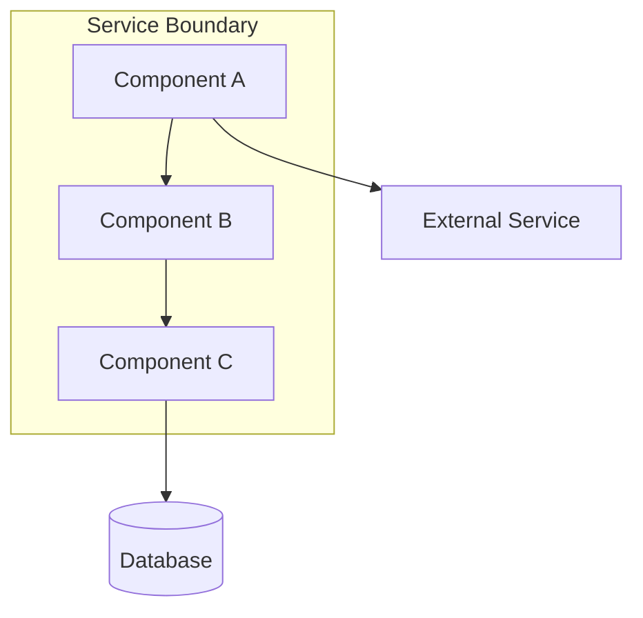
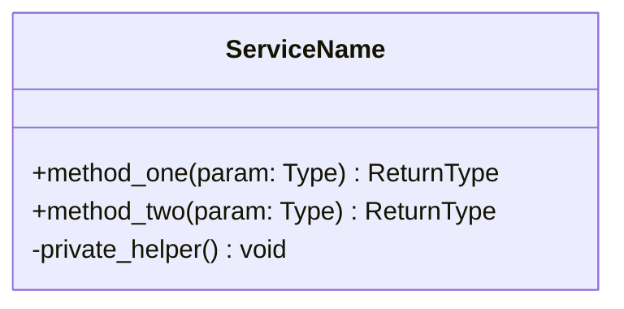
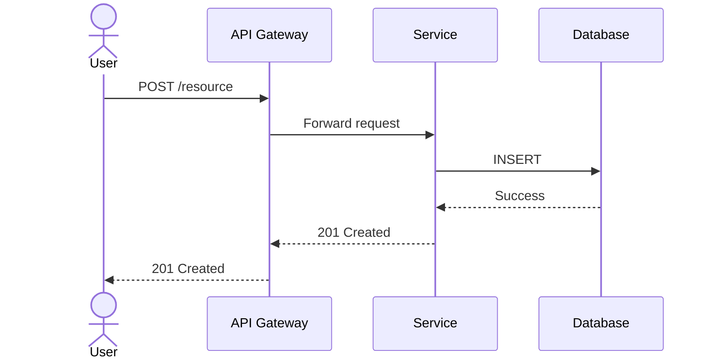
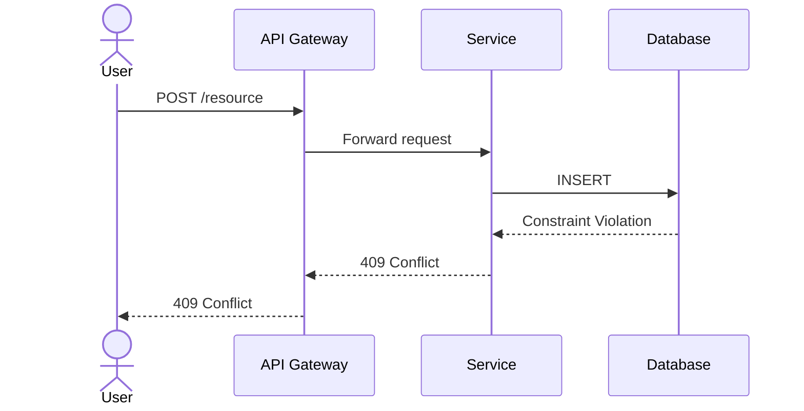
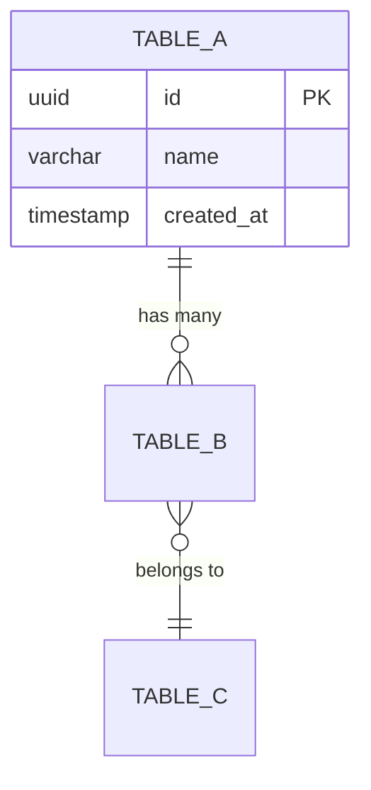

# [System/Feature Name] — Low-Level Design

| Field | Value |
|-------|-------|
| **Version** | 1.0 |
| **Author** | [Name] |
| **Reviewers** | [Names] |
| **Status** | Draft &#124; In Review &#124; Approved &#124; Superseded |
| **Date** | YYYY-MM-DD |
| **Related ADRs** | [Link to ADR-001, ADR-002] |
| **Related HLD** | [Link to parent HLD] |

---

## 1. Scope & Objectives

### 1.1 What This LLD Covers
<!-- Specific feature, service, or component being designed -->

### 1.2 What This LLD Does NOT Cover
<!-- Explicit exclusions to prevent scope creep -->

### 1.3 Business Context
<!-- WHY this is being built. Link to requirements, user stories, or product spec. -->

### 1.4 Success Criteria
<!-- Measurable outcomes that define "done" -->

| # | Criterion | Measurement |
|---|-----------|-------------|
| 1 | | |
| 2 | | |
| 3 | | |

---

## 2. Assumptions, Constraints & Dependencies

### 2.1 Assumptions
<!-- What you are taking for granted -->
- 

### 2.2 Constraints
<!-- What limits your design -->
- 

### 2.3 Dependencies
<!-- External systems, teams, or services this design depends on -->

| Dependency | Owner | Status | Risk if Unavailable |
|-----------|-------|--------|---------------------|
| | | | |

---

## 3. Detailed Design

### 3.1 Component Architecture

<!-- High-level view of components being created/modified -->



| Component | Responsibility | Tech Stack |
|-----------|---------------|------------|
| | | |

### 3.2 Class / Module Design

<!-- Class diagram or module structure -->



**Design Patterns Used:**
- [ ] Repository Pattern — for data access abstraction
- [ ] Factory Pattern — for object creation
- [ ] Strategy Pattern — for interchangeable algorithms
- [ ] Observer Pattern — for event handling
- [ ] Other: ___

### 3.3 Sequence Diagrams

#### 3.3.1 Happy Path



#### 3.3.2 Error Path — [Primary Failure Scenario]



#### 3.3.3 Error Path — [Downstream Service Failure]

<!-- Add sequence diagram for external dependency failure with circuit breaker -->

---

## 4. API Specification

### 4.1 Endpoint: `[METHOD] /path`

| Field | Value |
|-------|-------|
| **Method** | GET &#124; POST &#124; PUT &#124; PATCH &#124; DELETE |
| **Path** | `/api/v1/resource` |
| **Description** | |
| **Authentication** | Bearer JWT &#124; API Key &#124; None |
| **Authorization** | Roles: [admin, user] |
| **Rate Limit** | 100 req/min per user |
| **Idempotent** | Yes &#124; No |

**Request Headers:**
| Header | Required | Description |
|--------|:--------:|-------------|
| `Authorization` | ✅ | Bearer token |
| `Content-Type` | ✅ | `application/json` |
| `X-Request-Id` | ⬜ | Correlation ID for tracing |

**Request Body:**
```json
{
  "field_one": "string (required, max 255 chars)",
  "field_two": "integer (required, min 1, max 10000)",
  "field_three": "string (optional, enum: [value_a, value_b])"
}
```

**Response — Success (200/201):**
```json
{
  "id": "uuid-string",
  "field_one": "string",
  "field_two": 100,
  "created_at": "2026-03-11T09:00:00Z"
}
```

**Response — Error:**
```json
{
  "error": {
    "code": "RESOURCE_ALREADY_EXISTS",
    "message": "A resource with this identifier already exists.",
    "details": [],
    "correlationId": "req-abc123",
    "timestamp": "2026-03-11T09:00:00Z"
  }
}
```

**Status Codes:**
| Code | Condition |
|------|-----------|
| 200 | Success (GET, PUT, PATCH) |
| 201 | Created (POST) |
| 204 | No Content (DELETE) |
| 400 | Bad Request — validation failure |
| 401 | Unauthorized — missing or invalid token |
| 403 | Forbidden — insufficient permissions |
| 404 | Not Found |
| 409 | Conflict — duplicate or state violation |
| 422 | Unprocessable Entity — semantic validation failure |
| 429 | Too Many Requests — rate limit exceeded |
| 500 | Internal Server Error |
| 503 | Service Unavailable — dependency down |

<!-- Repeat Section 4.1 for each endpoint -->

---

## 5. Database Design

### 5.1 Entity Relationship Diagram



### 5.2 Table Definitions

#### Table: `table_name`

| Column | Type | Nullable | Default | Constraints | Notes |
|--------|------|:--------:|---------|------------|-------|
| `id` | UUID | No | `gen_random_uuid()` | PK | |
| `name` | VARCHAR(100) | No | | NOT NULL | |
| `status` | VARCHAR(20) | No | `'active'` | CHECK (active, inactive, deleted) | |
| `created_at` | TIMESTAMPTZ | No | `NOW()` | | Audit |
| `updated_at` | TIMESTAMPTZ | No | `NOW()` | | Audit |
| `created_by` | UUID | No | | FK → users(id) | Audit |

**Indexes:**
| Name | Columns | Type | Purpose |
|------|---------|------|---------|
| `idx_table_name_status` | `status` | B-tree | Filter queries |
| `idx_table_name_created` | `created_at` | B-tree | Sort/range queries |

**Data Projections:**
| Timeframe | Estimated Rows | Storage |
|-----------|:--------------:|---------|
| Launch | | |
| 1 year | | |
| 3 years | | |

**Partitioning:** [None / Range by date / Hash by tenant_id]
**Retention:** [Policy description]
**PII Columns:** [List any columns containing personal data]

### 5.3 Migration Plan

| Step | Migration | Backward Compatible | Rollback |
|------|-----------|:-------------------:|----------|
| 1 | | Yes &#124; No | |
| 2 | | Yes &#124; No | |

---

## 6. Event / Message Design

<!-- Include only if the design involves async messaging -->

### 6.1 Event: `event.name.v1`

| Field | Value |
|-------|-------|
| **Topic / Queue** | `domain.entity.action` |
| **Producer** | [Service name] |
| **Consumer(s)** | [Service names] |
| **Delivery Guarantee** | At-least-once &#124; Exactly-once |
| **Ordering** | Per-key &#124; Global &#124; None |
| **Retry Policy** | 3 retries, exponential backoff (1s, 5s, 30s) |
| **DLQ** | `domain.entity.action.dlq` |

**Event Schema:**
```json
{
  "eventId": "uuid",
  "eventType": "entity.action",
  "version": "1.0",
  "timestamp": "ISO-8601",
  "source": "service-name",
  "correlationId": "uuid",
  "data": {
    "field_one": "type",
    "field_two": "type"
  }
}
```

---

## 7. Error Handling Strategy

| Error Category | HTTP Code | Action | Log Level |
|---------------|:---------:|--------|:---------:|
| Validation error | 400/422 | Return structured error | WARN |
| Authentication failure | 401 | Return error, DO NOT leak details | WARN |
| Authorization failure | 403 | Return error, log user + action | WARN |
| Resource not found | 404 | Return error | INFO |
| Conflict/race condition | 409 | Return error with current state | WARN |
| Rate limit exceeded | 429 | Return error + Retry-After header | INFO |
| Downstream timeout | 504 | Circuit breaker → fallback | ERROR |
| Downstream failure | 503 | Circuit breaker → fallback → DLQ | ERROR |
| Unexpected error | 500 | Generic response, full stack in logs | ERROR |

---

## 8. Security Considerations

| Concern | Implementation |
|---------|---------------|
| **Authentication** | |
| **Authorization (RBAC)** | |
| **Input Validation** | |
| **SQL Injection Prevention** | |
| **XSS Prevention** | |
| **Sensitive Data Encryption** | |
| **Secrets Management** | |
| **Rate Limiting** | |
| **Audit Logging** | |

---

## 9. Performance Considerations

### 9.1 Latency Targets

| Endpoint | p50 | p95 | p99 |
|----------|:---:|:---:|:---:|
| | ms | ms | ms |

### 9.2 Throughput Targets

| Scenario | Requests/sec |
|----------|:------------:|
| Normal load | |
| Peak load | |

### 9.3 Caching Strategy

| Data | Cache Layer | TTL | Invalidation |
|------|------------|:---:|-------------|
| | Redis &#124; CDN &#124; In-memory | | |

### 9.4 Database Query Performance

| Query | Expected Time | Index Used | Notes |
|-------|:------------:|-----------|-------|
| | ms | | |

---

## 10. Observability Plan

### 10.1 Key Metrics

| Metric | Type | Alert Threshold |
|--------|------|:---------------:|
| `service_request_total` | Counter | |
| `service_request_duration_seconds` | Histogram | p99 > 2s |
| `service_error_total` | Counter | Rate > 5% for 5 min |
| `db_connection_pool_active` | Gauge | > 80% capacity |

### 10.2 Structured Log Fields

| Field | Type | Description |
|-------|------|-------------|
| `timestamp` | ISO-8601 | Event time |
| `level` | string | INFO, WARN, ERROR |
| `correlationId` | UUID | Request trace ID |
| `service` | string | Service name |
| `action` | string | Operation being performed |
| `duration_ms` | integer | Operation duration |
| `userId` | string | Authenticated user (if applicable) |
| `outcome` | string | success &#124; failure |

### 10.3 Alerts

| Alert | Condition | Severity | Action |
|-------|-----------|:--------:|--------|
| High Error Rate | Error rate > 5% for 5 min | Critical | Page on-call |
| High Latency | p99 > 2s for 10 min | Warning | Notify channel |
| DB Pool Exhaustion | Active > 80% | Warning | Investigate |

---

## 11. Testing Strategy

| Test Type | Scope | Tools | Coverage |
|-----------|-------|-------|:--------:|
| Unit | Business logic, utils | pytest / JUnit | 80%+ |
| Integration | API endpoints, DB queries | Testcontainers | Key flows |
| Contract | API contracts between services | Pact / Schemathesis | All APIs |
| Performance | Load and latency | k6 / Locust | Pre-launch |
| Security | OWASP, auth bypass | OWASP ZAP | Pre-launch |

---

## 12. Deployment & Rollout

| Field | Value |
|-------|-------|
| **Strategy** | Blue-Green &#124; Canary &#124; Rolling |
| **Feature Flags** | [List any flags] |
| **Rollback Procedure** | [Steps to rollback] |
| **DB Migration Timing** | Before deploy &#124; During deploy &#124; After deploy |
| **Smoke Tests** | [What to verify post-deploy] |
| **Monitoring (first 30 min)** | [What metrics to watch] |

---

## 13. Open Questions & Risks

| # | Question / Risk | Impact | Owner | Deadline | Resolution |
|---|----------------|:------:|-------|----------|------------|
| 1 | | H/M/L | | | |
| 2 | | H/M/L | | | |

---

## Appendix

### A. Glossary
| Term | Definition |
|------|-----------|
| | |

### B. References
- [Link to related HLD]
- [Link to API documentation]
- [Link to relevant ADRs]

---

*Generated using Archpilot LLD Standards v1.0*
*Created by Gaurav Sharma*
