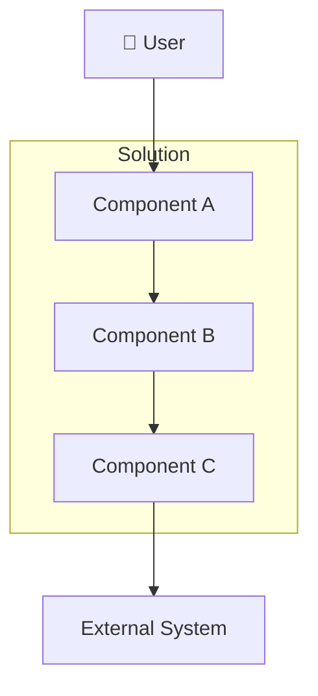

# [Project Name] — Solution Design Document

| Field | Value |
|-------|-------|
| **Version** | 1.0 |
| **Author** | [Name] |
| **Reviewers** | [Names] |
| **Status** | Draft &#124; In Review &#124; Approved |
| **Date** | YYYY-MM-DD |
| **Client/Sponsor** | [Name] |

---

## 1. Executive Summary

<!-- 5-7 sentences maximum. A CTO reads ONLY this section and makes a go/no-go decision.
Cover: Problem, Proposed Solution, Key Benefits, Estimated Cost, Timeline. -->

---

## 2. Business Context

### 2.1 Problem Statement
<!-- What pain exists today? Be specific with data. -->

### 2.2 Business Objectives

| # | Objective | Success Metric | Target |
|---|-----------|---------------|--------|
| 1 | | | |
| 2 | | | |

### 2.3 Target Users / Personas

| Persona | Role | Key Need | Volume |
|---------|------|----------|--------|
| | | | |

### 2.4 Business Constraints
- Budget:
- Timeline:
- Regulatory:
- Contractual:

---

## 3. Requirements

### 3.1 Functional Requirements

| ID | Requirement | Priority | Source |
|----|-----------|:--------:|--------|
| FR-001 | | Must | |
| FR-002 | | Must | |
| FR-003 | | Should | |
| FR-004 | | Could | |

### 3.2 Non-Functional Requirements

| ID | Category | Requirement | Target |
|----|----------|-----------|--------|
| NFR-001 | Performance | | |
| NFR-002 | Availability | | |
| NFR-003 | Security | | |
| NFR-004 | Scalability | | |
| NFR-005 | Compliance | | |

---

## 4. Solution Overview

### 4.1 Solution Architecture

### 4.2 Key Architecture Decisions

| # | Decision | Rationale | ADR |
|---|----------|-----------|-----|
| 1 | | | |

### 4.3 Technology Stack

| Layer | Technology | Rationale |
|-------|-----------|-----------|
| | | |

### 4.4 Integration Points

| System | Protocol | Direction | Purpose |
|--------|----------|-----------|---------|
| | | | |

---

## 5. Alternatives Considered

### 5.1 Evaluation Criteria

| Criterion | Weight |
|-----------|:------:|
| Technical Fit | 25% |
| Cost (3-year TCO) | 20% |
| Team Expertise | 15% |
| Time to Market | 15% |
| Scalability | 10% |
| Vendor Risk | 10% |
| Compliance | 5% |

### 5.2 Options Comparison

| Criterion (Weight) | Option A: [Name] | Option B: [Name] | Option C: [Name] |
|-------------------|:-----------------:|:-----------------:|:-----------------:|
| Technical Fit (25%) | /10 | /10 | /10 |
| Cost (20%) | /10 | /10 | /10 |
| Team Expertise (15%) | /10 | /10 | /10 |
| Time to Market (15%) | /10 | /10 | /10 |
| Scalability (10%) | /10 | /10 | /10 |
| Vendor Risk (10%) | /10 | /10 | /10 |
| Compliance (5%) | /10 | /10 | /10 |
| **Weighted Score** | **/10** | **/10** | **/10** |

### 5.3 Recommendation
<!-- Which option and why. Connect back to evaluation criteria. -->

---

## 6. Implementation Plan

### 6.1 Phased Delivery

| Phase | Scope | Duration | Team Size | Dependencies |
|-------|-------|:--------:|:---------:|-------------|
| Phase 1 (MVP) | | weeks | | |
| Phase 2 | | weeks | | Phase 1 |
| Phase 3 | | weeks | | Phase 2 |

### 6.2 Team Structure

| Role | Count | Responsibility |
|------|:-----:|---------------|
| Tech Lead | | Architecture, design decisions |
| Backend Developer | | Service implementation |
| Frontend Developer | | UI implementation |
| QA Engineer | | Testing strategy and execution |
| DevOps Engineer | | Infrastructure, CI/CD |

---

## 7. Cost Estimate

### 7.1 Development Cost

| Phase | Duration | Team Size | Effort (person-months) | Cost |
|-------|:--------:|:---------:|:----------------------:|:----:|
| Phase 1 | | | | |
| Phase 2 | | | | |
| **Total** | | | | |

### 7.2 Infrastructure Cost (Monthly)

| Service | Dev | Staging | Production | Notes |
|---------|:---:|:-------:|:----------:|-------|
| Compute | | | | |
| Database | | | | |
| Storage | | | | |
| Network | | | | |
| Monitoring | | | | |
| **Total** | | | | |

### 7.3 Total Cost of Ownership (3 Year)

| Category | Year 1 | Year 2 | Year 3 | Total |
|----------|:------:|:------:|:------:|:-----:|
| Development | | | | |
| Infrastructure | | | | |
| Licensing | | | | |
| Support/Ops | | | | |
| **Total** | | | | |

---

## 8. Risk Assessment

| # | Risk | Probability | Impact | Mitigation | Owner |
|---|------|:-----------:|:------:|-----------|-------|
| 1 | | H/M/L | H/M/L | | |
| 2 | | H/M/L | H/M/L | | |

---

## 9. Assumptions & Dependencies

### 9.1 Assumptions
- 

### 9.2 Dependencies

| Dependency | Type | Owner | Risk if Delayed |
|-----------|------|-------|----------------|
| | Technical/Organizational | | |

---

## 10. Out of Scope

<!-- Explicitly list what this solution does NOT cover -->
- 

---

## 11. Approvals

| Role | Name | Date | Decision |
|------|------|------|:--------:|
| Architecture Review | | | Approved &#124; Rejected |
| Security Review | | | Approved &#124; Rejected |
| Business Sponsor | | | Approved &#124; Rejected |

---

## Appendix

### A. Glossary
| Term | Definition |
|------|-----------|
| | |

### B. References
- [Related documents, ADRs, specifications]

---

*Generated using Archpilot SDD Standards v1.0*
*Created by Gaurav Sharma*
